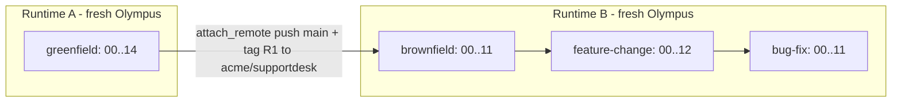
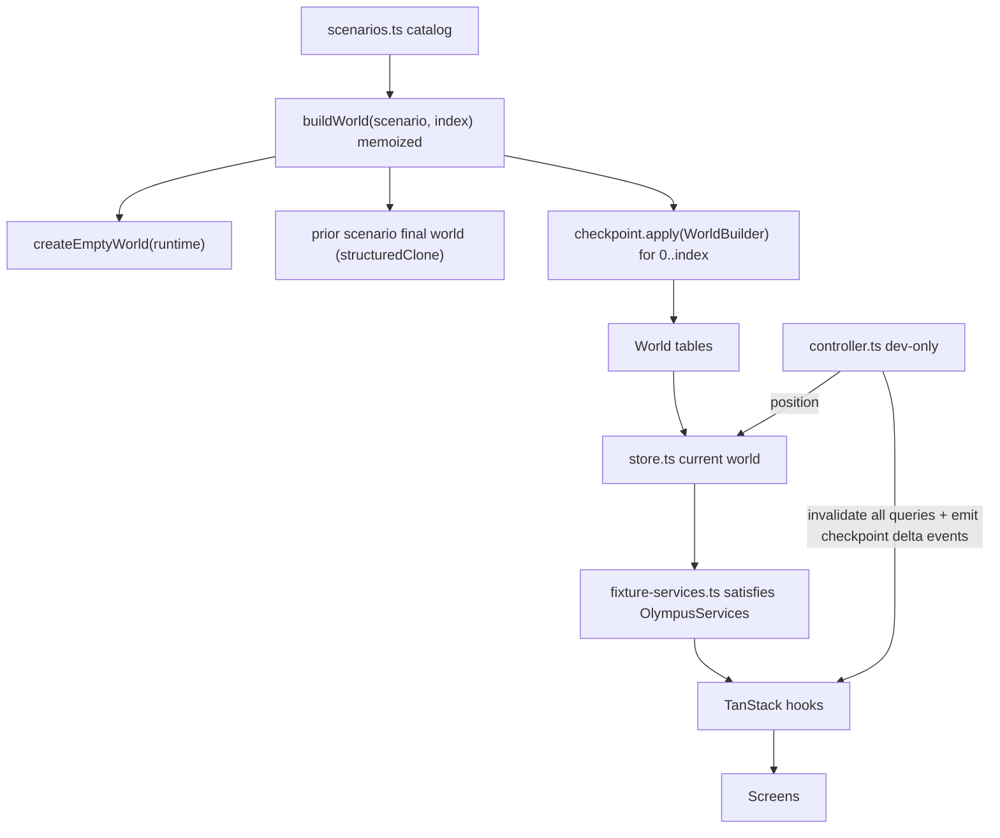
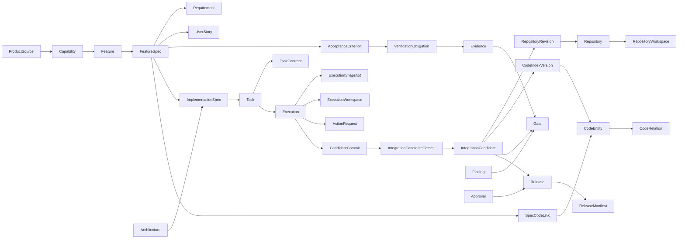

# Olympus Frontend — Four-Journey Simulation (Checkpointed Fixture World)

**Track:** Frontend UI (extends `plans/frontend-ui-implementation.md` v2; proposed as phase **UI-19** in `STATUS.md` §16).
**Planning date:** 2026-10-01.
**Execution model:** this plan is written in Plan mode and built with Composer 2.5.

**Authoritative inputs:**
- ARCH v1.2 and TECH v1.0 (`.docx`);
- `STATUS.md`;
- `plans/README.md` §5.9 (repository ownership, materialization and revision model);
- `plans/01`, `04`, `07`, `08`, `09`, `10`, `11`, `12`, `13`, `14`, `15`, `16`;
- `plans/frontend-ui-implementation.md`;
- the existing `apps/dashboard`.

> **Not journey proof.** Everything here is fixture-driven. No checkpoint, screen or Playwright run in this plan counts as backend E2E evidence. It does not change any backend phase state or tick any `STATUS.md` §7 invariant (README §6.3, STATUS §14.5).

**Do not redesign the architecture.** This plan adds UI, typed contracts that mirror planned backend shapes, and a deterministic fixture engine. Where the UI needs a field or endpoint that the backend plans do not define, the field is marked `@proposed` and recorded as a missing capability (§19).

---

## 1. Repository reality (2026-10-01)

**The dashboard exists.** `apps/dashboard` is Next.js 16 with TanStack Query, zod contracts, an `OlympusServices` interface, fixture and http adapters, an ESLint fixture-isolation rule and a Vitest isolation scan.

**What is weak:**

- **The fixture world is one static snapshot** (`lib/fixtures/scenarios/supportdesk/*`):
  - DC-003 is in DEVELOPMENT while DC-004 is in ASSURANCE at the same time;
  - IC-003 has no integrated SHA;
  - there is no time progression.
- **No repository model in the UI:**
  - there is no `Repository`, `RepositoryWorkspace`, `RepositoryRevision`, `RepositoryMaterialization` or `ExecutionWorkspace` contract;
  - `Worktree.path` is a host path (`/var/olympus/worktrees/ex-551`), which violates README rule 14 (logical locations only).
- **The code index is synthetic.** Entities are named `CLASS_5`, `METHOD_7`, and so on. The only relations are `CONTAINS` chains between adjacent rows.
- **Contracts are missing** for:
  - Evidence, VerificationObligation, AcceptanceCoverage and Review;
  - Requirement and UserStory;
  - Artifact, ModelCall and ExecutionLease;
  - ObservedBehavior, KnowledgeItem and PromotionDecision;
  - ReleaseManifest and IntegrationCandidateCommit.
- **Lineage is fake.** `lineage.query` returns one hand-written three-node sample for any root.
- **Fixture logic is hardcoded:**
  - `deliveryCycles.nextTransitions` and `controlPlane.forCycle` hard-code their answers;
  - `tasks.eligibility` returns only `blocked_reason`.
- **Fixtures are non-deterministic.** They use `new Date()`, `Date.now()` and `crypto.randomUUID()`.
- **Several screens are placeholders:**
  - Code (explorer, symbols, traceability);
  - Brownfield (pipeline, facts);
  - Lineage (sample only);
  - IC Forge (one chip row);
  - Release (thin);
  - Execution (no diff, host path);
  - Product, Impact, Defect and Audit.
- **`fixture-stream.ts` replays events in a loop** every 3 s instead of advancing state.

**Keep:**
- the service-interface boundary;
- `openEnum`;
- the tone registry;
- `Panel` and `KV`;
- `EligibilityVerdict`;
- `RecommendationVsGate`;
- `KnowledgeChip`;
- `ConfirmCommandDialog` and `useOlympusCommand`;
- the ProjectShell / NavRail / ContextBar shell;
- `buildForgeStages` and `buildMacroBands`;
- `journeyStates`;
- the production fixture guard in `next.config.ts`;
- the ESLint isolation rule.

---

## 2. Decisions and source reconciliations

| ID | Topic | Decision |
|---|---|---|
| SIM-D1 | Greenfield → Brownfield continuity (user-confirmed) | **Two runtime contexts** (§3.1). Runtime A: fresh Olympus; REPO-001 `GREENFIELD_MANAGED` / `LOCAL`; DC-001 → R1; then `attach_remote` pushes `main` + tag `R1` to GitHub `acme/supportdesk`. Runtime B: fresh Olympus; SupportDesk registered from `acme/supportdesk` as `EXTERNAL_CLONE` REPO-001 at HEAD `73fb91d` (tag R1); DC-002 → B1 → READY_FOR_CHANGE, DC-003 → R2, DC-004 → R3. Phase 19's single-runtime chained Stage B is **not** simulated. This is fixture narrative only; no invariant changes (Q-11 holds per runtime). |
| SIM-D2 | SHA labels | Fixture SHAs use the readable labels from the brief (`gf-init-001`, `73fb91d`, `r2-def456`, `982af11`). Unnamed commits get deterministic 7-hex labels from `shaFor(label)`. `ShaChip` shows strings of 12 characters or fewer in full. The ledger is in §11.1. |
| SIM-D3 | Conflicting SHA examples in the brief | The brief gives IC-003 as both `982af11` and `r2-def456`, and shows EX-551 based on `r2-def456`. Resolution: DC-003 base = `73fb91d`; IC-003 integrated = `r2-def456` (= CODEIDX-R2 = R2); IC-004 integrated = `982af11`. The "Workspaces" example (canonical `r2-def456` with active worktrees) is shown in Bug Fix, where DC-004 executions start from `r2-def456`. |
| SIM-D4 | Bug Fix remediation IC | The brief says "IC-004 → Assurance FAIL → … → R3". Phase 09 requires remediation to produce a **new** Execution, a new IC and new gates. Fixture: IC-004 (`982af11`) FAIL → FND-042 → TASK-303 → EX-603 → **IC-005** (supersedes IC-004) → `r3-a41c9e0` → CODEIDX-R3 → R3. |
| SIM-D5 | Action names and statuses (extends FE-C12) | Data uses Phase 04/16 tool names and `ActionStatus`. A presentation map shows the brief's names next to the backend names (§7.3). |
| SIM-D6 | Event names | Data uses plan event names. `event-registry.ts` adds a display alias from the brief, e.g. `repository.materialization_started` ⇢ "repository.clone.started" (§13). |
| SIM-D7 | `LIKELY_IMPLEMENTS` / `GENERATED_FROM_TASK` (extends FE-C14) | Wire data is `SpecCodeLink{relation: IMPLEMENTS, origin: DISCOVERED, confidence}` and `origin: GENERATED_LINEAGE` with `task_id`/`execution_id`/`commit_sha`. The labels are display-only. |
| SIM-D8 | Runtime B key numbering | Runtime B uses the brief's labels (TASK-221, EX-551, IC-003, R2, IC-004, R3). Per-project key sequences are not simulated. R2 follows the imported tag `R1`. Recorded as drift FE-C22. |
| SIM-D9 | Repository & Code view placement | The existing `/projects/[pid]/code` becomes the first-class **Repository & Code** view. `/projects/[pid]/repository` redirects to it. The old tab ids map as `explorer` → `repository` and `symbols` → `code-graph`. There is no duplicate screen. |
| SIM-D10 | Guard and eligibility logic | Still not ported to TypeScript (frontend v2 §13). Checkpoints **author** explanation records (backend-shaped responses). Consistency tests check that they agree with state. |

---

## 3. Simulation architecture

### 3.1 Runtimes and scenarios



- A world is **one runtime's accumulated backend state** at one checkpoint.
- The `feature-change` checkpoint `k` = the brownfield final world plus feature-change checkpoints `0..k`.
- The `bug-fix` checkpoint `k` = the feature-change final world plus bug-fix checkpoints `0..k`.
- The `greenfield` world is independent (Runtime A).
- The legacy scenario id `supportdesk-chained` aliases to `bug-fix:11-released`.

### 3.2 Engine



**Rules**

1. Every screen reads through `OlympusServices`. No checkpoint data or fixture ID appears in `app/` or `components/` (enforced by ESLint + the Vitest scan, extended to literal fixture UUIDs, SHAs and keys).
2. `checkpoint.apply(w)` mutates the world only through `WorldBuilder` helpers. Each helper:
   - advances the fixture clock;
   - emits the matching domain events with deterministic `id`, `sequence`, `correlation_id` and `causation_id`;
   - enforces immutability (candidate commits, evidence, snapshots, contracts, revisions and artifacts are frozen once written).
3. **Determinism:** no `Date.now`, `new Date()` without an argument, `Math.random` or `crypto.randomUUID` under `lib/fixtures/**` (enforced by a source-scan test).
   - IDs come from `fid(namespace, key)`, a pure FNV-1a-based UUID-shaped hash.
   - Timestamps come from `clock.at(runtime, minuteOffset)`.
4. Each world exposes `as_of` (the checkpoint clock). Durations shown in fixture mode use `as_of`, not the wall clock (`useNow()` hook).
5. Human commands in fixture mode use a **scripted outcome table**. If the next checkpoint declares `advancesOn: {approval_key | command}`, then `approvals.decide` / `deliveryCycles.command` advances the controller. Otherwise they return 422 `FIXTURE_NO_SCRIPT` (existing behavior).

### 3.3 Fixture / adapter boundary

- `lib/api/olympus-services.ts` gains new domain interfaces (§4). `fixture-services.ts` and `http-services.ts` both `satisfies OlympusServices`. Live methods throw `CapabilityPendingError` until the backend phases land.
- `lib/api/scenario-controller.ts` holds the `ScenarioController` interface. It is typed and has no fixture imports.
- `lib/api/services.ts` adds `getScenarioController(): Promise<ScenarioController | null>`. It returns `null` unless `getDataMode() === "fixture"`, and loads `@/lib/fixtures/controller` dynamically.
- `components/dev/*` render `null` outside fixture mode. The production guard in `next.config.ts` is unchanged.

---

## 4. Contracts and service additions

New zod files in `lib/contracts/`. Fields are copied from the plans (snake_case). `@proposed` marks fields with no plan source.

| File | Shapes (source) |
|---|---|
| `repository.ts` | `Repository` (README §5.9.2: id, project_id, name, source_type, provider, remote_url, default_branch, registered_sha, canonical_commit, released_commit, status, workspace_id, credential_ref, credential_status, created_at, updated_at; plus `key` @proposed); `RepositoryWorkspace` (workspace_type, storage_backend, logical_location, materialized_commit, state); `RepositoryRevision` (sequence, commit_sha, cause, integration_candidate_id, release_id, canonical_index_version_id, actor_id, correlation_id, created_at); `RepositoryMaterialization` (Phase 04: kind, attempt, status, action_request_ids, resulting_sha, observed_default_branch, error_class, started_at, finished_at; plus `steps[]` and `progress{objects_received, objects_total, bytes_received}` @proposed M-30) |
| `actions.ts` (extend) | `ExecutionWorkspace` (README §5.9.2: execution_id, repository_id, type, mode, base_commit, logical_location, branch, state, created_at, removed_at; plus `key`, `uncommitted_files` @proposed M-32). `Worktree` is kept as a deprecated alias with `path` removed. `CandidateCommit` gains id, key, task_id, repository_id, branch, diff_artifact_id, principal_symbols_declared, created_at (Phase 04). |
| `runtime.ts` | `ExecutionLease` (Phase 03); `ModelCall` (Phase 02: alias, provider, tokens, cost, latency, prompt_hash); `Artifact` (Phase 03); `RuntimeMetadata` (M-27 + `current_action_id`, `current_resource` @proposed M-40) |
| `integration.ts` | `IntegrationCandidate` gains integration_branch, integration_execution_id, checks_artifact_id, canonical_revision_id, supersedes_id (Phase 08); `IntegrationCandidateCommit` (ic_id, candidate_commit_id, position, included, skip_reason) |
| `assurance.ts` | `Evidence`, `VerificationObligation`, `AcceptanceCoverage`, `Review` (Phase 09). `Finding` gains commit_sha, detail, code_refs, spec_refs, remediation_task_id, resolved_by_ic_id. `Gate` gains inputs_hash and policy_version_id. |
| `product.ts` (extend) | `Requirement` (REQ-, kind, priority), `UserStory` (US-, actor, goal, benefit) (Phase 05); `KnowledgeItem` (Phase 05: class, statement, subject_refs, provenance, evidence_refs, confidence, status, blocking) |
| `brownfield.ts` (extend) | `ObservedBehavior` (Phase 11); `RepositoryDiscovery.content`, `steps[]` (M-29); `RecoveredSpec` citations; `PromotionDecision` (Phase 12); `BehavioralBaseline` fields (source, check_kind, entity refs, established_sha) |
| `traceability.ts` (extend) | `SpecCodeLink` aligned to Phase 08: spec_lineage_key, code_stable_key, task_id, execution_id, commit_sha, evidence_refs, established_index_version_id, promoted_from_link_id |
| `code-intelligence.ts` (extend) | `CodeRelation.provenance` / `confidence`; `CodeIndexVersion.key` @proposed; `CodeEntityChange` aligned to Phase 08 |
| `release.ts` | `ReleaseManifest` (Phase 10); eligibility `conditions[].subject_refs[]` @proposed M-34 |
| `control-plane.ts` | `ControlDecision {id, question_kind: TASK_BLOCKED / INTEGRATION_UNAVAILABLE / ACTION_DENIED / GATE_FAILED / RELEASE_BLOCKED, subject_ref, outcome, conditions[{name, ok, detail, refs[]}], source_endpoint}` @proposed M-35 (composes M-22/23/24) |

New service domains (both adapters):

- `repositories`: `forProject`, `get`, `workspace`, `revisions`, `materializations`, `executionWorkspaces(repoId, {state?, cycle_id?})`, `commitLedger(repoId)` (M-31; the fixture composes it from revisions, candidate commits and IC merges).
- `executions`: add `workspace(id)`, `lease(id)`, `modelCalls(id)`, `artifacts(id)`. `worktree(id)` becomes an alias of `workspace(id)` (Phase 04 §287).
- `artifacts`: `get(id)` and `content(id)` (unified diff and check logs for the viewer, M-33).
- `code`: add `entities(indexVersionId, {file_path?, type?})`, `neighbors(entityId, depth)`, `entityChanges(repoId, {stable_key?, ic_id?})`, `versionDiff(a, b)` (M-25), `byStableKey(indexVersionId, key)`.
- `lineage.query`: the fixture runs a real BFS over a typed edge index built from the world (§12). The hand-written sample is deleted.
- `assurance`: add `evidence({ic_id | cycle_id | subject})`, `obligations(icId)`, `coverage(icId)`, `reviews(icId)`.
- `release`: add `manifest(releaseId)` and `forCycle(cycleId)`.
- `product`: add `requirements(fsId)`, `userStories(fsId)`, `specDeltas(projectId)`, `knowledge(projectId, {cycle_id?})`.
- `planning`: add `architecture(projectId)`, `taskPlans(cycleId)`.
- `brownfield`: add `observedBehaviors(cycleId)`, `promotions(cycleId)`, `discoverySteps(cycleId)` (M-29).
- `controlPlane`: add `explain(subject_type, subject_id)` (M-35).
- `deliveryCycles.nextTransitions` and `tasks.eligibility` return world-authored data (per-condition explain, M-23) instead of hardcoded literals.

---

## 5. Repository UI

### 5.1 Project / Command Center header (`RepositorySummaryChip`)

The chip is shown in `ContextBar`, `CycleHeader` and project cards on `/projects`. Clicking it opens `/projects/[pid]/code?tab=repository`.

```
Repository READY · Origin GitHub acme/supportdesk (or "Olympus Managed · LOCAL") · Branch main · Canonical 73fb91d · Index CODEIDX-R2
```

- The canonical SHA is visibly distinct from the released SHA when they differ. Example: during DC-003 after IC-003 READY, it reads "canonical r2-def456 · released 73fb91d".
- When the repository is not READY (PROVISIONING / CLONING / ERROR), the chip shows the state and the current materialization step.

### 5.2 Repository & Code view (`/projects/[pid]/code`)

**Header (`RepositoryHeader`):**
- Project;
- Repository key / ID;
- Origin (`source_type`);
- Provider;
- Remote (no userinfo);
- Default branch;
- Canonical SHA;
- Released SHA;
- Workspace ID + state + logical location;
- Current release;
- Current CodeIndex (key, kind, SHA, `pointer == canonical_commit` check);
- Authentication (`credential_status` → `CONNECTED` / `NOT_REQUIRED` / `MISSING`; never the ref value or a secret).

An `OwnershipNotice` sits under the header: "Source bytes live in Git in canonical workspace WS-001 (`projects/<pid>/repo`, bare). Olympus stores repository metadata, SHAs, revisions and index references only."

**Tabs:** `repository` | `code-graph` | `workspaces` | `commits` | `index-history` | `traceability` | `search`.

- **repository**
  - `MaterializationTimeline` (§5.3 / §5.4).
  - `RepositoryExplorer`: a lazy tree of FILE/MODULE/PACKAGE entities from the canonical index at the canonical SHA.
  - Click a file → `SymbolPanel` (classes, methods, functions, routes, schemas, ORM models, tests in that file, with line spans).
  - Click a symbol → `RelationGroups` (Calls, Called By, Imports, Inherits, Accesses, Exposes, Uses Schema, Maps To, Verified By, Implements [SpecCodeLink], Changed By [code_entity_changes]). Each group shows provenance and confidence.
  - Alongside: `ProductLinks` with a `ProvenanceCard` per link, and "Open lineage" / "Open in graph" actions.
- **code-graph**
  - `SymbolNeighborhood`: React Flow + elk, depth ≤ 2, ≤ 200 nodes, with a list twin.
  - `RoutePathView` preset: `POST /tickets → create_ticket → TicketService.create_ticket → TicketRepository.create → Ticket → tickets`.
- **workspaces**: §6.
- **commits**: `CommitLedger`.
  - Canonical revisions are solid. Columns: `#sequence`, SHA, cause, IC, release, index, time.
  - Candidate commits are dashed, labelled "NOT CANONICAL". Columns: SHA, EX, TASK, branch, base, files, included in IC?
  - Integration merge commits sit on `olympus/integration/<IC>`.
  - Filters: canonical / candidate / integration / cycle.
- **index-history**
  - `IndexHistory`: key, kind, source, scope_ref, SHA, status, pointer roles canonical/released. Candidate indexes are hatched and show DISCARDED.
  - `IndexPromotionFlow`: candidate commits → IC → integrated SHA → canonical re-index → pointer.
  - Compare two versions (M-25; the fixture provides `versionDiff`).
- **traceability**: SpecCodeLinks by FeatureSpec version / AC with origin chips.
- **search**: the existing `CodeSearch` with retrieval-source badges.

### 5.3 Greenfield provisioning UX (Runtime A)

`MaterializationTimeline variant=GREENFIELD_MANAGED`. It is driven by `repository_materializations.steps` (M-30) and the revision ledger:

```
Project Created → Repository Declared (PROVISIONING) → git init --bare (WS-001 MATERIALIZING)
→ Baseline commit gf-init-001 (README.md, .gitignore, OLYMPUS.md) → Revision #1 MATERIALIZED
→ WS-001 READY → (later) ExecutionWorkspaces → Candidate commits → IC-001 → 73fb91d
→ Revision #2 INTEGRATION_READY → CODEIDX-R1 → R1 → Revision #3 RELEASED (main + tag R1)
→ attach_remote → git_provider.push_release to GitHub acme/supportdesk
```

Each step shows the ActionRequest key, `git_local.<action>`, status, duration and the resulting SHA.

### 5.4 Brownfield clone UX (Runtime B)

`MaterializationTimeline variant=EXTERNAL_CLONE` (also the Brownfield page `pipeline` tab):

```
REPOSITORY REGISTRATION → CREDENTIAL RESOLUTION (Authentication: CONNECTED) → CLONING (412 / 1,280 objects, 32%)
→ VALIDATING (connectivity, branch, size / LFS / submodule policy) → HEAD RESOLVED 73fb91d (tag R1)
→ WORKSPACE READY (WS-001, revision #1 MATERIALIZED) → CODE INDEXING (CODEIDX-R1, REPOSITORY_SNAPSHOT) → DISCOVERY
```

- `credential_ref` is never rendered. Only `credential_status` is shown, mapped to "Authentication: CONNECTED".
- The integrity test greps the world for token-like strings.
- A banner states: "Brownfield begins from repository reality: Olympus has no product model in this runtime until discovery and human review."

---

## 6. ExecutionWorkspace and candidate / canonical UX

### 6.1 Workspaces tab

```
CANONICAL WORKSPACE      WS-001 · READY · bare · materialized 73fb91d · branch main
ACTIVE EXECUTION WORKSPACES
  EX-551 · Forge · TASK-221 · base 73fb91d · olympus/EX-551 · ACTIVE · 3 files modified
  EX-552 · Forge · TASK-222 · base 73fb91d · olympus/EX-552 · ACTIVE · 2 files modified
  EX-553 · Forge · TASK-223 · base 73fb91d · olympus/EX-553 · ACTIVE · 2 files modified
RETAINED / REMOVED (collapsed)
```

In Bug Fix, the same tab shows WS-001 at `r2-def456` with EX-602 (and later EX-603), as the brief's example intends (SIM-D3).

**`ExecutionWorkspaceDetail`** (drawer `?inspect=execution_workspace:<id>`) shows:
- base SHA (== snapshot `base_commit`);
- branch;
- logical location;
- mode (WRITABLE / READONLY);
- state;
- uncommitted changed files (M-32, before commit);
- candidate commit (SHA, parent, files, +/−);
- a `DiffViewer` (react-diff-view over the diff artifact);
- TaskContract (key, version, hash, `allowed_scope`);
- Execution (status, agent, attempt);
- candidate index;
- "Included in IC-003 at position 1" when applicable.

A permanent `NOT CANONICAL — candidate work in an isolated worktree` watermark is shown until the IC containing the commit is READY. After that it reads "Integrated via IC-003 into r2-def456 (revision #2)". The candidate commit itself is still labelled as a candidate; only the integrated SHA is canonical.

### 6.2 `CanonicalVsCandidateDiagram`

This diagram appears on the Workspaces tab, the IC page and the Command Center when the cycle is in DEVELOPMENT or INTEGRATION.

```
CANONICAL  main · 73fb91d (solid lane)
ACTIVE WORKTREES (dashed lanes)  EX-551 ─ AAA   EX-552 ─ BBB   EX-553 ─ CCC   EX-554 ─ DDD
          ↓ IC-003 (olympus/integration/IC-003)
Integrated SHA r2-def456 → Canonical revision #2 (INTEGRATION_READY) → CODEIDX-R2 (pointer moved)
```

### 6.3 Integration Forge (`/projects/[pid]/cycles/[cid]/integration`, `/integration-candidates/[icId]`)

- `CommitConvergenceGraph` (React Flow + elk):
  - canonical base SHA node;
  - one lane per ExecutionWorkspace with its candidate commit;
  - the SYSTEM integration ExecutionWorkspace (`olympus/integration/IC-003`);
  - then IC → integrated SHA → canonical repository revision → CODEIDX.
- `IcCommitsTable`: position, task, EX, SHA, included, skip_reason.
- `IntegrationChecks`: compileall / pytest collect / pytest -q, with the result and log artifact.
- IC status rail: CREATED → INTEGRATING → VALIDATING → READY, plus the supersession chain (IC-004 → IC-005).
- "Why is integration unavailable?" `DecisionExplainer` (§7.1) while the cycle is still in DEVELOPMENT.

---

## 7. Transparency surfaces

### 7.1 Control-plane decisions (`DecisionExplainer`)

A reusable "Why?" card that renders a `ControlDecision`: question, outcome, condition checklist (✓/✕, detail, clickable refs) and source.

| Question | Where | Seeded example |
|---|---|---|
| Why is the task blocked? | TaskInspector, Control Plane | TASK-224: the seven ARCH §7.1 conditions; ✕ `DEPENDENCY_INCOMPLETE: TASK-222 (RUNNING, EX-552)`. Others ✓, e.g. `repository_ready`, `base_commit_available 73fb91d`, `contract_issued TC-224 v1`. |
| Why is integration unavailable? | Command Center, IC page | `start_integration` guard `all_code_tasks_completed`; per-task ✓/✕ (M-24). |
| Why was the action denied? | Action timeline, Agents ▸ Actions | EX-552 `repo.write app/main.py`: the 8-step `ActionGovernancePipeline`; ✕ `path_in_allowed_scope` (rule `scope.write.glob`). |
| Why did the gate fail? | Assurance, Gate card | IC-004 SENTINEL / BASELINE FAIL: obligation `BL-009` evidence FAIL at `982af11`; FND-042 BLOCKER open. |
| Why is the release blocked? | Release board | R3 at IC-004: `required_gates_pass` ✕, `blocking_findings` ✕, `baselines_pass` ✕, `canonical_index_matches_ic` ✓, `manifest_valid` ✓. |

### 7.2 Active execution (`ActiveExecutionPanel`, Execution page)

Shows:
- agent profile and capability;
- Task;
- TaskContract key / version / hash;
- Execution key, attempt and retry lineage;
- runtime (`LangGraphRuntime`, non-authoritative M-27);
- model alias (`implementation`) and the resolved model label;
- snapshot hash;
- base SHA;
- ExecutionWorkspace key and branch;
- lease (worker, heartbeat);
- current resource and current action (latest EXECUTING ActionRequest, M-40);
- elapsed time (from `as_of`);
- candidate commit status (NONE → UNCOMMITTED_CHANGES n files → COMMITTED sha → INCLUDED IN IC-x).

### 7.3 ToolGateway / actions

`ActionTimeline` and `ActionStatusLifecycle` show the brief's name and the backend name side by side.

| Brief name | Backend tool (plan) |
|---|---|
| repository.read | `repo.read` / `repo.search` / `repo.list` (04) |
| repository.write_worktree | `repo.write` / `repo.delete` (04) |
| test.execute | `test.run` (04) |
| artifact.create | `olympus.submit_artifact` (04) |
| repository.commit_candidate | `git.commit` (04) |
| git.push | `git_provider.push_branch` / `push_release` (16) |
| ci.trigger | `ci.trigger_verification` (16) |
| deployment.execute | `deployment.deploy` (16) |

| Brief status | Backend `ActionStatus` / policy |
|---|---|
| REQUESTED | `REQUESTED` |
| ALLOWED | `policy_decision.decision = ALLOW` |
| DENIED | `DENIED` |
| APPROVAL_REQUIRED | `PENDING_APPROVAL` (Approval ACTION) |
| RUNNING | `EXECUTING` |
| COMPLETED | `SUCCEEDED` |
| FAILED | `FAILED` |

### 7.4 Assurance / evidence

- **Warden and Sentinel lanes:** profile, execution, recommendation and summary.
- **`RecommendationVsGate`:** for example, "Warden recommended APPROVE ≠ SENTINEL gate FAIL (authoritative, `SYSTEM:gate_finalizer`)".
- **`EvidenceRegistry`:** key, type, result, subject (AC / BASELINE / DEFECT), `commit_sha` with a "== IC integrated_sha" check, producer, execution and artifact.
- **`AcCoverageTree`:** FeatureSpec → AC → obligation → evidence.
- **`ObligationList`** (reason chips: AC_MANDATORY, BASELINE_REQUIRED, IMPACT_ASSESSMENT, REGRESSION, DEFECT_REPRODUCTION).
- **`FindingList`:** severity, blocking, status, remediation task, resolved_by IC.

### 7.5 Release (`ReleaseBoard` on `/releases/[rid]` and `/projects/[pid]/releases`)

Every row is a `ConditionRow` linking to its screen:
- IntegrationCandidate;
- integrated SHA;
- CodeIndex;
- Warden gate;
- Sentinel gate;
- Baseline gate;
- AC coverage (n/m mandatory);
- behavioral baselines;
- blocking findings;
- approvals (pending or decided, pinned to the manifest hash);
- manifest (`ManifestView`: SHA, IC, index, specs, evidence and baseline set refs).

Approve stays disabled until the server reports ELIGIBLE.

### 7.6 Audit / event timeline (`/audit`)

- **Columns:** timestamp, event type (plus alias), aggregate, project, cycle, task, execution, agent, correlation_id and causation_id. Rows expand to show the payload.
- **Filters:** project, cycle, task, execution, agent, type, correlation_id.
- **"Trace this correlation":** renders the causation tree.
- **Data:** events carry refs through `payload.{task_key, execution_key, agent_profile}`. `event-registry.ts` provides the entity-ref extractor.

---

## 8. Journey checkpoints

Each checkpoint lists the new backend state it adds and the screens that should show it (`lookAt`). The controller renders these as "Where to look" links.

### 8.1 Greenfield — Runtime A (`greenfield/`)

> As a Product Owner, I want to give Olympus a product definition, so that Olympus can generate and verify the software.

| # | Checkpoint | DC-001 state | New state (summary) | lookAt |
|---|---|---|---|---|
| 00 | `00-intake` | DISCOVERY | Project SupportDesk (UNKNOWN); DC-001; PRD upload → InboundEvent → ProductSource PS-001 v1 (hash); REPO-001 declared PROVISIONING, WS-001 PENDING | Command Center, Product (sources), Repository chip |
| 01 | `01-product-model` | PRODUCT_MODEL | Kira `kira.decompose` EX-101: 3 capabilities, 8 features, 8 FeatureSpecs v1 PROPOSED, 15 REQ, 12 US, 32 AC; KnowledgeItems (ASSUMPTION/UNCERTAINTY) | Product tree, FeatureSpec view, Agents |
| 02 | `02-scope-approval` | PRODUCT_MODEL | Approval SCOPE APR-001 PENDING → APPROVED; FeatureSpecs APPROVED | Inbox, Product |
| 03 | `03-repository-provisioned` | PRODUCT_MODEL | Materialization PROVISION (git init --bare, baseline commit) → `gf-init-001`; revision #1 MATERIALIZED; REPO READY; WS-001 READY | Repository tab (timeline), Commits |
| 04 | `04-architecture` | ARCHITECTURE | Atlas EX-102 → ARCH-001 v1; Approval ARCHITECTURE APPROVED | Product ▸ architecture |
| 05 | `05-implementation-specs` | ARCHITECTURE | 10 ImplementationSpecs IS-101..110 APPROVED (file_scope, components) | Product ▸ specs |
| 06 | `06-task-plan` | PLANNING | `start_planning` pins `base_sha=gf-init-001` (guard ✓); TaskPlan; 24 tasks TASK-101..124 + DAG; TaskContracts TC-1xx v1 (hash) | Task DAG, TaskInspector ▸ contract, Control Plane |
| 07 | `07-development-started` | DEVELOPMENT | TASK-101..104 READY → EX-111..114 LEASED/STARTED; ExecutionWorkspaces ACTIVE at `gf-init-001`; `repo.read`/`repo.write` actions | Command Center (active executions), Workspaces |
| 08 | `08-development-running` | DEVELOPMENT | EX-112 FAILED (TEST_FAILURE) → EX-115 retry; DENIED `repo.write` outside scope; PENDING_APPROVAL `shell.run pip install` → Approval ACTION; TASK-110 BLOCKED (decision); first candidate commits | Execution page, Actions, Control Plane "Why?" |
| 09 | `09-candidate-commits` | DEVELOPMENT | All CODE_CHANGE tasks COMPLETED; 14 candidate commits; candidate indexes (CANDIDATE/EXECUTION); `start_integration` guard ✓ | Commits (candidate), Index history, Workspaces |
| 10 | `10-integration` | INTEGRATION | IC-001 CREATED → INTEGRATING (SYSTEM EX on `olympus/integration/IC-001`) → VALIDATING; integration checks PASS; integrated `73fb91d` | Integration Forge |
| 11 | `11-canonical-reindex` | INTEGRATION | CODEIDX-R1 CANONICAL at `73fb91d`; code_entity_changes; GENERATED_LINEAGE SpecCodeLinks; revision #2 INTEGRATION_READY; IC-001 READY; candidate indexes DISCARDED | Repository explorer, Code graph, Lineage |
| 12 | `12-assurance` | ASSURANCE | Warden EX-140 review (APPROVE, 1 MINOR finding); Sentinel EX-141 plan + EX-142 checks → ≥ 34 Evidence at `73fb91d`; gates INTEGRATION/WARDEN/SENTINEL PASS | Assurance, Evidence |
| 13 | `13-release-ready` | RELEASE | Eligibility ELIGIBLE (all conditions ✓); R1 ELIGIBLE + manifest; Approval RELEASE APR-004 PENDING (`advancesOn`) | Release board, Inbox |
| 14 | `14-released` | COMPLETE | APR-004 APPROVED; Stratos: ff main + tag R1 → revision #3 RELEASED, `released_commit=73fb91d`; attach_remote: `git_provider.push_release` → GitHub `acme/supportdesk` (ConnectorAction SUCCEEDED) | Release, Commits, Integrations, Audit |

### 8.2 Brownfield — Runtime B (`brownfield/`)

> As an Engineering Lead, I want Olympus to understand an existing repository, so that future work can be done safely.

| # | Checkpoint | DC-002 state | New state | lookAt |
|---|---|---|---|---|
| 00 | `00-registration` | RECON | Fresh runtime: Project SupportDesk (ONBOARDING); `register_repository` → REPO-001 EXTERNAL_CLONE / GITHUB / `https://github.com/acme/supportdesk` / main / `credential_ref` (hidden) / CLONING; WS-001 PENDING; DC-002 created | Repository header, pipeline |
| 01 | `01-credential-resolution` | RECON | Materialization CLONE attempt 1 RUNNING; step CREDENTIAL ✓; `credential_status=CONFIGURED` → "Authentication: CONNECTED" | pipeline |
| 02 | `02-cloning` | RECON | step CLONING; progress 412/1,280 objects; ConnectorAction `git_provider.fetch` EXECUTING | pipeline (progress bar) |
| 03 | `03-validating` | RECON | clone done; `verify_repository` + `read_metadata` (no LFS, no submodules, 3.1 MB) | pipeline |
| 04 | `04-head-resolved` | RECON | `resolve_branch` main → `resolve_head` `73fb91d` (tag R1) | Repository header |
| 05 | `05-workspace-ready` | RECON | `registered_sha=canonical_commit=73fb91d`; revision #1 MATERIALIZED; WS-001 READY; REPO READY | Workspaces, Commits |
| 06 | `06-code-index` | CODE_INDEX | `start_code_index` pins `base_sha=73fb91d`; CODEIDX-R1 (REPOSITORY_SNAPSHOT) BUILDING → READY; pointer set | Code graph, Index history |
| 07 | `07-discovery` | CODE_INDEX | RepositoryDiscovery (FastAPI, SQLAlchemy, pytest, entry `app.main:app`); `brownfield.run_existing_tests` (11 passed); 14 ObservedBehaviors + FACT items | Brownfield ▸ facts, discovery steps |
| 08 | `08-recovered-specs` | RECOVERED_SPEC | Scout survey EX-501 + recover_feature EX-502..504 (context manifest: no product rows); recovered 3 capabilities / 7 features / 7 FeatureSpecs (PROPOSED, RECOVERED); INFERENCE + UNCERTAINTY (incl. U-03 "behavior when updating a CLOSED ticket is unspecified; code raises ValueError"); DISCOVERED SpecCodeLinks (IMPLEMENTS, 0.62–0.93, basis Route + Test + Call Graph) | Recovered specs, Traceability |
| 09 | `09-baselines` | BASELINE | Sentinel characterize EX-506/507 → 10 baselines BL-001..010 PROPOSED with PASS evidence at `73fb91d` (incl. BL-009 "CLOSED ticket can be reopened via status=OPEN") | Baselines, Evidence |
| 10 | `10-human-review` | READINESS | Review queue; PromotionDecisions (6 promoted, 1 rejected, U-03 kept non-blocking); FeatureSpecs APPROVED (HUMAN_CONFIRMED links, `promoted_from_link_id`); baselines ACTIVE; BaselineSet B1 | Review queue, Product, Lineage |
| 11 | `11-ready-for-change` | READY | ReadinessAssessment metrics ✓; Approval READINESS APPROVED; Project READY_FOR_CHANGE | Readiness, Command Center |

### 8.3 Feature Change — Runtime B (`feature-change/`)

> Add ticket priority.

| # | Checkpoint | DC-003 state | New state | lookAt |
|---|---|---|---|---|
| 00 | `00-intake` | INTAKE | GitHub issue #42 label `olympus:change` → InboundEvent → CR-003; Kira `change_interpret` EX-540 → resolves to FEAT-001 "Create & manage tickets" | Change request, Integrations ▸ inbound |
| 01 | `01-spec-delta` | SPEC_DELTA | FS-001 v1 → v2 SpecDelta (+REQ-016 priority enum LOW/MEDIUM/HIGH/URGENT default MEDIUM, +US-013, +AC-001-05..08); v1 unchanged; Approval SPEC_DELTA APPROVED | Product ▸ deltas (v1↔v2) |
| 02 | `02-impact` | IMPACT_ANALYSIS | `start_impact_analysis` pins `base_sha=73fb91d`; IA-003 at CODEIDX-R1: DIRECT `Ticket` ORM, `tickets` table, `TicketCreate`/`TicketRead`, `TicketService.create_ticket`, `TicketRepository.create`, `POST /tickets`; TRANSITIVE `GET /tickets`, tests; SEMANTIC_CANDIDATE `TicketUpdate`; impacted baselines BL-001, BL-003, BL-005 → obligations | Impact explorer, Code graph |
| 03 | `03-planning` | PLANNING | Architecture delta not required (decision record); IS-104 v2; TaskPlan: TASK-221 (model+migration), TASK-222 (schemas), TASK-223 (service/repository), TASK-224 (route+tests), TASK-225 INTEGRATION, TASK-226 Warden, TASK-227 Sentinel; TC-221..227 v1 | Task DAG, contracts |
| 04 | `04-development-started` | DEVELOPMENT | EX-548 (TASK-221 attempt 1), EX-552, EX-553 STARTED; ExecutionWorkspaces at `73fb91d`; TASK-224 BLOCKED (decision) | Command Center, Workspaces |
| 05 | `05-development-running` | DEVELOPMENT | EX-548 FAILED (TEST_FAILURE) → EX-551 attempt 2; EX-552 DENIED `repo.write app/main.py`; EX-553 PENDING_APPROVAL → approved; uncommitted files 3/2/2; "Why is integration unavailable?" | Execution page, Actions, Control Plane |
| 06 | `06-candidate-commits` | DEVELOPMENT | EX-551 → `aaa5511`, EX-552 → `bbb5522`, EX-553 → `ccc5533`; TASK-224 READY → EX-554 → `ddd5544`; candidate indexes; workspaces RETAINED | Commits, Workspaces, Diff |
| 07 | `07-integration` | INTEGRATION | IC-003 CREATED (base `73fb91d`) → INTEGRATING (EX-555 SYSTEM, `olympus/integration/IC-003`) → VALIDATING; checks PASS; integrated `r2-def456` | Integration Forge |
| 08 | `08-canonical-reindex` | INTEGRATION | CODEIDX-R2 at `r2-def456`; entity changes (ADDED `TicketPriority`, `Ticket.priority`, `tests/test_priority.py::*`; MODIFIED 6); SpecCodeLinks GENERATED_LINEAGE for FS-001 v2; revision #2 INTEGRATION_READY; IC-003 READY; candidate indexes DISCARDED | Repository, Index history (compare R1↔R2) |
| 09 | `09-assurance` | ASSURANCE | Regression: impacted baselines BL-001/003/005 PASS at `r2-def456`; new ACs evidence; Warden EX-556 APPROVE; Sentinel EX-557 → gates PASS (INTEGRATION, WARDEN, SENTINEL, BASELINE, REGRESSION) | Assurance, Evidence |
| 10 | `10-release-ready` | RELEASE | Eligibility ELIGIBLE; R2 ELIGIBLE + manifest (`r2-def456`, IC-003, CODEIDX-R2, B2); Approval RELEASE PENDING | Release board |
| 11 | `11-released` | COMPLETE | R2 RELEASED; revision #3 RELEASED; `push_release`; issue #42 commented and closed; BaselineSet B2 | Release, Commits, Audit |

### 8.4 Bug Fix — Runtime B (`bug-fix/`)

> Updating a CLOSED ticket returns HTTP 500.

| # | Checkpoint | DC-004 state | New state | lookAt |
|---|---|---|---|---|
| 00 | `00-defect-intake` | TRIAGE | GitHub issue #57 `olympus:defect` → DEF-004 (affected_sha `r2-def456`); Kira `defect_triage` EX-600; link to Brownfield U-03 | Defect page |
| 01 | `01-reproduction` | REPRODUCTION | `start_reproduction` pins base `r2-def456`; Sentinel `reproduce` EX-601 in READONLY ExecutionWorkspace (detached at `r2-def456`, overlay `tests/olympus_repro/**`); REPRODUCTION Evidence FAIL (HTTP 500, traceback ValueError) PRE_REPAIR | Failure path, Evidence, Workspaces |
| 02 | `02-expected-behavior` | EXPECTED_BEHAVIOR | Kira `expected_behavior` proposal 409 `TICKET_CLOSED` (INFERENCE); Approval EXPECTED_BEHAVIOR APPROVED → DECISION item; resolves to FS-004 v1 AC-004-03 | Defect ▸ expected, Product |
| 03 | `03-root-cause` | ROOT_CAUSE | TraceCorrelation (TRACEBACK): `PATCH /tickets/{id}` → `update_ticket` → `TicketService.update_ticket` → `Ticket.transition_to` raises ValueError → unhandled → 500; Warden `root_cause` EX-604 (INFERENCE only, not Evidence) | Defect ▸ code path, Code graph |
| 04 | `04-repair-spec` | ROOT_CAUSE | Regression test REG-004 authored (fails at `r2-def456`); RepairSpec RS-004 + Approval REPAIR_SPEC; TASK-302 (REPAIR) + TC-302 | Defect, Task DAG |
| 05 | `05-repair-execution` | DEVELOPMENT | EX-602 Forge in WRITABLE workspace at `r2-def456` (`olympus/EX-602`); actions; candidate `5e1f0aa` | Execution, Workspaces (`r2-def456`) |
| 06 | `06-integration` | INTEGRATION | IC-004 → `982af11`; revision #4 INTEGRATION_READY; CODEIDX-R3-RC1 | Integration Forge |
| 07 | `07-assurance-fail` | ASSURANCE | REG-004 PASS; repro now 409 PASS; **BL-009 FAIL** (reopen blocked); Warden recommended APPROVE; gates SENTINEL PASS, BASELINE FAIL; FND-042 BLOCKER; R3 NOT_ELIGIBLE (decision record) | Assurance (recommendation ≠ gate), Release board |
| 08 | `08-remediation` | DEVELOPMENT | `return_to_development`; TASK-303 (origin FINDING FND-042) + TC-303; EX-603 at base `982af11` → `6c2d0b7` | Task DAG (loop arc), Execution |
| 09 | `09-reintegration` | INTEGRATION | IC-005 (supersedes IC-004) → `r3-a41c9e0`; revision #5; CODEIDX-R3; IC-004 gates SUPERSEDED | Integration Forge (supersession) |
| 10 | `10-assurance-pass` | ASSURANCE | All evidence at `r3-a41c9e0`; BL-009 PASS; FND-042 RESOLVED (resolved_by IC-005); gates PASS; R3 ELIGIBLE; Approval RELEASE PENDING | Assurance, Release |
| 11 | `11-released` | COMPLETE | R3 RELEASED; revision #6 RELEASED; DEF-004 RELEASED; issue #57 closed; BaselineSet B3 (adds REG-004) | Release, Defect, Audit |

---

## 9. Fixture file layout

```
apps/dashboard/lib/fixtures/
  engine/
    deterministic-id.ts     fid(namespace, key) → UUID-shaped; shaFor(label) → 7-hex
    clock.ts                per-runtime T0 + at(minutes); WorldBuilder.tick()
    world.ts                World type (all tables) + createEmptyWorld(runtime)
    world-builder.ts        put/update/transition/emit/freeze helpers; event + audit emission
    checkpoint.ts           Checkpoint / ScenarioDef types (id, label, stage, narrative, lookAt, advancesOn, apply)
    build-world.ts          buildWorld(scenarioId, index) memoized; prerequisite chaining
    lineage-index.ts        typed edge index over world tables + BFS forward/reverse
    compose-views.ts        project summary / cycle overview / control-plane view composition
  supportdesk/
    shas.ts                 SHA ledger (§11.1)
    code-model/
      revisions.ts          declarative source model per revision (R1, R2, R3-RC1, R3)
      index-from-model.ts   CodeEntity + CodeRelation emission per index version
      diffs.ts              unified-diff artifacts for candidate commits
    product-catalog.ts      capabilities / features / specs / REQ / US / AC definitions (shared by GF generation + BF recovery)
    runtime-a/greenfield/00-intake.ts … 14-released.ts
    runtime-b/brownfield/00-registration.ts … 11-ready-for-change.ts
    runtime-b/feature-change/00-intake.ts … 11-released.ts
    runtime-b/bug-fix/00-defect-intake.ts … 11-released.ts
    scenarios.ts            catalog + legacy alias
  controller.ts             dev-only ScenarioController (URL ?fx=, sessionStorage, play/pause)
  store.ts                  current world for the controller position
  fixture-services.ts       satisfies OlympusServices; reads the world only
```

The old `lib/fixtures/scenarios/supportdesk/*` modules and `lib/fixtures/ids.ts` are deleted once their consumers move. Routes and tests stop using hardcoded UUIDs and resolve the project by key through the controller's `lookAt` resolution.

---

## 10. Entity relationships



**Consistency rules** (each is an executable assertion in `tests/unit/fixtures/consistency-rules.test.ts`, evaluated at every checkpoint where its subjects exist):

1. TASK-221.`implementation_spec` → IS-104 v2 → FS-001 v2 (the correct FeatureSpec version).
2. EX-551.`task_id` = TASK-221; EWS for EX-551.`execution_id` = EX-551; its `base_commit` = snapshot `base_commit` = DC-003 `base_sha` = `73fb91d`.
3. CandidateCommit `aaa5511`.`execution_id` = EX-551, `branch` = `olympus/EX-551`, `base_sha` = `73fb91d`.
4. IC-003 `integration_candidate_commits` include `aaa5511`, `bbb5522`, `ccc5533` and `ddd5544`.
5. After IC-003 READY: `Repository.canonical_commit` = IC-003 `integrated_sha` = `r2-def456`, and the revision row cause = INTEGRATION_READY references IC-003.
6. CODEIDX-R2 `commit_sha` = `r2-def456`, and pointer `canonical_index_version_id` = CODEIDX-R2.
7. Every Warden/Sentinel Evidence and Finding for IC-003 has `commit_sha` = `r2-def456`.
8. R2 `integration_candidate_id` = IC-003, R2 `integrated_sha` = manifest SHA = `r2-def456` = `released_commit` after R2.
9. The same rules hold for IC-001/R1 (`73fb91d`) and IC-005/R3 (`r3-a41c9e0`). IC-004 (`982af11`) never appears in a manifest.
10. No candidate SHA appears in `repository_revisions`, index pointers, Evidence, manifests or GENERATED_LINEAGE links of canonical indexes.
11. Every FK resolves. Keys and IDs are unique per world. Every entity parses with its zod schema.
12. No host paths (`/var/`, `/Users/`, `/home/`, `C:\`) and no secret-like values (token prefixes, PEM) anywhere in the world. Only `credential_ref` and `credential_status` are present.

**Temporal rules** (`temporal-consistency.test.ts`):
- registration < clone start < clone complete < head resolved < workspace ready < code index start < code index ready < discovery;
- task.created < execution.created < execution.started < worktree.created ≤ first action < candidate_commit.created < IC.created < IC.ready (= canonical advance = index pointer move) < warden/sentinel execution.started < evidence.recorded < gate.finalized < release.eligible < approval.decided < release.executed;
- event `sequence` is strictly increasing and `occurred_at` is non-decreasing;
- `causation_id` always references an earlier event.

**Monotonicity** (`checkpoint-monotonicity.test.ts`): from checkpoint k to k+1:
- events, revisions and evidence are append-only;
- immutable rows are byte-identical;
- state transitions follow `journeyStates` order (loop arcs allowed only where declared).

---

## 11. Code Intelligence data

### 11.1 SHA ledger (`supportdesk/shas.ts`)

| Label | Meaning |
|---|---|
| `gf-init-001` | A: Greenfield baseline, revision #1 MATERIALIZED |
| `shaFor("A:EX-1xx")` | A: candidate commits (14) |
| `73fb91d` | A: IC-001 integrated = revision #2 = CODEIDX-R1 = R1 = released (#3) = tag R1. B: cloned HEAD = registered_sha = revision #1 = CODEIDX-R1 = DC-003 base |
| `aaa5511`, `bbb5522`, `ccc5533`, `ddd5544` | B: DC-003 candidates (EX-551..554) |
| `r2-def456` | B: IC-003 integrated = revision #2 = CODEIDX-R2 = R2 = released (#3) = DC-004 base / affected_sha |
| `5e1f0aa` | B: EX-602 repair candidate |
| `982af11` | B: IC-004 integrated = revision #4 = CODEIDX-R3-RC1 (superseded) |
| `6c2d0b7` | B: EX-603 remediation candidate (base `982af11`) |
| `r3-a41c9e0` | B: IC-005 integrated = revision #5 = CODEIDX-R3 = R3 = released (#6) |

### 11.2 Source model (`code-model/revisions.ts`)

```
app/__init__.py  app/main.py  app/db.py
app/api/__init__.py  app/api/tickets.py
app/services/ticket_service.py
app/repositories/ticket_repository.py
app/models/ticket.py
app/schemas/ticket.py
tests/conftest.py  tests/test_create_ticket.py  tests/test_ticket_status.py
tests/test_list_tickets.py  tests/test_assign_ticket.py
tests/test_priority.py                    (R2+)
tests/olympus_repro/test_closed_ticket_update.py   (R3-RC1+, reproduction / regression REG-004)
```

**Entities at R2** (≈ 58; all twelve EntityTypes):
- REPOSITORY: supportdesk.
- PACKAGE: `app`, `app.api`, `app.services`, `app.repositories`, `app.models`, `app.schemas`, `tests`.
- MODULE and FILE per file.
- CLASS: `TicketService`, `TicketRepository`, `TicketStatus`, `TicketPriority` (R2), `TicketClosedError` (R3).
- ORM_MODEL: `Ticket`. TABLE: `tickets`.
- SCHEMA: `TicketBase`, `TicketCreate`, `TicketUpdate`, `TicketRead`.
- METHOD: `TicketService.create_ticket / get_ticket / list_tickets / update_ticket / assign_ticket`, `TicketRepository.create / get / list / update`, `Ticket.transition_to`.
- FUNCTION: route handlers `create_ticket`, `list_tickets`, `get_ticket`, `update_ticket`, `assign_ticket`, `health`; `get_db`; `create_app`.
- ROUTE: `POST /tickets`, `GET /tickets`, `GET /tickets/{id}`, `PATCH /tickets/{id}`, `POST /tickets/{id}/assign`, `GET /health`.
- TEST: ≈ 12 test functions.

**Relations** (≈ 110 at R2):
- `CONTAINS` (tree);
- `IMPORTS`;
- `CALLS`, e.g. handler → service → repository → ORM;
- `INHERITS` (`TicketCreate` → `TicketBase`; `Ticket` → `Base`);
- `ACCESSES` (repository → `tickets`);
- `EXPOSES` (ROUTE → handler);
- `USES_SCHEMA`;
- `MAPS_TO` (ORM → TABLE);
- `VERIFIED_BY` (entity → TEST).

Each relation carries `provenance` (AST / FRAMEWORK:fastapi / FRAMEWORK:sqlalchemy / HEURISTIC) and `confidence`.

`IMPLEMENTS` (SpecCodeLink) and `CHANGED_BY` (`code_entity_changes`) are rendered in the same relation groups with their own source labels.

Index versions:
- Runtime A: CODEIDX-R1 plus 14 candidate indexes.
- Runtime B: CODEIDX-R1, candidates EX-551..554, CODEIDX-R2, candidate EX-602, CODEIDX-R3-RC1, candidate EX-603, CODEIDX-R3.

Entity IDs are `fid("entity", indexKey + stable_key)`. Stable keys follow the form `py:app/services/ticket_service.py::TicketService.create_ticket`.

---

## 12. Product-to-code lineage

**Forward path (Feature → … → Release):**

```
FEAT-001 → FS-001 v2 → IS-104 v2 → TASK-223 → TC-223 v1 → EX-553 → ccc5533 → IC-003 → r2-def456
→ CODEIDX-R2: TicketService.create_ticket → VERIFIED_BY tests/test_priority.py::test_default_priority
→ EV-3xx PASS @ r2-def456 → Gate SENTINEL PASS → R2
```

- `lineage-index.ts` builds typed edges from world tables:
  - spec hierarchy;
  - `ImplementationSpec.feature_spec_id`;
  - `Task.implementation_spec_id`;
  - contracts, executions and candidate commits;
  - IC commits;
  - `code_entity_changes` (CHANGED_BY);
  - SpecCodeLinks (IMPLEMENTS / VERIFIES);
  - `VERIFIED_BY` relations;
  - obligations, evidence and gates;
  - release manifest refs.
- `lineage.query` runs BFS forward or reverse with depth ≤ 4 and a node cap of 150.
- The `LineageExplorer` rewrite is a column layout with clickable nodes. `LineageQuestions` presets include:
  - "What implements FS-001 v2?";
  - "What verifies TicketService.create_ticket?";
  - "Which release contains this symbol?";
  - "Which execution last changed it?".
- Every edge shows a `ProvenanceCard`:
  - **Greenfield / Feature Change:** `Origin GENERATED_FROM_TASK` (= GENERATED_LINEAGE) · Task · Execution · Commit · confidence 1.0.
  - **Brownfield:** `Origin DISCOVERED` · Relation `LIKELY_IMPLEMENTS` (IMPLEMENTS with confidence < 1) · Confidence 0.87 · Source "Route + Test + Call Graph" (from `evidence_refs` types ROUTE / TEST / CALL_GRAPH).
  - **Promoted:** `HUMAN_CONFIRMED` · approver · `promoted_from_link_id` (DISCOVERED history retained).

---

## 13. Audit events

These are emitted by `WorldBuilder` helpers (target ≥ 150 in Runtime A and ≥ 250 in Runtime B at their finals). Each event has `id`, `sequence`, `occurred_at`, `correlation_id` and `causation_id`. `actor_id` and `payload{task_key, execution_key, agent_profile, …}` are set where applicable.

| Brief name (display alias) | Plan event |
|---|---|
| repository.registered | `repository.registered` / `repository.declared` (GF) |
| repository.clone.started | `repository.materialization_started` (kind CLONE) |
| repository.clone.completed | `repository.materialized` (payload `resulting_sha`) |
| repository.head.resolved | `repository.head_resolved` @proposed M-37 (fallback: an action.completed of `git_local.resolve_head`) |
| repository.workspace.ready | `repository.status_changed` → READY |
| code_index.started / completed | `code_index.build_started` / `code_index.ready` |
| task.ready | `task.ready` |
| execution.started | `execution.started` |
| worktree.created | `worktree.created` |
| action.requested / allowed | `action.requested` / `action.allowed` @proposed M-37 (fallback: policy decision in `action.completed`) |
| candidate_commit.created | `candidate_commit.created` |
| integration_candidate.created | `integration_candidate.created` |
| canonical_revision.updated | `repository.canonical_advanced` |
| warden.started / sentinel.started | `execution.started` with `agent_profile=warden.review` / `sentinel.plan` |
| finding.created | `finding.created` |
| gate.finalized | `gate.finalized` |
| release.eligible / approved / executed | `release.eligible` / `release.approved` / `release.executed` |

Additional plan events used:
- `delivery_cycle.transitioned`;
- `product_source.ingested`;
- `feature_spec.proposed` / `approved` / `promoted`;
- `spec_delta.computed` / `approved`;
- `impact.assessed`;
- `approval.requested` / `decided`;
- `action.denied` / `action.approval_requested` / `action.completed`;
- `execution.leased` / `output_produced` / `failed` / `completed`;
- `code_index.updated`;
- `integration.ready`;
- `evidence.recorded`;
- `baseline.proposed` / `activated` / `executed`;
- `readiness.assessed`;
- `defect.reported` / `reproduced` / `expected_behavior_resolved` / `root_caused` / `fixed` / `released`;
- `change_request.received` / `interpreted` / `done`;
- `repository.canonical_reverted` (not used in the happy paths);
- `issue.updated`.

---

## 14. Scenario Controller and auto-play

**UI** (`components/dev/ScenarioControlBar.tsx`, docked under the `DataModeBanner`; development / fixture only):

```
[FIXTURE PLAYBACK] Scenario: [Greenfield | Brownfield | Feature Change | Bug Fix]  Runtime A/B
 ◀ Previous  ▶ Next  ⟲ Reset  Jump: [05-development-running ▾]  ▶ Play / ❚❚ Pause  Speed [1x 2x 4x]
 Checkpoint 05/11 — "Development running": EX-548 failed, EX-551 retry; EX-552 action denied …
 Where to look: Command Center · Execution EX-551 · Actions · Control Plane "Why?"
```

**Behavior:**

- **Position in the URL.** The position lives in `?fx=<scenario>:<checkpointId>` and is preserved across navigation (`router.replace`, merged with existing params). A sessionStorage fallback is used when the param is absent. Read the Next.js 16 docs in `node_modules/next/dist/docs/` on `useSearchParams` / `useRouter` before implementing.
- **On a position change:**
  - `queryClient.invalidateQueries()` runs for all queries;
  - the fixture stream emits that checkpoint's **delta events** into the LiveTimeline, with pulses;
  - if the runtime changed, the controller navigates to the same sub-route under the new world's project ID.
- **Play** steps every `2500 / speed` ms and stops at the final checkpoint. Pause, Next, Previous and Jump also stop playback. The timer is cleared on unmount. Reduced-motion users still step, without animations.
- **Reset** returns to checkpoint 00 of the current scenario.
- **Default position** is `feature-change:05-development-running` (the richest live screen).
- **No random state.** Every position maps to exactly one world.

---

## 15. Volume targets (at final checkpoints; asserted in `volume.test.ts`)

| Entity | Runtime A (GF final) | Runtime B (BUG final) | Brief target |
|---|---|---|---|
| Capabilities | 3 | 3 | 3–5 |
| Features | 8 | 7 | 6–10 |
| FeatureSpec versions | 8 | 7 recovered + FS-001 v2 | 6–10 |
| Requirements | 15 | 14 + 1 | 10–20 |
| User stories | 12 | 10 + 1 | 8–15 |
| Acceptance criteria | 32 | 26 + 4 | 20–40 |
| ImplementationSpecs | 10 | 7 recovered + IS-104 v2 + RS-004 | 8–15 |
| Tasks | 30 (24 code + 6 control) | 8 BF + 8 FC + 8 BUG | 20–35 |
| TaskContracts | 1 per executable task version | same | — |
| Executions | ≈ 32 | ≈ 30 | 25–50 |
| ActionRequests | ≈ 90 | ≈ 100 | 50–100 |
| Artifacts | ≈ 30 | ≈ 35 | 20+ |
| Candidate commits | 14 | 6 | 10+ (per world: A 14; B 6 + integration merges) |
| CodeEntities (canonical, latest) | ≈ 50 | ≈ 60 | 30–60 |
| CodeRelations (canonical, latest) | ≈ 95 | ≈ 115 | 50+ |
| SpecCodeLinks / lineage edges | ≥ 60 | ≥ 70 | 50+ |
| Evidence | ≥ 34 | ≥ 45 | 30+ |
| Audit events | ≥ 150 | ≥ 250 | 100+ |
| Behavioral baselines | 0 (GF) | 10 + REG-004 | 8–15 |
| Findings | 1 MINOR | FND-042 BLOCKER + 2 | multiple |
| Approvals | 6 | 9 | multiple |
| Canonical revisions | 3 | 6 | R1 / R2 / R3 states |
| ExecutionWorkspaces | ≈ 18 | ≈ 14 | multiple per stage |

Runtime B has fewer candidate commits than the brief's "10+". This is honest: one feature delta plus one repair. Runtime A carries the volume (14).

---

## 16. Tests

**Vitest unit tests (`tests/unit/`):**

- `fixtures/world-build.test.ts`: every scenario × checkpoint builds; zod-parses every table; FKs resolve; IDs and keys are unique; the build is deterministic (two builds are deep-equal).
- `fixtures/consistency-rules.test.ts`: §10 rules 1–12.
- `fixtures/temporal-consistency.test.ts`: §10 temporal rules.
- `fixtures/checkpoint-monotonicity.test.ts`: append-only and immutable rows.
- `fixtures/canonical-invariants.test.ts`:
  - pointer SHA == `canonical_commit` wherever a pointer exists;
  - candidate SHAs never canonical;
  - evidence SHA == IC SHA;
  - the manifest chain holds.
- `fixtures/secrets-and-paths.test.ts`: no host paths or secret-like values.
- `fixtures/determinism-scan.test.ts`: no `Date.now` / `Math.random` / `randomUUID` / argument-less `new Date()` under `lib/fixtures`.
- `fixtures/volume.test.ts`: §15.
- `fixtures/lineage.test.ts`:
  - forward FEAT-001 reaches R2;
  - reverse `TicketService.create_ticket` reaches FS-001 v2 and FEAT-001 with provenance;
  - Brownfield DISCOVERED link at confidence 0.87.
- `scenario-controller.test.ts`: next / prev / jump / reset / play / pause with fake timers; `?fx=` parsing; the runtime switch; `advancesOn`.
- `fixture-isolation.test.ts` (extend): forbid fixture UUIDs, ledger SHAs and fixture keys as literals in `app/` and `components/`.
- **Component tests:**
  - `RepositoryHeader` (no credential value);
  - `MaterializationTimeline` (both variants);
  - `ExecutionWorkspaceDetail` (NOT CANONICAL watermark);
  - `CanonicalVsCandidateDiagram`;
  - `DecisionExplainer`;
  - action-name and status mapping;
  - `ReleaseBoard` (every blocker is a link);
  - `RecommendationVsGate`;
  - `EventTimeline` filters.
- `production-guard.test.ts` (keep): live mode → `getScenarioController()` resolves `null`.

**Playwright `@fixture` (`tests/ui/`):**

- `journey-greenfield.spec.ts`, `journey-brownfield.spec.ts`, `journey-feature-change.spec.ts`, `journey-bug-fix.spec.ts`. Each one:
  - starts at `?fx=<scenario>:00-…`;
  - uses the control bar's **Next** to traverse every checkpoint;
  - asserts the checkpoint's headline facts on its `lookAt` screens. Examples: the Repository chip state; `gf-init-001`; "Authentication: CONNECTED"; the clone progress; EX-551 base `73fb91d`; IC-003 → `r2-def456`; the CODEIDX-R2 pointer; R2 manifest SHA; IC-004 FAIL "Why release blocked"; IC-005 → R3.
- `screens-populated.spec.ts`: visits every project route at each scenario's final checkpoint and asserts no `data-testid="empty-state"` where the world has data.
- `scenario-controls.spec.ts`: play / pause / reset / jump, and the URL persists across navigation.
- axe checks on the Repository & Code view, Workspaces, Integration Forge, Release board and Audit.
- The existing `smoke.spec.ts` is updated to drop hardcoded UUIDs and resolve the project from `/projects`.

**Commands** (from `apps/dashboard`): `npm run lint`, `npm run typecheck`, `npm test`, `npm run test:e2e`.

---

## 17. Build sequence (Composer 2.5)

Rules for every step:
- reuse existing components;
- do not rewrite working screens;
- keep `satisfies OlympusServices`;
- run `npm run check` after each step;
- read `node_modules/next/dist/docs/` before touching routes or `searchParams`.

| Step | Scope | Exit |
|---|---|---|
| SIM-01 | Contracts (§4) + service interfaces + http stubs (`CapabilityPendingError`) + query keys | typecheck green |
| SIM-02 | Engine (§3.2, §9 engine/), deterministic IDs and clock, `WorldBuilder` event emission, store, controller, `getScenarioController`, `ScenarioControlBar` + `CheckpointGuide`, fixture stream → checkpoint deltas | controller tests green |
| SIM-03 | Code model + index generation (§11), diffs, lineage index (§12) | lineage + index tests green |
| SIM-04 | Greenfield checkpoints 00–14 | world tests green for `greenfield` |
| SIM-05 | Brownfield checkpoints 00–11 | world tests green for `brownfield` |
| SIM-06 | Feature Change checkpoints 00–11 | consistency rules 1–8 green |
| SIM-07 | Bug Fix checkpoints 00–11 | all fixture tests green; old seed deleted |
| SIM-08 | Repository & Code view (§5) + `RepositorySummaryChip` in ContextBar / CycleHeader / projects list | component tests green |
| SIM-09 | Workspaces / ExecutionWorkspace detail / diff, CanonicalVsCandidate, Integration Forge (§6), Execution page + ActiveExecutionPanel (§7.2), actions (§7.3) | — |
| SIM-10 | DecisionExplainer (§7.1), Assurance / Evidence (§7.4), ReleaseBoard (§7.5), Audit (§7.6), Lineage (§12) | — |
| SIM-11 | Fill weak screens: Product (tree, spec view, delta diff, architecture), Brownfield (pipeline, facts, recovered + citations, review queue, baselines, readiness), Impact (paths, obligations), Defect (failure path, repro, RCA), Change Request, Integrations (inbound / outbound), Agents (capability lanes from world executions) | screens-populated spec green |
| SIM-12 | Playwright journeys + axe; manual traversal of all four journeys; fix any empty or weak screen; update `STATUS.md` §16; produce the completion report (§21) | all checks green |

---

## 18. Acceptance criteria

A user stepping through the controller can answer each question from the UI alone.

| Question | Where it is answered |
|---|---|
| Where does the code live? | `OwnershipNotice` + RepositoryHeader (WS-001, bare, logical location, Git) |
| What is the canonical repository? | RepositoryHeader canonical SHA + Commits (revision ledger) |
| What is an execution worktree? | Workspaces tab + ExecutionWorkspaceDetail (NOT CANONICAL) |
| What source revision did the Execution start from? | ExecutionWorkspace / snapshot `base_commit` on the Execution page and the Workspaces tab |
| What code did the agent change? | Uncommitted files → candidate commit files + DiffViewer |
| What candidate commit was created? | Execution page, Commits (candidate rows) |
| How did commits converge? | CommitConvergenceGraph + IcCommitsTable |
| What IntegrationCandidate was created? | Integration Forge |
| What is the exact integrated SHA? | IC header, Release manifest |
| When did that SHA become canonical? | Revision ledger (sequence, cause, time, IC) + `repository.canonical_advanced` in Audit |
| Which CodeIndex represents it? | Index history (pointer role) + RepositoryHeader |
| What Feature / Spec maps to the code? | SymbolPanel ▸ Implements + Lineage + ProvenanceCard |
| What tests / evidence verify it? | Verified By + EvidenceRegistry (SHA check) |
| What gate decisions were made? | Gate cards + RecommendationVsGate + "Why did the gate fail?" |
| Why was the release allowed or blocked? | ReleaseBoard condition rows + DecisionExplainer |

Additional criteria:
- [ ] All four journeys traverse from checkpoint 00 to their final outcome (R1, READY_FOR_CHANGE, R2, R3) in Playwright.
- [ ] Every screen consumes the same world. No component contains scenario values (isolation tests).
- [ ] Every fixture test in §16 passes. `npm run check` and `npm run test:e2e` are green.
- [ ] No screen shows an empty state while the world has data for it (`screens-populated.spec.ts`).
- [ ] The controller is absent in live mode. The production guard is unchanged.

## 18a. Exit criteria

- §18 is satisfied.
- STATUS §16 UI-19 is set to `FIXTURE_COMPLETE`, with evidence (test names, Playwright run summary).
- No backend phase, journey readiness (§6) or invariant (§7) state has changed.

---

## 19. Missing backend capabilities (append to STATUS §16 "Missing backend APIs / events")

| ID | Capability | Owner phase |
|---|---|---|
| M-30 | `repository_materializations.steps[]` + clone progress (`objects_received/total`, `bytes_received`) | 04/16 |
| M-31 | `GET /repositories/{id}/commits` ledger (revisions + candidate + integration merges), or confirmation that composition is acceptable | 01/04/08 |
| M-32 | `GET /repositories/{id}/execution-workspaces?state=&cycle_id=`; uncommitted changed-file count per workspace (governed `git.status`) | 04/17 |
| M-33 | Candidate commit diff content (`GET /candidate-commits/{id}/diff` or artifact content route) | 04/17 |
| M-34 | Release eligibility `conditions[].subject_refs[]` for clickable blockers | 10 |
| M-35 | `GET /explain/{subject_type}/{id}` control decision records (composes M-22/M-23/M-24 + gate finalizer inputs + action policy steps) | 03/04/09/10/17 |
| M-36 | Spec-code link `evidence_refs` typing for DISCOVERED basis (ROUTE / TEST / CALL_GRAPH) | 11 |
| M-37 | Events `repository.head_resolved`, `action.allowed`; `task_key` / `execution_key` / `agent_profile` in event payloads | 04/01 |
| M-38 | Lineage hops for Evidence / Gate / Release in the generic lineage endpoint (extends M-11) | 08/09/10 |
| M-39 | IC exposes `integration_execution_id` workspace via `/executions/{id}/workspace` (SYSTEM integration workspace) | 08 |
| M-40 | `runtime_metadata.current_action_id` / `current_resource` (extends M-27) | 03/04 |
| M-41 | `CodeIndexVersion.key` (human key such as CODEIDX-R2) | 07 |

## 20. STATUS.md changes (made during the build, not in Plan mode)

- §16 phase table: add the row `UI-19 | Four-journey simulation (checkpointed fixtures, repository/workspace UX) | IN_PROGRESS → FIXTURE_COMPLETE` with the milestone and evidence.
- §16 "Journey visualization readiness": add a "Checkpointed fixture" column (Greenfield 00–14, Brownfield 00–11, Feature Change 00–11, Bug Fix 00–11). Live stays NOT_STARTED.
- §16 Missing APIs: add M-30..M-41.
- §13 Drift log:
  - FE-C17: two-runtime fixture narrative vs Phase 19 chained Stage B;
  - FE-C18: event display aliases;
  - FE-C19: Bug Fix IC-005 vs the brief's IC-004-only flow;
  - FE-C20: non-hex fixture SHA labels;
  - FE-C21: resolution of the brief's conflicting SHA examples;
  - FE-C22: Runtime B key labels.
  
  All are marked "none" for invariant impact.
- §15 Planning change log: add a row for this plan.
- Not changed: §2 overall state, §4 phase states, §6 journey readiness, §7 invariants, §11 MVP definition of done.

## 21. Completion report template (returned at the end of the build)

```
Screens added/updated:
Repository views:
Workspace views:
Scenario files:
Scenario checkpoints:
Entities seeded:
Code Intelligence entities:
TraceLinks:
Audit events:
Fixture controls:
Tests:
Empty/weak UI areas fixed:
Missing backend capabilities:
Remaining UX gaps:
STATUS.md changes:
```
