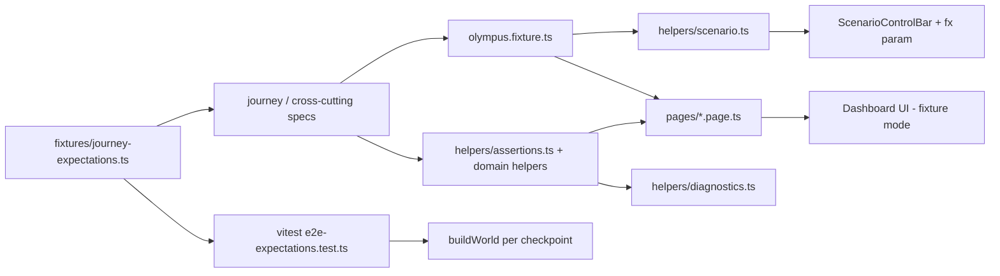

# Olympus Frontend — Playwright Four-Journey E2E Suite (Fixture Journeys)

**Status:** PLANNED (Plan mode, 2026-10-01). Build with Composer 2.5.
**Scope label:** `@frontend-e2e @fixture-journey` — FRONTEND EXPERIENCE tests over the deterministic checkpointed fixture world. **Not backend E2E proof.** Must never be cited as evidence for Phases 00–19 or §6 journey readiness in `STATUS.md`.

**Inputs:** `plans/frontend-four-journey-simulation.md` (canonical checkpoint narrative, §8; SHA ledger, §11; transparency surfaces, §6–7), `plans/frontend-ui-implementation.md`, `STATUS.md` §16, the existing `apps/dashboard` implementation and tests.

**Decisions taken with the user (2026-10-01):**
- **D1 Phased scope.** Build the suite and close the fixture and UI gaps it needs. Anything that is still missing becomes `test.step.skip` / `test.fixme` tagged `UI-GAP-xx` or `FX-GAP-xx`, and is listed in `COVERAGE.md`.
- **D2 ID canon.** Use the simulation-plan IDs already present in fixtures and unit tests. The prompt's example IDs are mapped in §3.

---

## 1. Current-state assessment (evidence)

### 1.1 Playwright

| Item | Today | File |
|---|---|---|
| Version | `@playwright/test` 1.63.0, `@axe-core/playwright` installed (unused) | `apps/dashboard/package.json` |
| Config | `testDir: tests/ui`, single project `fixture` (`grep: /@fixture/`), `trace: on-first-retry`, no retries, no screenshot or video, `webServer: npm run dev` with `NEXT_PUBLIC_OLYMPUS_DATA_MODE=fixture` | `apps/dashboard/playwright.config.ts` |
| Specs | `smoke.spec.ts` (hard-coded UUIDs, render-only assertions); `journey-feature-change.spec.ts` (clicks Next 3x with `waitForTimeout(300)`, asserts "Checkpoint 4/") | `apps/dashboard/tests/ui/` |
| Helpers / POMs | none | — |

### 1.2 Scenario Controller (reusable as is)

- `ScenarioControlBar` (`components/dev/ScenarioControlBar.tsx`): `data-testid="scenario-control-bar"`. Selects are labelled `Scenario`, `Checkpoint` and `Playback speed`. The buttons are `◀ Previous`, `▶ Next`, `⟲ Reset` and `▶ Play` / `❚❚ Pause`. The text is `Checkpoint {n}/{total} — {label}`. Position is held in `?fx=<scenario>:<checkpointId>`, with sessionStorage key `olympus.fx` as a fallback.
- Controller (`lib/fixtures/controller.ts`): `setPosition / next / previous / reset / setPlaying / setSpeed / subscribe`. A position change calls `invalidateQueries()` and emits fixture-stream checkpoint deltas.
- World state is **per browser JS realm**. It is rebuilt from `?fx=` on load. Each Playwright `BrowserContext` is therefore isolated by construction.
- `CheckpointDef.advancesOn` exists in `lib/fixtures/engine/checkpoint.ts`, but **nothing wires it up**.

### 1.3 Fixture world: the main finding

`buildWorld()` clones one static legacy "chained" seed (`lib/fixtures/scenarios/supportdesk/*`) and applies coarse index thresholds (`lib/fixtures/engine/world-variants.ts`). Compared with simulation-plan §8:

- **Checkpoint IDs.** Only 9 of 52 have real names. The rest are auto-filled `NN-stage` placeholders (`lib/fixtures/supportdesk/scenarios.ts`).
- **Greenfield (all checkpoints).** Tasks, executions and workspaces are cleared. There is no scope approval, no PROVISIONING state, no IC-001 gates and no evidence. Features are the single `FEAT-TICKETS`, and the product source is `PRD-SUPPORTDESK` with no status.
- **Brownfield.** `knowledgeItems`, `observedBehaviors` and `promotions` are empty, and discovery has no steps or entities. Baselines `BL-001..012` are generic. Recovered specs have no source entities.
- **Feature Change.** IC-003 becomes READY at index 10, but §8.3 says 08. EX-553/554 do not exist. There is no DC-003 eligibility row and no regression evidence.
- **Bug Fix.** TASK-303, EX-603, CODEIDX-R3-RC1, evidence, IC-005 gates and the EXPECTED_BEHAVIOR approval are all missing.
- **Global.** `evidence`, `obligations`, `releaseManifests`, `executionLeases`, `requirements`, `userStories` and `codeEntityChanges` are always empty. Index keys are `CODEIDX-IC-001` / `CODEIDX-IC-004`, not `CODEIDX-R1` / `CODEIDX-R3-RC1`.
- **SHA ledger.** `shaFor()` takes the 7-hex padding shortcut before checking the known-label map. As a result, `73fb91d` does not round-trip through `shortSha()`, and `gf-init-001` is 39 characters long and not hex.

### 1.4 UI: selectors and transparency gaps

- **Test IDs.** Only two exist: `scenario-control-bar` and `repository-summary-chip`. `TaskNode` has `aria-label="Task {key} {status}"`, and `LifecycleForge` has `aria-label="Delivery lifecycle forge"`.
- **`StatusBadge`.** Always renders the status as text, so status is not colour-only. That's good.
- **Placeholders or no-ops:**
  - Assurance `evidence` tab.
  - Release manifest; there is no release approve control.
  - Product `architecture` / `deltas` tabs; ProductTree `onSelectFeature` is not wired.
  - TaskInspector `specs / acceptance / artifacts / commits / evidence / findings` tabs.
  - Code `code-graph` / `traceability` tabs, and a dead `?tab=explorer` link.
  - Lineage has no direction or root controls and no clickable nodes.
  - Cycle Forge stage buttons do nothing.
  - EntityDrawer is a stub.
  - Agents `runtime` tab is `PendingCapability`.
- **SHA truncation.** Inconsistent across about 12 sites: some use `slice(0,12)`, `KV` uses `7…4`, and the IC list appends `…`. There is no single formatter and no machine-readable full SHA.
- **Detail routes.** `/executions/[id]`, `/releases/[id]`, `/integration-candidates/[id]`, `/defects/[id]`, `/impact/[id]` and `/change-requests/[id]` render outside `ProjectShell`. They have no ContextBar (project, cycle, journey), which is a state-clarity gap.
- **Mutations.** Only Inbox Approve / Request Changes / Reject change fixture state (`approvals.decide`). Cycle commands return `422 FIXTURE_NO_SCRIPT`, and `ConfirmCommandDialog` is unused.

---

## 2. Architecture



The key design point is that **`journey-expectations.ts` is the single source of expected facts**, and it is checked from two sides:
1. A **vitest guard** (`tests/unit/fixtures/e2e-expectations.test.ts`) builds every world and asserts that each expected fact exists in the data. A failure there is an **FX-GAP** (fixture).
2. **Playwright** asserts that the same facts are visible and navigable. If the world has the fact but Playwright fails, it is a **UI-GAP**. This split makes failures self-diagnosing.

### 2.1 Layout (adapted to repo conventions: `apps/dashboard/tests/`)

```
apps/dashboard/tests/e2e/olympus/
  fixtures/
    olympus.fixture.ts          test.extend: scenario, nav, pages, diag; auto-attach milestone screenshots
    journey-expectations.ts     stable keys + SHA ledger view (label/full/short) per scenario:checkpoint
  helpers/
    scenario.ts                 gotoCheckpoint, next, previous, reset, jump, play/pause, expectPosition, waitSettled
    navigation.ts               openProject(key), section(navLabel), selectCycle(key), openEntityLink(name)
    diagnostics.ts              ctx(journey, stage), check(dimension, expectation, fn), formatted messages
    assertions.ts               state-clarity + control-plane helpers
    lifecycle.ts                expectLifecycleStage, expectBlockedTransition, expectAllowedTransition
    execution.ts                expectExecutionContext, expectActionDecision, expectRetryLineage
    repository.ts               expectRepositoryTruth, expectCandidateNotCanonical, expectShaConsistency
    traceability.ts             traverseForward, traverseReverse, expectLineagePath
    assurance.ts                expectRecommendationVsGate, expectEvidenceCoverage, expectReleaseTarget, expectReleaseBlocked
    gaps.ts                     gapStep(id, reason) -> test.step.skip + annotation; FX/UI gap registry
    screenshots.ts              milestone(page, name) -> testInfo.attach + outputPath
  pages/                        (see section 5)
  journeys/
    greenfield.spec.ts  brownfield.spec.ts  feature-change.spec.ts  bug-fix.spec.ts
  cross-cutting/
    state-clarity.spec.ts  control-plane-transparency.spec.ts  execution-transparency.spec.ts
    repository-truth.spec.ts  traceability.spec.ts  cross-journey-consistency.spec.ts
    navigation-consistency.spec.ts  scenario-controls.spec.ts  accessibility.spec.ts
  COVERAGE.md
```

The legacy `tests/ui/` is retired. `smoke.spec.ts` moves into `navigation-consistency.spec.ts` with UUIDs removed and projects resolved by key. `journey-feature-change.spec.ts` is deleted because it relies on a sleep.

### 2.2 Playwright config changes (`apps/dashboard/playwright.config.ts`)

- Set `testDir: "tests/e2e"`. Use one project, `frontend-e2e-fixture`, with `grep: /@frontend-e2e/` on Desktop Chrome at a 1440x900 viewport.
- Retries are `process.env.CI ? 2 : 0`. Workers are `CI ? 2 : 3`, with `fullyParallel: true`.
- `use`: `trace: "retain-on-failure"`, `screenshot: "only-on-failure"`, `video: "retain-on-failure"`, `testIdAttribute: "data-testid"`.
- Set `expect.timeout` to 10_000. Set `timeout` to 60_000 by default; traversal tests call `test.setTimeout(240_000)`.
- Reporters are `[["list"], ["html", { open: "never", outputFolder: "playwright-report" }]]`, with `outputDir: "test-results/olympus"`.
- `webServer`: run `npm run build && npm run start` when `CI` or `E2E_PROD=1`. Otherwise run `npm run dev`. Use `timeout: 180_000` and keep the env `NEXT_PUBLIC_OLYMPUS_DATA_MODE=fixture`. The production build avoids first-compile latency, which is the main flake source with `next dev`.
- `package.json` scripts:
  - `test:e2e` runs `playwright test`.
  - `test:e2e:journeys` adds `--grep @fixture-journey`.
  - `test:e2e:flake` adds `--repeat-each=3`.
  - `test:e2e:report` runs `playwright show-report`.
- Read `node_modules/next/dist/docs/` before touching routes or `searchParams` (per `apps/dashboard/AGENTS.md`).

### 2.3 Tags

Every test has `@frontend-e2e @fixture-journey`. Journey tags are `@greenfield`, `@brownfield`, `@feature-change` and `@bug-fix`. Dimension tags are `@state`, `@control-plane`, `@execution`, `@lineage`, `@repository` and `@assurance`. Cross-cutting tests also have `@transparency`. Use Playwright's `tag` option (`test("…", { tag: [...] }, fn)`), not title strings.

---

## 3. ID canon and prompt mapping (D2)

The prompt's IDs are illustrative. The suite asserts the canon below. Mapping:

| Prompt example | Canonical fixture value | Notes |
|---|---|---|
| `r1-abc123` | `73fb91d` (IC-001 → R1; Runtime B clone HEAD) | §11.1 |
| `r2-def456` | `r2-def456` (IC-003 → R2) | unchanged |
| `r3-ghi789` via IC-004 | `r3-a41c9e0` via **IC-005**; IC-004 → `982af11` (SUPERSEDED, assurance-fail) | §8.4 |
| `CODEIDX-B1` | `CODEIDX-R1` (Runtime B REPOSITORY_SNAPSHOT) + BaselineSet `B1` | §8.2 |
| `CODEIDX-R3` (after IC-004) | `CODEIDX-R3-RC1` at IC-004; `CODEIDX-R3` at IC-005 | §11 |
| `DEF-001` | `DEF-004` | seed + §8.4 |
| `CR-001` | `CR-003` | seed |
| `PS-001` | `PS-001` (re-key seed `PRD-SUPPORTDESK`) | §8.1 |
| `EX-105-01 FAILED / EX-105-02 COMPLETED` | Greenfield `EX-112 FAILED` → `EX-115 COMPLETED`; Feature Change `EX-548 FAILED` → `EX-551` | §8.1, §8.3 |
| `TC-221-v1` | `TC-221` v1 (rendered `TC-221 v1`) | |
| `TASK-223` blocked by `TASK-222` | `TASK-224` BLOCKED, `DEPENDENCY_INCOMPLETE: TASK-222` (RUNNING, EX-552) at FC 04–05; READY at 06 | §7.1, §8.3 |
| `TASK-403 / EX-403` | `TASK-303 / EX-603` (origin FINDING FND-042, base `982af11` → `6c2d0b7`) | §8.4 |
| `BL-004` (observed 500) | Observed behaviour `OB-011` + UNCERTAINTY `U-03` ("CLOSED update unspecified; code raises ValueError → 500"). It is **not** a baseline. `BL-009` is the reopen baseline that fails at IC-004 | §8.2 |
| `ClosedTicketError` | `ValueError` from `Ticket.transition_to` at R2; `TicketClosedError` added at R3 | §11.2 |
| `TicketService.update_status` | `TicketService.update_ticket` | §8.4 |
| `TicketResponse` | `TicketRead` | §11.2 |
| `test_closed_ticket_update_returns_409` | `tests/olympus_repro/test_closed_ticket_update.py::test_closed_ticket_update_returns_409` (REG-004) | adopt name |
| `EV-REP-001` | adopt `EV-REP-001` (REPRODUCTION, FAIL, PRE_REPAIR, `r2-def456`) | new key |
| `repository.read / write_worktree / test.execute` | `repo.read` / `repo.write` / `test.run`, shown next to the brief name (`ActionTimeline`) | §7.3 |
| `ALLOWED / APPROVAL_REQUIRED` | policy `ALLOW` / status `PENDING_APPROVAL`, shown next to the brief label | §7.3 |
| Priority enum | **LOW / MEDIUM / HIGH, default MEDIUM**. This deviates from §8.3's `URGENT` to match the seed `CR-003` title and the prompt. Update the sim plan in E2E-02 | decision D5 |
| Bug-fix assurance fail | IC-004: Warden recommendation APPROVE with WARDEN gate PASS. **Sentinel recommendation FAIL** with SENTINEL gate FAIL, reason `EVIDENCE_MISSING: AC-004-03`. BASELINE gate FAIL from BL-009. FND-042 BLOCKER OPEN. R3 NOT_ELIGIBLE | decision D4; this reconciles seed (SENTINEL FAIL) with §8.4 (BASELINE FAIL); update §8.4 |
| Greenfield features | `FEAT-001 Create Ticket`, `FEAT-002 View Ticket`, `FEAT-003 List Tickets`, `FEAT-004 Update Ticket Status` (plus 4 more, for 8 total); FC resolves CR-003 to FEAT-001 / FS-001 v2 | §8.1 volume |

### 3.1 SHA presentation (D3)

- Add `lib/utils/sha.ts` with `formatShortSha(sha)` (12 characters, matching the dominant existing convention). Add `components/design/Sha.tsx`, which renders `<span data-testid="sha" data-sha={full} data-sha-role={role} title={full}>{short}</span>`. Replace every ad-hoc `slice(0, 12)` and `KV` SHA rendering with it.
- Fix the ordering bug in `shaFor()` (check the known-label map first) and make `gf-init-001` a valid 40-character value. Unit tests reference `SHAS.*` symbolically, so they keep passing.
- Repository-truth assertions compare **full SHAs via `data-sha`**, which gives exact equality. Visible-text assertions use `formatShortSha`. Expectations expose `{ label: "r2-def456", full, short }`, so failure messages use the human label.

---

## 4. Fixture, reset and diagnostics strategy

### 4.1 Reset and isolation
- Each test gets a fresh `BrowserContext`, so JS module state and sessionStorage start clean. Each test deep-links `?fx=<scenario>:<checkpoint>`, so there is **no cross-test state**.
- `scenario.gotoCheckpoint(scenario, checkpoint, route?)` loads `route?fx=…` and waits until the position is reached and queries have settled (see 4.2).
- `scenario.reset()` clicks `⟲ Reset` and asserts checkpoint 00 of the current scenario. It is covered in `scenario-controls.spec.ts`.
- A mutation test (Inbox approve) only changes its own context. A guard test reloads the same `fx` in a new page and asserts the approval is back to PENDING (no leakage). This covers "no test mutates unrelated scenario state".

### 4.2 Deterministic waits (no `waitForTimeout` anywhere)
Add the following to `ScenarioControlBar`:
- `data-scenario`, `data-checkpoint-id`, `data-checkpoint-index` and `data-runtime` attributes;
- `data-query-state="idle|fetching"`, from `useIsFetching()` (React Query).

`scenario.waitSettled()` does three things: it expects `data-checkpoint-id` to equal the target, it expects `data-query-state` to be `idle`, and it expects the URL to contain `fx=<scenario>:<checkpoint>`. Journey assertions then wait on semantic content (`toHaveText` / `toHaveAttribute`). An ESLint rule (`no-restricted-properties` on `page.waitForTimeout`) is scoped to `tests/e2e/**`.

### 4.3 Approval-driven advancement (`advancesOn`)
- Wire `CheckpointDef.advancesOn.approval_key`. When fixture `approvals.decide(APPROVE)` runs on an approval whose key matches the current checkpoint's `advancesOn`, the controller calls `next()`. This reuses the existing Inbox mutation, so no new mutation paths are needed.
- Advancing checkpoints:
  - Greenfield `02-scope-approval` (APR-001 SCOPE) → 03.
  - Greenfield `13-release-ready` (APR-004 RELEASE) → 14.
  - Brownfield `10-human-review` (APR-010 PROMOTION batch) → 11.
  - Feature Change `10-release-ready` (APR-R2) → 11.
  - Bug Fix `02-expected-behavior` (APR-EB-004) → 03.
  - Bug Fix `10-assurance-pass` (APR-221 RELEASE R3) → 11.
- Reject or Request Changes does **not** advance. The blocker stays visible, and that is asserted.
- The checkpoint at N shows **PENDING**. The approved state is N+1, so the timeline in §8 shifts by "pending at N, approved at N+1".

### 4.4 Diagnostics
`diag.check({ journey, stage, dimension }, expectation, async () => …)` wraps `test.step(`[${journey}][${stage}][${dimension}] ${expectation}`)`. Inside the step, assertions use Playwright's custom message (`expect(locator, msg)`). The message carries the expected value and the observed value (read with `locator.textContent()` / `getAttribute` in a `catch` before rethrowing). Example:

```
[FEATURE_CHANGE][07-integration][REPOSITORY_TRUTH]
Expected canonical SHA to remain 73fb91d before IC-003 is READY. Observed r2-def456.
```

Per-checkpoint matrix tests use `expect.soft` so that one run reports every failing dimension. A final `expect(test.info().errors).toHaveLength(0)` keeps the test failing.

`gaps.gapStep("UI-GAP-07", "Evidence registry not rendered", fn)` uses `test.step.skip` and adds an annotation `{ type: "ui-gap", description }`. `COVERAGE.md` lists each gap ID. As gaps close, the skip is removed.

---

## 5. Page Objects (one per screen; locators by role, label, test ID)

| Page Object | Route(s) | Key members |
|---|---|---|
| `shell.page.ts` | ContextBar, NavRail, ScenarioControlBar, CycleSwitcher, RepositorySummaryChip | `projectContext`, `cycleContext`, `journeyContext`, `nav(label)`, `cycleLink(key)`, `repoChip` |
| `command-center.page.ts` | `/projects/{pid}?cycle=` | `cycleHeader`, `stageBadge`, `objective`, `macroForge`, `lifecycle`, `controlPlaneStrip`, `activeExecution(key)`, `statusTiles`, `liveTimeline` |
| `lifecycle.page.ts` | `/projects/{pid}/cycles/{cid}` | `stage(state)`, `activeStage`, `transition(command)` with allowed/blocked + reasons |
| `control-plane.page.ts` | `/control-plane` | `decision(questionKind)` → outcome + conditions + refs; scheduler blocked/ready lists |
| `product.page.ts` | `/product?tab=tree|specs|architecture|deltas&spec=` | `source(key)`, `capability`, `feature(name)`, `spec(key, version)`, `reqs/stories/acs`, `delta(v1, v2)` |
| `tasks.page.ts` | `/cycles/{cid}/tasks?task=&tab=` | `node(key)` (aria-label `Task {key} {status}`), `inspector.tab(name)`, `contract`, `eligibility`, `dependencies` |
| `execution.page.ts` | `/executions` list, `/executions/{id}` | `chain` (Task→TC→EX→Snapshot→Lease→Worktree→Runtime), `workspace`, `candidateCommit`, `actions`, `retryLineage` |
| `agents.page.ts` | `/agents?tab=capabilities|runtime|actions` | `lane(profile)`, `action(key)` → decision + governance pipeline steps |
| `repository.page.ts` | `/code?tab=repository|workspaces|commits` | `header` (source, provider, remote, auth, canonical/released SHA, WS, index), `materialization`, `workspaces`, `ledger` |
| `code-intelligence.page.ts` | `/code?tab=index-history|code-graph|search|explorer&entity=` | `indexVersion(key)` (kind, role pointer, SHA), `entity(stableKey)`, `relations(kind)`, `search(q)` |
| `lineage.page.ts` | `/lineage?root_type&root_id&direction` | `setDirection`, `node(type, key)`, `follow(type, key)`, `edge(rel)` |
| `impact.page.ts` | `/impact`, `/impact/{id}` | `group(DIRECT|TRANSITIVE|SEMANTIC_CANDIDATE)`, `item(stableKey).why`, `baselines`, `obligations` |
| `brownfield.page.ts` | `/brownfield?tab=pipeline|facts|recovered|baselines|readiness` | `step(name)`, `knowledge(class, text)`, `recoveredSpec(key)` (origin, confidence, sources, review), `baseline(key)`, `readiness` |
| `change-request.page.ts`, `defect.page.ts` | `/change-requests/{id}`, `/defects/{id}` | CR fields; repro, expected behaviour, code path, root cause, regression test |
| `integration.page.ts` | `/cycles/{cid}/integration`, `/integration-candidates/{id}` | `ic(key)` (status rail, base, integrated SHA), `commits` table, `checks`, `supersession` |
| `assurance.page.ts` | `/assurance?tab=control-room|gates|findings` | `recommendation(profile)`, `gate(type)`, `finding(key)`, `whyGateFailed` |
| `evidence.page.ts` | `/assurance?tab=evidence` | `evidence(key)` (subject, result, SHA, "== IC" check), `acCoverage(fs)` |
| `attention.page.ts` | `/inbox` | `item(key)` (type, why, affected refs, risk), `approve/reject/requestChanges(key)` |
| `release.page.ts` | `/releases`, `/releases/{rid}` | `release(key)`, `condition(name)` + link, `manifest` (IC, SHA, index, spec versions, gates, approvals, evidence) |
| `audit.page.ts` | `/audit?project=&cycle=` | `event(type)`, filter, correlation trace |

Navigation resolves IDs **through the UI**. `openProject("SUPPORTDESK")` goes through `/projects`, `selectCycle("DC-003")` uses the CycleSwitcher, and detail routes open from list links. Specs contain no UUIDs.

---

## 6. Selector / data-testid additions (only where role or label is not enough)

Test IDs are templated from entity **keys** at render time. This keeps `fixture-isolation.test.ts` green, because no fixture literals appear in `app/` or `components/`.

| test id (template) | Component | Extra attributes |
|---|---|---|
| `project-context`, `delivery-cycle-context`, `journey-context` | `ContextBar` (and new `EntityContextHeader` on detail routes) | `data-key`, `data-type` |
| `lifecycle-stage-{STATE}` | `LifecycleForge`, `MacroForge` | `data-stage-state=ACTIVE|COMPLETE|PENDING|BLOCKED|FAILED`, `aria-current="step"` on the active stage |
| `stage-objective`, `next-transition` | `CycleHeader` / Cycle Forge | `data-allowed`, reasons list |
| `decision-{QUESTION_KIND}-{subjectKey}` | `DecisionExplainer` | `data-outcome`; conditions `decision-condition-{name}` with `data-ok` |
| `task-{KEY}` | `TaskNode`, list twin | `data-status` |
| `task-contract-{KEY}-v{n}` | `ContractView`, `ExecutionChain`, `ActiveExecutionPanel` | — |
| `execution-{KEY}` | execution rows/cards/chain | `data-status`, `data-attempt`, `data-retry-of` |
| `execution-workspace-{KEY}` | workspaces tab, execution page | `data-canonical="false"`, `data-mode` |
| `lease-{executionKey}` / `runtime-{executionKey}` | `ExecutionChain` | — |
| `action-{KEY}` | `ActionTimeline` | `data-decision=ALLOW|DENY|REQUIRE_APPROVAL`, `data-status` |
| `candidate-commit-{short}` | execution page, commits tab, IC table | `data-canonical="false"` |
| `integration-candidate-{KEY}` | `IcForge`, IC detail | `data-status` |
| `repository-canonical-sha`, `repository-released-sha` | `RepositoryHeader`, chip | via `Sha` (`data-sha`) |
| `code-index-{KEY}` | `IndexStatusBar`, index history | `data-kind`, `data-pointer="canonical"` |
| `code-entity-{stableKey-slug}` | explorer/search | `data-type` |
| `lineage-node-{type}-{key}` | `LineageExplorer` | — |
| `knowledge-{CLASS}-{key}` | `KnowledgeChip` | — |
| `recovered-spec-{KEY}` | brownfield recovered | `data-origin`, `data-review`, `data-canonical` |
| `baseline-{KEY}` | baselines | `data-status` |
| `gate-{TYPE}-{icKey}` / `recommendation-{PROFILE}-{icKey}` | `RecommendationVsGate` | `data-status` |
| `finding-{KEY}` | findings | `data-severity`, `data-status` |
| `evidence-{KEY}` | evidence registry | `data-result`, `data-sha` |
| `approval-{KEY}` | inbox | `data-status` |
| `release-{KEY}`, `release-manifest-{KEY}`, `release-condition-{name}` | release list/detail | `data-status`, `data-ok` |
| `sha` | `Sha` component | `data-sha`, `data-sha-role=canonical|candidate|integrated|base|released|evidence|manifest|index` |

---

## 7. Gap closure (prerequisites for the journeys)

### 7.1 Fixture gaps (FX), authored per simulation plan §8 with §3 mapping
Use per-checkpoint apply modules under `lib/fixtures/supportdesk/runtime-a/greenfield/NN-*.ts` and `runtime-b/{brownfield,feature-change,bug-fix}/NN-*.ts`, as §9 already prescribes. Author **assertion-driven** content: every fact in `journey-expectations.ts` must exist, but not every §15 volume target is required.

- **FX-01** Real checkpoint IDs and labels for all 52 checkpoints. No `NN-stage` remains. Each checkpoint has `narrative`, `lookAt` and `advancesOn` (§4.3).
- **FX-02** Greenfield 00–14:
  - Cycle states: DISCOVERY → PRODUCT_MODEL → ARCHITECTURE → PLANNING → DEVELOPMENT → INTEGRATION → ASSURANCE → RELEASE → COMPLETE.
  - Product: PS-001 PRD INGESTED; 3 capabilities; FEAT-001..008 (named as in §3); FS v1 with REQ/US/AC, provenance and status.
  - APR-001 SCOPE; REPO-001 PROVISIONING → READY at `gf-init-001`; ARCH-001; IS-101..110 → FS links.
  - Tasks TASK-101..124 with a DAG, TASK-110 BLOCKED, and TC-1xx v1.
  - Executions EX-111..114, EX-112 FAILED → EX-115 COMPLETED, with leases and snapshots.
  - Actions: `repo.read` / `repo.write` / `test.run` ALLOW, `repo.write` out-of-scope DENY, `shell.run pip install` PENDING_APPROVAL.
  - Candidate commits; IC-001 → `73fb91d` with integration checks; CODEIDX-R1; entities per §11.2, including `TicketCreate` and `TicketRead`.
  - Warden EX-140 and Sentinel EX-141/142; gates INTEGRATION/WARDEN/SENTINEL PASS; evidence per mandatory AC at `73fb91d`.
  - R1 manifest; APR-004.
- **FX-03** Brownfield 00–11:
  - Fresh Runtime B; REPO-001 EXTERNAL_CLONE / GITHUB / remote; `credential_status=CONFIGURED`.
  - Materialization steps REGISTERED → CLONING → VALIDATING → READY; HEAD `73fb91d`; WS-001.
  - CODEIDX-R1 snapshot; discovery steps and entities (routes, functions, schemas, ORM, tests).
  - `knowledgeItems`: FACT ("PATCH /tickets/{id} calls TicketService.update_ticket"), INFERENCE ("likely Feature: Ticket Status Management") and UNCERTAINTY U-03; observed behaviour OB-011 (500).
  - 7 recovered specs (origin RECOVERED, confidence, source CodeEntities, review status).
  - BL-001..010 (BL-009 reopen); APR-010 promotion; BaselineSet B1; READY_FOR_CHANGE.
- **FX-04** Feature Change 00–11:
  - CR-003; FS-001 v1 → v2 delta (priority LOW/MEDIUM/HIGH, default MEDIUM, AC-001-05..08).
  - IA-003: DIRECT `Ticket.priority` / `TicketCreate.priority` / `TicketRead.priority`; TRANSITIVE `TicketService.create_ticket` / `TicketRepository.create`; why-paths; baselines BL-001/003/005.
  - TASK-221..227 with TC-221..227 v1; TASK-224 BLOCKED → READY.
  - EX-548 FAILED → EX-551; EX-552 DENY; EX-553 PENDING_APPROVAL; EX-554; candidates `aaa5511..ddd5544`.
  - **IC-003 READY and canonical `r2-def456` at 08, not 10.** CODEIDX-R2 with R1→R2 entity changes.
  - Regression evidence; gates INTEGRATION/WARDEN/SENTINEL/BASELINE/REGRESSION PASS; DC-003 eligibility; R2 manifest; APR-R2.
- **FX-05** Bug Fix 00–11:
  - DEF-004 (affected `r2-def456`); EV-REP-001 FAIL; expected behaviour UNKNOWN with APR-EB-004 → 409 (FS-004 AC-004-03 DECISION).
  - TraceCorrelation path (§3); REG-004 FAIL; RS-004; TASK-302 / TC-302 / EX-602 → `5e1f0aa`.
  - IC-004 → `982af11` and CODEIDX-R3-RC1; assurance fail per D4; FND-042.
  - TASK-303 / TC-303 / EX-603 (base `982af11` → `6c2d0b7`); IC-005 → `r3-a41c9e0` superseding IC-004; CODEIDX-R3.
  - Targeted revalidation: only the affected obligations are re-run, and evidence shows `reused` / `re-run` status. Gates PASS; FND-042 RESOLVED; R3 manifest; release approval.
- **FX-06** SHA ledger fix (§3.1); index keys `CODEIDX-R1` / `CODEIDX-R3-RC1` (replacing `CODEIDX-IC-00x`).
- **FX-07** Vitest guard `tests/unit/fixtures/e2e-expectations.test.ts`. Extend `consistency-rules.test.ts` for the moved IC-003 checkpoint (08) and for IC-001/R1 and IC-005/R3 manifests (§10 rule 9).

### 7.2 UI gaps (UI), with minimal, targeted changes to existing components
- **UI-01** `Sha` component plus formatter, used everywhere (§3.1).
- **UI-02** Context test IDs; `EntityContextHeader` (project, cycle, journey) on the six detail routes outside `ProjectShell`.
- **UI-03** Lifecycle stage semantics: `data-stage-state` and `aria-current`; a visible stage-state label (text, not colour); objective; next transition with allowed/blocked reasons on Command Center and Cycle Forge.
- **UI-04** Product: wire `onSelectFeature` → `?spec=`; the specs tab shows REQ/US/AC, version, status, origin and provenance; the deltas tab shows v1↔v2; the architecture tab lists ARCH and IS with FS links.
- **UI-05** TaskInspector: fill the specs, acceptance, commits, evidence and findings tabs from existing services.
- **UI-06** Execution page:
  - real lease (worker, heartbeat) instead of the static label;
  - current resource and current action;
  - retry lineage list;
  - candidate commit labelled `CANDIDATE — NOT CANONICAL` until its IC is READY, then "Integrated via IC-x into {sha}".
- **UI-07** Evidence registry (`assurance?tab=evidence`): key, subject (AC/BASELINE/DEFECT), result, SHA with "== IC integrated_sha" check, producer, plus AC coverage.
- **UI-08** Release detail: `ManifestView` (IC, SHA, CODEIDX, FeatureSpec versions, gates, approvals, evidence, baseline set), condition rows with links, and an **Approve** control enabled only when the release is ELIGIBLE. It opens the matching Inbox approval or calls the same `approvals.decide`.
- **UI-09** Lineage: direction toggle (FORWARD/REVERSE); clickable nodes that re-root via `root_type` / `root_id`; links from symbol, spec and evidence screens into lineage.
- **UI-10** Code: real `explorer` tab (entity detail with relations, implements and verified-by); the index-history tab shows the canonical pointer, candidate vs canonical kind, and R1→R2 compare (entity changes).
- **UI-11** Brownfield: pipeline steps; facts tab from `knowledgeItems` plus observed behaviours; recovered specs show origin, confidence, source entities, review status and `RECOVERED — NOT CANONICAL` until promoted; baseline descriptions.
- **UI-12** Defect page: expected behaviour (UNKNOWN → decided), code path chain, root cause linked to Feature/FS/CodeEntity, regression test status, reproduction evidence.
- **UI-13** Inbox: show approval subject refs, affected features/specs and risk/context (`why`) for SCOPE, PROMOTION, EXPECTED_BEHAVIOR, ACTION and RELEASE approvals.
- **UI-14** Integration Forge: commits table (position, task, EX, SHA), integration checks, status rail, supersession chain.
- **UI-15** `ActionTimeline`: brief name next to backend tool name; decision label (ALLOWED/DENIED/APPROVAL_REQUIRED); "Why denied?" `DecisionExplainer`.

Out of scope (recorded as gaps, not built): Agents `runtime` tab (`PendingCapability`, backend M-07); EntityDrawer full inspector; Cycle Forge stage-click selection; Code graph visualization.

---

## 8. Journey test cases

Structure for every journey spec:
1. **Per-checkpoint tests**, one `test()` per checkpoint. Each deep-links `?fx=`, so they are independent and parallel. Each runs the five-dimension matrix for that checkpoint with soft assertions.
2. **Traversal test** (`test.describe.serial` is not needed). One test starts at 00 and uses **▶ Next** to reach the final checkpoint. At each step it asserts the headline fact (stage plus one key entity) and checks that the position and URL advance. This proves controller continuity.
3. **Interaction tests**: approvals through Inbox with `advancesOn` (approve advances; reject keeps the blocker).
4. **Milestone screenshots** via `screenshots.milestone()`.

Legend: **S** = state clarity, **C** = control plane, **E** = execution, **T** = traceability, **R** = repository truth. "n/a" gives the reason.

### 8.1 Greenfield (`greenfield.spec.ts`, Runtime A, DC-001 GREENFIELD_BUILD)

| Checkpoint | S | C | E | T | R |
|---|---|---|---|---|---|
| 00-intake | SupportDesk, DC-001, GREENFIELD_BUILD, stage DISCOVERY ACTIVE, objective | n/a (no gated work yet) | n/a (no executions) | PS-001 PRD INGESTED is the lineage root | REPO-001 PROVISIONING, canonical SHA "—", no Release |
| 01-product-model | PRODUCT_MODEL | n/a | EX-101 Kira decompose visible in Agents | 3 capabilities; FEAT-001..004 names; click Create Ticket → FS-001 v1 PROPOSED, REQ/US/AC, provenance PS-001 | unchanged pre-provisioning |
| 02-scope-approval | PRODUCT_MODEL, waiting on approval | APR-001 SCOPE PENDING in Inbox with affected FEAT/FS, risk/context; **Approve → advances to 03** | n/a | approval refs link to FS | unchanged |
| 03-repository-provisioned | APR-001 APPROVED recorded (Inbox + Audit `approval.decided`) | — | n/a | — | REPO-001 GREENFIELD_MANAGED / LOCAL, materialization PROVISIONING → READY, WS-001, canonical `gf-init-001`; "source of truth is the repository/workspace" wording (no "database" wording) |
| 04-architecture / 05-implementation-specs | ARCHITECTURE | ARCHITECTURE approval APPROVED | EX-102 Atlas | ARCH-001; IS-104 → FS-001 link; components listed | canonical `gf-init-001` |
| 06-task-plan | PLANNING | `start_planning` guard ✓ base pinned; TASK-110 BLOCKED with exact dependency | n/a | TASK-10x → TC-10x v1, FS/IS/AC refs, deps, expected outputs | DAG base_sha = `gf-init-001` |
| 07-development-started | DEVELOPMENT ACTIVE | TASK-101..104 READY/eligible reasons | EX-111 chain: Task, TC, Execution, Snapshot, Runtime, Model alias, Base `gf-init-001`, Worktree `olympus/EX-111`, Lease | Task → Execution link | Execution workspace `NOT CANONICAL`, distinct from WS-001 |
| 08-development-running | DEVELOPMENT | `repo.write` DENY + reason; `shell.run` APPROVAL_REQUIRED + approval; TASK-110 blocker | EX-112 FAILED kept; EX-115 retry (attempt 2, retry-of EX-112) COMPLETED; history unchanged when navigating back | — | candidate commits not canonical |
| 09-candidate-commits | DEVELOPMENT complete | `start_integration` guard ✓ (allowed) | candidate SHA on executions | Execution → Commit | 14 candidates labelled CANDIDATE, canonical still `gf-init-001` |
| 10-integration | INTEGRATION | integration checks PASS | SYSTEM integration execution | candidate commits converge into IC-001 (table) | IC-001 integrated `73fb91d`; canonical **still** `gf-init-001` until READY |
| 11-canonical-reindex | INTEGRATION | IC-001 READY | — | CodeEntity lineage: Create Ticket → FS-001 → IS-104 → TASK → EX → commit → `TicketService.create_ticket` → `test_create_ticket` | canonical = `73fb91d` = CODEIDX-R1 pointer; entities `POST /tickets`, `create_ticket`, `TicketService.create_ticket`, `TicketRepository.create`, `Ticket`, `TicketCreate`, `TicketRead`, `test_create_ticket`; candidate indexes DISCARDED |
| 12-assurance | ASSURANCE | Warden recommendation APPROVE ≠ WARDEN gate PASS (shown separately); Sentinel rec PASS / gate PASS | EX-140/141/142 | Evidence → AC; mandatory ACs covered | target IC-001 / `73fb91d` everywhere |
| 13-release-ready | RELEASE, waiting | R1 ELIGIBLE, every condition ✓; APR-004 PENDING; **Approve → 14** | — | — | manifest SHA `73fb91d` |
| 14-released | COMPLETE | APR-004 APPROVED | — | Release → IC-001 (reverse) | R1 RELEASED; same full SHA in IC-001, CODEIDX-R1, assurance, evidence, manifest, released SHA. **Milestone: GF-R1** |

### 8.2 Brownfield (`brownfield.spec.ts`, Runtime B, DC-002 BROWNFIELD_ONBOARDING)

| Checkpoint | S | C | E | T | R |
|---|---|---|---|---|---|
| 00-registration | DC-002 BROWNFIELD_ONBOARDING, RECON; control bar shows Runtime B; no Greenfield executions or agent history (EX-1xx absent) | — | n/a | — | EXTERNAL_CLONE / GITHUB / `https://github.com/acme/supportdesk`; **no credential value in DOM** (scan page text for `credential_ref` value / token patterns); REGISTERED |
| 01–04 | stage RECON, step progression | — | n/a | — | Authentication: CONNECTED; CLONING (progress) → VALIDATING → HEAD resolved `73fb91d` |
| 05-workspace-ready | — | — | n/a | — | WS-001 READY; canonical = registered = `73fb91d` |
| 06-code-index | CODE_INDEX | `start_code_index` pinned base | — | — | CODEIDX-R1 (REPOSITORY_SNAPSHOT) READY at `73fb91d` |
| 07-discovery | CODE_INDEX | — | test run (11 passed) | explorer: files, routes, functions, schemas, ORM models, tests | — |
| 08-recovered-specs | RECOVERED_SPEC | — | EX-501..504 | FACT / INFERENCE / UNCERTAINTY each visually and textually distinct (chip label + icon); recovered FS origin RECOVERED, confidence, source entities, review UNREVIEWED, `NOT CANONICAL` | — |
| 09-baselines | BASELINE | — | EX-506/507 | BL-009 described; OB-011 (HTTP 500) labelled observed behaviour / UNCERTAINTY U-03, **not** a requirement or AC | baselines at `73fb91d` |
| 10-human-review | READINESS, waiting | APR-010 PROMOTION PENDING (6 promote, 1 reject); specs still RECOVERED; **Approve → 11** | — | — | — |
| 11-ready-for-change | READY_FOR_CHANGE | readiness metrics ✓ | — | promoted FS now canonical (HUMAN_CONFIRMED); lineage + code intelligence still navigable | BaselineSet B1, CODEIDX-R1. **Milestone: BF-READY** |

### 8.3 Feature Change (`feature-change.spec.ts`, DC-003 FEATURE_CHANGE)

| Checkpoint | S | C | E | T | R |
|---|---|---|---|---|---|
| 00-intake | DC-003 FEATURE_CHANGE INTAKE; CR-003 "Add ticket priority: LOW, MEDIUM, HIGH" | — | EX-540 | CR-003 → FEAT-001 | canonical `73fb91d` |
| 01-spec-delta | SPEC_DELTA | SPEC_DELTA approval | — | FS-001 v1 vs v2: priority enum LOW/MEDIUM/HIGH, default MEDIUM, new AC-001-05..08; v1 unchanged | — |
| 02-impact | IMPACT_ANALYSIS | — | — | DIRECT `Ticket.priority`, `TicketCreate.priority`, `TicketRead.priority`; TRANSITIVE `TicketService.create_ticket`, `TicketRepository.create`; click item shows the why-path; tests and baselines BL-001/003/005. **Milestone: FC-IMPACT** | impact at CODEIDX-R1 / `73fb91d` |
| 03-planning | PLANNING | TASK-224 deps on 222/223 | — | TASK-221..227, TC-22x v1 → IS-104 v2 → FS-001 v2 | — |
| 04-development-started | DEVELOPMENT | TASK-224 BLOCKED: `DEPENDENCY_INCOMPLETE: TASK-222 (RUNNING, EX-552)` | EX-548, EX-552, EX-553 | — | workspaces at base `73fb91d` |
| 05-development-running | DEVELOPMENT | `start_integration` DENIED ("Why is integration unavailable?"); EX-552 `repo.write app/main.py` DENIED (`path_in_allowed_scope`); EX-553 APPROVAL_REQUIRED | EX-551: TASK-221, TC-221 v1, Snapshot, Runtime LangGraphRuntime, model `implementation`, base `73fb91d`, `olympus/EX-551`, lease, current action, uncommitted files; EX-548 FAILED, retry-of chain | — | canonical `73fb91d`; workspaces NOT CANONICAL |
| 06-candidate-commits | DEVELOPMENT | TASK-224 READY (allowed); `start_integration` allowed | EX-554 | EX-551 → `aaa5511` | candidates `aaa5511..ddd5544` ≠ canonical |
| 07-integration | INTEGRATION | checks PASS | EX-555 SYSTEM | 4 candidates → IC-003 | IC-003 integrated `r2-def456`, **canonical still `73fb91d`** |
| 08-canonical-reindex | INTEGRATION | IC-003 READY | — | entity changes R1→R2 (ADDED `TicketPriority`, `Ticket.priority`) | canonical `r2-def456` = CODEIDX-R2 pointer |
| 09-assurance | ASSURANCE | gates INTEGRATION/WARDEN/SENTINEL/BASELINE/REGRESSION PASS, each separate from its recommendation | EX-556/557 | new AC evidence; BL-001/003/005 PASS | evidence SHA `r2-def456` |
| 10-release-ready → 11-released | RELEASE → COMPLETE | R2 ELIGIBLE; APR-R2 **Approve → 11** | — | Release → IC-003 | R2 manifest `r2-def456`; same SHA across IC, repo, index, assurance, evidence, release. **Milestone: FC-R2** |

### 8.4 Bug Fix (`bug-fix.spec.ts`, DC-004 BUG_FIX)

| Checkpoint | S | C | E | T | R |
|---|---|---|---|---|---|
| 00-defect-intake | DC-004 BUG_FIX TRIAGE; DEF-004 "Updating a CLOSED ticket returns HTTP 500" | — | EX-600 | DEF-004 → U-03 (Brownfield) | affected `r2-def456` |
| 01-reproduction | REPRODUCTION | — | EX-601 READONLY workspace | `PATCH /tickets/{id}`, precondition status CLOSED, observed HTTP 500, EV-REP-001 FAIL. **Milestone: BUG-REPRO** | workspace detached at `r2-def456`, NOT CANONICAL |
| 02-expected-behavior | EXPECTED_BEHAVIOR waiting; expected behaviour **UNKNOWN** | APR-EB-004 in Inbox; **Approve → 03** | — | — | — |
| 03-root-cause | ROOT_CAUSE | — | EX-604 (INFERENCE, not Evidence) | expected 409 CONFLICT → FS-004 AC-004-03; path `PATCH /tickets/{id}` → `update_ticket` → `TicketService.update_ticket` → `Ticket.transition_to` → ValueError → unhandled 500; root cause → FEAT/FS/CodeEntity | — |
| 04-repair-spec | ROOT_CAUSE | REPAIR_SPEC approval | — | REG-004 `test_closed_ticket_update_returns_409` FAIL; TASK-302 / TC-302 | — |
| 05-repair-execution | DEVELOPMENT | actions governed | EX-602: Task, TC-302, worktree `olympus/EX-602`, base `r2-def456`, actions, candidate `5e1f0aa` | — | candidate not canonical |
| 06-integration | INTEGRATION | — | — | — | IC-004 `982af11`; CODEIDX-R3-RC1 |
| 07-assurance-fail | ASSURANCE **FAILED/BLOCKED** | Sentinel recommendation FAIL; SENTINEL gate FAIL `EVIDENCE_MISSING: AC-004-03`; BASELINE gate FAIL (BL-009); Warden recommendation APPROVE vs gates; FND-042 BLOCKER; R3 NOT_ELIGIBLE with the exact conditions (§7.1 of sim plan). **Milestone: BUG-ASSURANCE-FAIL** | — | Finding → gate → release condition links | target IC-004 / `982af11` |
| 08-remediation | DEVELOPMENT (loop arc) | TASK-303 origin FINDING FND-042 | EX-603 base `982af11` → `6c2d0b7` | — | earlier stages stay COMPLETE: PRODUCT, TRIAGE, REPRODUCTION, etc. are not reset |
| 09-reintegration | INTEGRATION | IC-004 SUPERSEDED by IC-005 | — | — | IC-005 `r3-a41c9e0`; CODEIDX-R3 |
| 10-assurance-pass | ASSURANCE → RELEASE waiting | targeted revalidation (only affected obligations re-run, others reused); Warden PASS, Sentinel PASS, all required gates PASS; FND-042 RESOLVED (resolved_by IC-005); R3 ELIGIBLE; **Approve → 11** | — | new evidence → AC-004-03 | evidence SHA `r3-a41c9e0` |
| 11-released | COMPLETE | — | — | DEF-004 RELEASED | R3 manifest `r3-a41c9e0`; same SHA across repo, CODEIDX-R3, assurance, evidence, release; final behaviour "PATCH CLOSED → 409". **Milestone: BUG-R3** |

---

## 9. Cross-cutting specs

- **`state-clarity.spec.ts`**: a table-driven test over representative checkpoints (GF 00/08/14, BF 00/11, FC 05/07, BUG 07/11). It runs `expectStateClarity({ project, cycle, journey, stage, stageState, objective, blocker?, next? })`, plus "stage state is text, not colour only".
- **`control-plane-transparency.spec.ts`**:
  - task blocked by dependency (FC 04 TASK-224) → allowed (FC 06);
  - lifecycle transition `start_integration` blocked (FC 05) → allowed (FC 06);
  - ActionRequest ALLOW (GF 07 `repo.read`), DENY (FC 05 EX-552), APPROVAL_REQUIRED (FC 05 EX-553);
  - gate FAIL due to missing evidence (BUG 07 SENTINEL);
  - release blocked by gate and by finding (BUG 07);
  - eligible after remediation (BUG 10);
  - Inbox Reject keeps the release blocked (BUG 10, Reject).
- **`execution-transparency.spec.ts`**: for EX-111, EX-115 (retry), EX-551, EX-602 and EX-603, every one of Task, TaskContract, Execution, Snapshot, Runtime, Model alias, Base SHA, Lease, Worktree, Resources, Actions, Candidate Commit and Retry lineage is reachable from both the Task inspector and the Execution page.
- **`repository-truth.spec.ts`** covers each journey's integration window (GF 09–11, FC 06–08, BUG 05–06 and 08–09). It asserts:
  - before integration: candidate ≠ canonical;
  - integrated SHA is visible before canonicalization;
  - canonical == integrated after READY;
  - CodeIndex pointer SHA == canonical;
  - assurance target == evidence SHA == manifest SHA.

  All comparisons use `data-sha` full values.
- **`traceability.spec.ts`**:
  - Forward: FEAT-001 → FS-001 v2 → IS-104 v2 → TASK-223 → TC-223 v1 → EX-553 → `ccc5533` → IC-003 → `TicketService.create_ticket` → test → evidence → R2. This uses clickable links, not URL jumps.
  - Reverse: CodeEntity → FS → Feature; Evidence → AC; Commit → Execution; Release → IC.
  - Greenfield R1 variant: Create Ticket → … → R1.
- **`cross-journey-consistency.spec.ts`**:
  - SUPPORTDESK persists through DC-001..DC-004.
  - Release history R1/R2/R3 at BUG 11.
  - Revision ledger `73fb91d → r2-def456 → (982af11 superseded) → r3-a41c9e0`.
  - Index history CODEIDX-R1, R2, R3-RC1, R3 with the pointer at R3. Brownfield B1 is shown as BaselineSet with index CODEIDX-R1.
  - IC-004 never appears in a manifest.
- **`navigation-consistency.spec.ts`** (replaces `smoke.spec.ts`): every NavRail entry at each final checkpoint keeps `fx` and the cycle. No `empty-state` appears where the world has data (sim plan "screens-populated"). Detail routes show `EntityContextHeader`.
- **`scenario-controls.spec.ts`**:
  - Previous/Next/Jump/Reset;
  - Play then Pause, verified by polling `data-checkpoint-index` with `expect.poll`;
  - scenario switch changes runtime A↔B;
  - URL and sessionStorage persistence across navigation;
  - mutation isolation (§4.1).
- **`accessibility.spec.ts`**: axe (`@axe-core/playwright`) with no critical or serious violations on Command Center, Tasks, Execution, Repository & Code, Integration, Assurance, Release, Inbox and Audit. Critical controls (Approve, Reject, Next, Jump, nav links) are reachable by role and name. The labels PASS, FAIL, BLOCKED, RUNNING, WAITING and COMPLETE are present as text.

---

## 10. Semantic assertion helpers (signatures)

```ts
expectProjectContext(page, { project: "SupportDesk", deliveryCycle: "DC-003", journey: "FEATURE_CHANGE" })
expectLifecycleStage(page, { active: "DEVELOPMENT", state: "ACTIVE", completed?: string[] })
expectStateClarity(page, { …context, stage, stageState, objective?: RegExp, blocker?: RegExp, next?: RegExp })
expectBlockedTransition(page, { command: "start_integration", to: "INTEGRATION", reason: /TASK-224/ })
expectAllowedTransition(page, { command, to })
expectTaskState(page, { taskId: "TASK-224", status: "BLOCKED", blockedBy?: "TASK-222" })
expectDecision(page, { kind: "TASK_BLOCKED", subject: "TASK-224", outcome: "BLOCKED", failing: ["dependency_complete"] })
expectExecutionContext(page, { executionId: "EX-551", taskId: "TASK-221", taskContractId: "TC-221 v1", baseSha: SHA.r1, runtime: "LangGraphRuntime", modelAlias: "implementation", worktree: "olympus/EX-551", lease?: true })
expectActionDecision(page, { actionKey, tool: "repo.write", brief: "repository.write_worktree", decision: "DENIED", reason: /path_in_allowed_scope/ })
expectRetryLineage(page, { failed: "EX-548", retry: "EX-551", attempt: 2 })
expectCandidateNotCanonical(page, { candidateSha: SHA.c551, canonicalSha: SHA.r1 })
expectRepositoryTruth(page, { canonicalSha, codeIndex: "CODEIDX-R2", integrationCandidate?: "IC-003" })
expectShaConsistency(page, sha, surfaces: Array<"ic"|"repository"|"index"|"assurance"|"evidence"|"release">)
expectRecommendationVsGate(page, { ic: "IC-004", profile: "SENTINEL", recommendation: "FAIL", gate: "FAIL", reason: /AC-004-03/ })
expectEvidenceCoverage(page, { ic, sha, acs: string[] })
expectReleaseTarget(page, { release: "R2", integrationCandidate: "IC-003", sha: SHA.r2 })
expectReleaseBlocked(page, { release: "R3", conditions: { required_gates_pass: false, blocking_findings: false } })
expectLineagePath(page, path: Array<{ type, key }>, direction)
```

Every helper takes an optional `ctx` from `diagnostics.ts`, so failures print `[JOURNEY][STAGE][DIMENSION]` together with the expected and observed values.

---

## 11. Coverage report

`tests/e2e/olympus/COVERAGE.md` is generated by hand from §8 and kept in sync. It has these columns: Journey, Checkpoint, State, Control, Execution, Traceability, Repo Truth, Test (file::title), and Gaps. Each cell is ✓, n/a (with reason) or a gap ID (UI-GAP / FX-GAP). A vitest check (`tests/unit/e2e-coverage-doc.test.ts`) asserts that every checkpoint ID in `SCENARIO_CHECKPOINTS` appears in `COVERAGE.md`.

---

## 12. Artifacts and tracing

- Failures produce a screenshot, trace (`retain-on-failure`, plus `on-first-retry` in CI) and video (`retain-on-failure`) under `test-results/olympus/`. The HTML report goes to `playwright-report/`. Both directories are already gitignored; verify this and add them if not.
- Milestone screenshots use `testInfo.attach(name, { path })`, saved to `testInfo.outputPath("milestones/<name>.png")`: GF-R1, BF-READY, FC-IMPACT, FC-R2, BUG-REPRO, BUG-ASSURANCE-FAIL and BUG-R3. They are full page with animations disabled.
- In final validation, open one trace (FC traversal) with `npx playwright show-trace` and confirm the steps are named `[JOURNEY][STAGE][DIMENSION]`.

---

## 13. Implementation order

| Step | Scope | Exit |
|---|---|---|
| E2E-00 | Read Next.js 16 docs for `useSearchParams` / routing; inventory confirmation | — |
| E2E-01 | Playwright config, scripts, ESLint `waitForTimeout` ban for `tests/e2e/**`, retire `tests/ui` | `npx playwright test --list` works |
| E2E-02 | FX-01, FX-06 (checkpoint IDs, SHA ledger, index keys); update sim plan §8.3/§8.4 for D4/D5; `journey-expectations.ts` + FX-07 vitest guard (initially many `it.todo`) | `npm test` green |
| E2E-03 | Scenario helpers, control-bar data attributes, `advancesOn` wiring, diagnostics, gaps, screenshots, `olympus.fixture.ts` | `scenario-controls.spec.ts` green |
| E2E-04 | UI-01, UI-02, UI-03 (`Sha`, context, lifecycle) + base test IDs (§6); semantic helpers; Page Objects | `state-clarity.spec.ts` green on existing data |
| E2E-05 | FX-04 + UI-06/14/15 → `feature-change.spec.ts` (richest existing data first) | FC green |
| E2E-06 | FX-05 + UI-07/08/12/13 → `bug-fix.spec.ts` | BUG green |
| E2E-07 | FX-02 + UI-04/05/10 → `greenfield.spec.ts` | GF green |
| E2E-08 | FX-03 + UI-11 → `brownfield.spec.ts` | BF green |
| E2E-09 | UI-09 + `traceability.spec.ts` | green |
| E2E-10 | `control-plane-transparency`, `execution-transparency` | green |
| E2E-11 | `repository-truth`, `cross-journey-consistency` | green |
| E2E-12 | `navigation-consistency` (screens-populated), `accessibility` (axe) | green |
| E2E-13 | Flake hardening: `--repeat-each=3` on prod build, 2 workers; fix waits | 0 flaky |
| E2E-14 | `COVERAGE.md` + doc check; STATUS §16 row; completion report | all checks green |

Run `npm run check` after each step (lint + typecheck + vitest). Keep `satisfies OlympusServices`, the fixture isolation scan and the production guard (`getScenarioController()` resolves `null` in live mode) unchanged.

---

## 14. Acceptance criteria

- [ ] Greenfield runs 00 → R1 (`14-released`); Brownfield runs registration → READY_FOR_CHANGE; Feature Change runs CR-003 → R2; Bug Fix runs DEF-004 → R3. Each has per-checkpoint tests plus a Next-driven traversal.
- [ ] Every checkpoint has state-clarity assertions; blocked states assert **exact** reasons (keys + reason codes).
- [ ] Task eligibility and transition reasoning are tested (blocked → allowed); TaskContract is inspectable from Task and Execution.
- [ ] Execution runtime, model, snapshot, lease, worktree, base SHA, actions, candidate commit and retry lineage are tested.
- [ ] ToolGateway ALLOW / DENY / APPROVAL_REQUIRED are tested, with explanations.
- [ ] Candidate commits are distinguished from canonical source; IC convergence is tested; canonical SHA moves only at IC READY.
- [ ] CodeIndex pointer SHA == canonical SHA; manifest SHA == assurance == evidence == IC integrated SHA (full-SHA equality).
- [ ] Forward and reverse Product-to-Code lineage traversal is tested by clicking.
- [ ] Brownfield FACT / INFERENCE / UNCERTAINTY distinction is tested; recovered ≠ canonical until promotion.
- [ ] Warden/Sentinel recommendation vs Gate is tested; evidence coverage is tested; release blockers are deterministic.
- [ ] R1 → R2 → R3 history and revision ledger are consistent.
- [ ] Failure screenshots, traces and video are produced; milestone screenshots are attached.
- [ ] No `waitForTimeout`, enforced by lint; three repeated runs are green on a clean context.
- [ ] `COVERAGE.md` maps every checkpoint; any remaining gap is an explicit `UI-GAP` / `FX-GAP` skip.
- [ ] No test is described as backend proof; STATUS §16 only gets a FIXTURE-level row.

## 15. Final validation (build phase)

From `apps/dashboard`:
1. `npm run lint`, `npm run typecheck`, `npm test`.
2. `E2E_PROD=1 npm run test:e2e`.
3. `E2E_PROD=1 npx playwright test --repeat-each=3 --workers=2` (flake detection).
4. `npx playwright show-trace` on the FC traversal trace.
5. Verify the isolation and mutation-leak test.
6. Review that selectors use only role, label and `data-testid` (no CSS / `nth-child`).
7. Verify `COVERAGE.md`.
8. Add a STATUS.md §16 row `UI-20 Playwright fixture journeys` (FIXTURE_COMPLETE, with evidence). Do not change backend phases or §6 / §7.

## 16. Completion report template

Report the following at completion:
- Playwright specs added
- Page Objects added
- Helpers added
- data-testid additions
- Greenfield coverage
- Brownfield coverage
- Feature Change coverage
- Bug Fix coverage
- Five-dimension coverage
- Cross-journey tests
- Repository truth tests
- Traceability tests
- Artifacts configured
- Flaky tests discovered/fixed
- UI gaps discovered by automation
- Backend gaps discovered (append to STATUS §16 M-xx)
- STATUS.md updates
