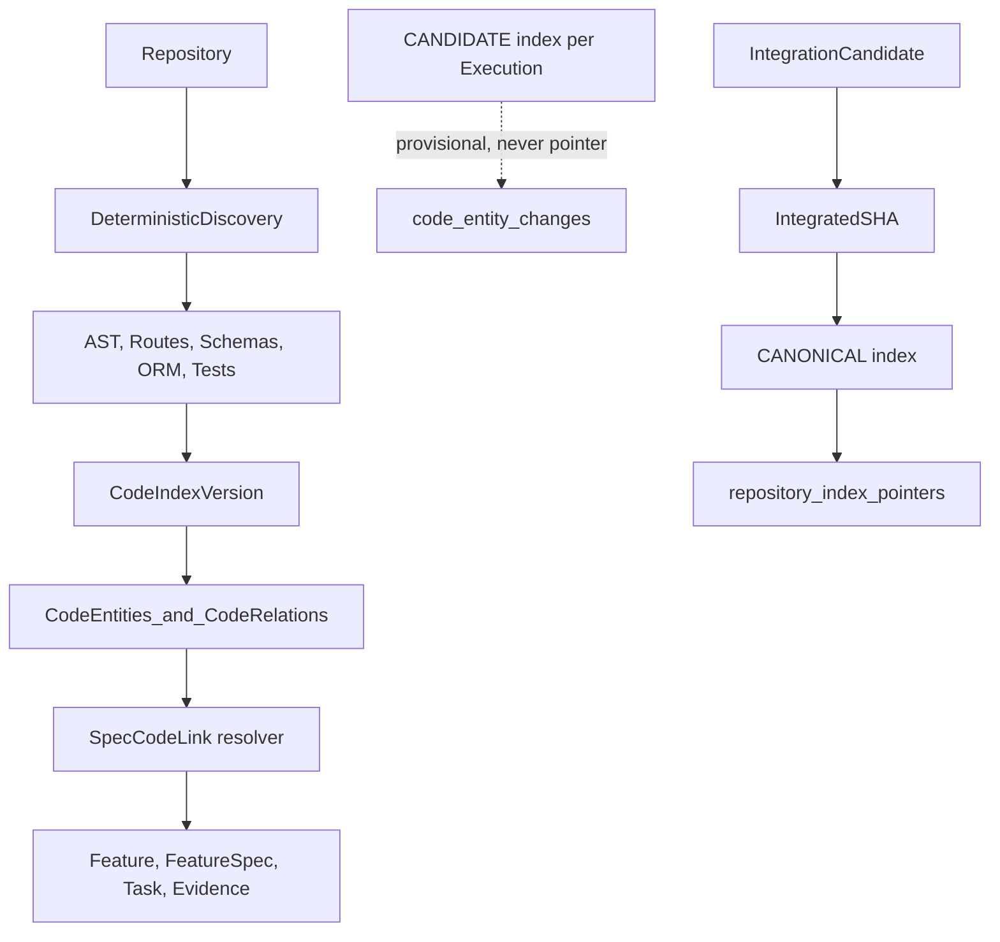
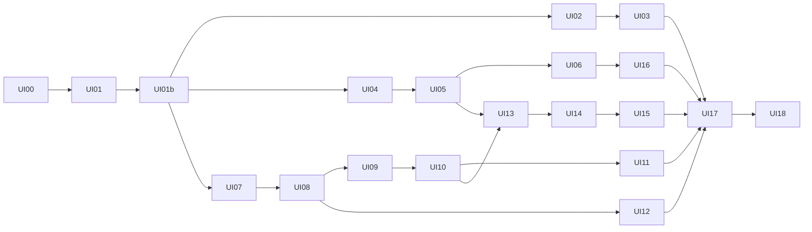

# Olympus Frontend UI Track — Implementation Plan (v2)

**Version:** v2 (Software Delivery Control Room / Software Forge). Supersedes v1 UI-00..UI-20 phase numbering with UI-00..UI-18.

# Olympus Frontend v2: Software Delivery Control Room and Software Forge

First build action: rewrite [plans/frontend-ui-implementation.md](plans/frontend-ui-implementation.md) as **v2**, using sections 1–20 below. Move the still-valid v1 reference material into appendices without changing it:
- v1 §7.3 verbatim enums;
- v1 §7.4 term mapping, extended in §20 below;
- v1 §8 dependency rows;
- v1 §33 missing APIs.

Then reset [STATUS.md](STATUS.md) §16 (see §15 below).

Next.js 16 rule (from [apps/dashboard/AGENTS.md](apps/dashboard/AGENTS.md)): before writing any route, layout or `searchParams` code, read `apps/dashboard/node_modules/next/dist/docs/`. Use `npm`, because `package-lock.json` is present. Do not use pnpm.

---

## 1. Current UI assessment (repository reality, 2026-10-01)

**Backend**
- None exists ([STATUS.md](STATUS.md) §1–2: 0/20 phases).
- All APIs are PLANNED contracts in `plans/01..17`.
- Live adapters in [apps/dashboard/lib/api/http-services.ts](apps/dashboard/lib/api/http-services.ts) all throw `CapabilityPendingError`.
- Every screen is therefore fixture-driven. **No fixture rendering counts as journey proof.**

**Frontend size**
- About 2,900 lines in total.
- Real screens:
  - Projects list;
  - Command Center ([app/(console)/projects/[projectId]/page.tsx](apps/dashboard/app/(console)/projects/[projectId]/page.tsx), 168 lines);
  - Cycle Forge (55 lines);
  - Task DAG (41 lines; default white React Flow nodes on a grid; elkjs installed but unused);
  - Execution (58 lines; the execution chain is just a sentence);
  - Agents (46 lines);
  - Assurance (54 lines);
  - IC detail (24 lines);
  - Inbox (66 lines);
  - Release (38 lines);
  - Audit (27 lines; hardcoded to DC-003).
- Placeholders of 10–22 lines: Code, Lineage, Brownfield, Product, Impact, Integrations, Defects, Change Requests.

**Shell**
- 4 nav items (Projects, Human Attention, Lineage, Audit).
- No ContextBar, project or cycle switcher, command palette, EntityDrawer, SSE client or live indicator.

**Tests**
- 2 Vitest files. `production-guard.test.ts` is tautological.
- 1 Playwright spec with 2 smoke tests.
- No axe checks, no fixture-isolation scan and no ESLint restricted-imports rule.

**Defects to fix before extending**
1. `export type OlympusServices = FixtureServices` in [lib/api/services.ts](apps/dashboard/lib/api/services.ts). The fixture defines the contract, which is inverted.
2. App code imports `@/lib/fixtures/ids`:
   - Command Center: default cycle and `enabled: cycleId === IDS.dc004`;
   - Assurance: default IC and the DC-004 findings;
   - Audit;
   - Release: `releaseId === IDS.r3`.
3. Fixture `release.eligibility` returns `eligible: true` for any unknown cycle. This fabricates an authoritative verdict.
4. The fixture world is incoherent:
   - R2 is RELEASED on DC-003, which is still in DEVELOPMENT;
   - R1 and R2 both point to IC-003;
   - TC exists only for TASK-221;
   - there are 2 events in total.
5. `running` counts only `STARTED`, ignoring LEASED, OUTPUT_PRODUCED and VALIDATING.
6. STATUS §16 claims FIXTURE_COMPLETE for UI-00..UI-20, which violates "rendering alone never qualifies".

**Good foundations to keep:**
- dark tokens in [app/globals.css](apps/dashboard/app/globals.css);
- the tone registry [lib/status/tones.ts](apps/dashboard/lib/status/tones.ts) (icon + label + shape);
- `openEnum`;
- `buildForgeStages` (presentation only);
- journey definitions;
- `EligibilityVerdict`, which depends only on `eligible`;
- `RecommendationVsGate`;
- `KnowledgeChip`;
- `ConfirmCommandDialog` + `useOlympusCommand` (Idempotency-Key);
- `DataModeBanner`;
- the production fixture guard in `next.config.ts`;
- the viewer-mode toggle.

## 2. Screens to RETAIN (behavior kept, restyled)

- Projects list.
- `ProjectSwitcher` behavior (cycle chips become a `CycleSwitcher`).
- The LifecycleForge stage logic, with server-only transition allowance.
- `EligibilityVerdict` semantics.
- The `RecommendationVsGate` split.
- Inbox approve/reject flowing through a typed command with a role gate and the chat disclaimer.
- The DataModeBanner (non-dismissible).
- The deterministic blocker strings, displayed verbatim plus a humanized line.

## 3. Screens to EXTEND

- **Command Center** gains:
  - a header (Project, Cycle, Journey, Objective, Risk, Current Stage, Target Release);
  - a macro-band forge;
  - the ActiveExecutionPanel;
  - a ControlPlaneStrip;
  - eight status tiles;
  - a live timeline.
- **Cycle Forge** gains the StageInspector, a ConditionGraph for blocked transitions and loop arcs.
- **Agents** becomes capability lanes (8 capabilities plus Olympus Deterministic) with Runtime and Actions tabs.
- **Assurance** gains two lanes, a gates row, and Evidence, Findings and Gates tabs.
- **Release** gains a structured verdict board with clickable blockers and a manifest.
- **Inbox** gains context-rich cards (target IC/SHA, gates, AC and baseline counts, diff stats, View Evidence/Diff/Manifest, Request Changes).
- **IC detail** reuses `IcForge`.
- **Audit** becomes a distributed-trace timeline.

## 4. Screens to REFACTOR

- **Task DAG:** custom dark `TaskNode`, elk layered layout in a worker, non-overlapping edge labels, `?task=` TaskInspector with 11 tabs.
- **Execution:** becomes the Execution Workspace (`ExecutionChain` graph, panels, retry lineage, action timeline).
- **AppShell:** NavRail groups, ContextBar, CommandPalette, EntityDrawer.
- **Service layer and fixtures:** see §10 and §13.

## 5. New screens and modules to ADD

- Control Plane Inspector.
- Executions list.
- IntegrationCandidate Forge per cycle.
- Code Intelligence (Explorer, Symbol Graph, Traceability, Index History, Search).
- Project-scoped Lineage.
- Impact list and Impact Explorer.
- Brownfield Intelligence (discovery pipeline, facts vs Scout interpretation, recovered specs, baselines, readiness).
- Product & Specs (tree, specs, architecture, deltas).
- Bug Fix failure-path view on the Defect page.
- Change Request page.
- Integration Topology.
- Evidence Registry.

## 6. Route map

The new `app/(console)/projects/[projectId]/layout.tsx` provides `ProjectShell` (ContextBar + grouped NavRail). The selected cycle lives in `?cycle=`. When it is absent, `useCycleContext()` falls back to the server overview `active_cycle_id` (never a fixture ID).

- `/projects`: EXTEND.
- `/projects/[pid]`: Command Center, EXTEND.
- `/projects/[pid]/control-plane`: NEW.
- `/projects/[pid]/cycles` and `/cycles/[cid]`: Cycle Forge, EXTEND.
- `/projects/[pid]/cycles/[cid]/tasks?task=&tab=`: REFACTOR.
- `/projects/[pid]/cycles/[cid]/integration?ic=`: NEW.
- `/projects/[pid]/executions`: NEW (list with retry lineage).
- `/executions/[eid]`: REFACTOR (workspace).
- `/projects/[pid]/agents?tab=capabilities|runtime|actions`: EXTEND.
- `/projects/[pid]/product?tab=tree|specs|architecture|deltas&spec=`: REPLACE shell.
- `/projects/[pid]/code?tab=explorer|symbols|traceability|index-history|search&entity=&index=`: REPLACE shell.
- `/projects/[pid]/lineage?root_type=&root_id=&direction=`: NEW. The global `/lineage` redirects here when `?project=` is set.
- `/projects/[pid]/impact` (list) and `/impact/[iaId]`: NEW / REPLACE.
- `/projects/[pid]/brownfield?tab=pipeline|facts|recovered|baselines|readiness`: REPLACE.
- `/projects/[pid]/assurance?tab=control-room|evidence|findings|gates&ic=`: EXTEND.
- `/projects/[pid]/releases` and `/releases/[rid]`: EXTEND.
- `/inbox`: EXTEND.
- `/projects/[pid]/integrations?tab=topology|inbound|outbound|reconciliation`: REPLACE.
- `/audit?project=&cycle=&task=&execution=&agent=&type=&severity=&correlation_id=`: REFACTOR.
- `/defects/[id]` and `/change-requests/[id]`: REPLACE.
- `/integration-candidates/[icId]`: EXTEND.

Entity routes resolve their project from the entity and render inside the project shell. Drawer state lives in `?inspect=<type>:<id>`.

**NavRail groups** (project-scoped; the prompt's IA is mapped to tabs where tabs work better):
- **Delivery:** Command Center, Control Plane, Tasks (selected cycle), Executions.
- **Product:** Product & Specs, Architecture (product tab).
- **Operations:** Agents, Runtime (tab), Actions (tab).
- **Intelligence:** Code Intelligence, Lineage, Impact, Brownfield.
- **Assurance:** Integration (cycle), Evidence, Findings, Gates.
- **Governance:** Human Attention, Release.
- **System:** Integrations, Audit.

## 7. Component hierarchy (new or changed directories under `apps/dashboard/components/`)

- `design/`:
  - `Panel` (header bar: key, title, state rail, actions);
  - `KV`, `KeyChip`, `ShaChip`, `VersionTag`, `HashTag`;
  - `StateRail`, `Conduit`, `Pulse`, `Duration` (ticking), `TimeAgo`;
  - `SectionTabs`, `DenseTable` (virtualized), `Legend`.
- `shell/`: `AppShell`, `ProjectShell`, `NavRail`, `ContextBar`, `ProjectSwitcher`, `CycleSwitcher`, `LiveConnectionIndicator`, `CommandPalette` (cmdk), `ActorMenu`.
- `entity/`: `EntityLink`, `EntityDrawer`, `JsonInspector`.
- `states/`: `LoadingState`, `EmptyState`, `ErrorState`, `PendingCapability`, `FixtureBadge`, `NotAvailable`.
- `command-center/`: `CycleHeader`, `MacroForge`, `ActiveExecutionPanel`, `ControlPlaneStrip`, `StatusTiles`, `LiveTimeline`.
- `control-plane/`: `SchedulerPanel`, `ExecutionManagerPanel`, `PolicyPanel`, `IntegrationReadiness`, `AssuranceProgress`, `ReleaseReadiness`, `ConditionGraph`, `ReasonCode` (code → human sentence + raw code).
- `lifecycle/`: `LifecycleForge`, `ForgeStage`, `ForgeConduit` (loop arcs), `StageInspector`, `TransitionPreview`, `TerminalOverlay`.
- `graph/`: `GraphCanvas`, `useElkLayout` (worker), `nodes/*` (dark custom nodes), `GraphToolbar`, `GraphListView` (accessible twin).
- `dag/`: `TaskDag`, `TaskNode`, `TaskInspector` + tabs, `ContractView`, `EligibilityExplain`.
- `execution/`: `ExecutionChain`, `ExecutionHeader`, `SnapshotPanel`, `LeasePanel`, `WorktreePanel`, `RetryLineage`, `ModelCallsTable`, `CandidateCommitPanel`, `RuntimeTelemetry` (labelled non-authoritative).
- `governance/`: `ResourcePanel`, `ActionTimeline`, `ActionGovernancePipeline` (the 8 fixed Phase 04 validation steps), `ActionRequestDetail`.
- `agents/`: `AgentOpsBoard`, `CapabilityLane`, `CapabilityCard`.
- `code/`: `IndexStatusBar`, `IndexKindBadge`, `RepositoryExplorer` (lazy virtual tree), `SymbolPanel`, `RelationGroups`, `SymbolNeighborhood`, `ProductLinks`, `ProvenanceCard`, `IndexHistory`, `IndexPromotionFlow`, `CodeSearch`.
- `lineage/`: `LineageExplorer`, `LineageNode`, `LineageQuestions`, `LineageFilters`.
- `impact/`: `ImpactFlow` (columns), `ImpactItemList`, `ImpactPath`, `ImpactRationale`.
- `brownfield/`: `DiscoveryPipeline`, `FactsVsInterpretation`, `RecoveredSpecCard`, `RecoveredWatermark`, `CitationList`, `ReviewQueue`, `BaselineList`, `ReadinessMetrics`.
- `defects/`: `FailurePath`, `ReproductionList`, `RootCausePanel`.
- `integration/`: `IcForge`, `CommitConvergenceGraph`, `IntegrationChecks`, `ConflictRemediationChain`, `IcSupersessionChain`.
- `assurance/`: `AssuranceLane`, `RecommendationVsGate`, `GateCard`, `ObligationList`, `FindingList`.
- `evidence/`: `EvidenceRegistry`, `AcEvidenceTree`, `CoverageMetrics`.
- `release/`: `ReleaseBoard`, `EligibilityVerdict`, `ConditionRow` (clickable), `ManifestView`.
- `attention/`: `AttentionCard`, `ApprovalDecisionForm` (APPROVED / REJECTED / CHANGES_REQUESTED).
- `integrations/`: `InboundPipeline`, `OutboundPipeline`, `ConnectorList`, `InboundEventList`, `ConnectorActionList`, `ReconciliationList`.
- `timeline/`: `EventTimeline`, `EventRow` (expandable trace detail), `EventFilters`.
- `product/`: `ProductTree`, `FeatureSpecView`, `AcList`, `ImplementationSpecView`, `ArchitectureView`, `SpecDeltaView`.

**Visual system** (extend `globals.css` tokens):
- forge amber accent;
- tone colors from v1 §UI-01;
- Geist Mono for keys and SHAs;
- 12–13px density;
- panel header bars with a 2px state rail;
- a dark React Flow theme override (`.react-flow` variables).

**Motion is event-bound only**, through `useEventPulse(entityRef)`:
- stage heat (only when executions are running);
- task-node pulse on `task.ready`;
- execution start and finish;
- action row slide-in on `action.*`;
- commit node appearance on `candidate_commit.created`;
- IC convergence on `integration.*`;
- gate flip on `gate.finalized`;
- loop arc on `return_to_development`;
- verdict change on `release.*`.

Motion is disabled under `prefers-reduced-motion`.

## 8. Code Intelligence architecture

- **Entities:** the backend `EntityType` values verbatim (REPOSITORY, PACKAGE, MODULE, FILE, CLASS, METHOD, FUNCTION, ROUTE, SCHEMA, ORM_MODEL, TABLE, TEST).
- **Symbol relation groups.** The prompt's labels map to backend sources:
  - Called By = CALLS (in);
  - Calls = CALLS (out);
  - Imports = IMPORTS;
  - Inherits = INHERITS;
  - Accesses = ACCESSES;
  - Exposes / Uses Schema / Maps To = EXPOSES / USES_SCHEMA / MAPS_TO;
  - Verified By = VERIFIED_BY;
  - **Implements = SpecCodeLink** (`relation=IMPLEMENTS`; not a CodeRelation);
  - **Changed By = `code_entity_changes`** (execution, task, candidate commit, IC, integrated SHA).
  
  Every relation shows its provenance (AST, FRAMEWORK:*, HEURISTIC) and confidence.
- **Index distinction:**
  - CANONICAL: solid border with a seal icon, reading "Canonical index @ SHA, source IC-003, CURRENT".
  - CANDIDATE: dashed and hatched, reading "Provisional, Execution EX-551 worktree".
  - Selecting a candidate index sets a persistent PROVISIONAL banner.
  - `IndexStatusBar` shows a factual "pointer SHA == current IC integrated_sha" match label.
  - `IndexPromotionFlow` visualizes Candidate commits → IC → Integrated SHA → Canonical re-index → Project graph.
- **Index History:** a list of versions (kind, source, scope_ref, SHA, status, pointer roles canonical/released), grouped by release and cycle. Compare uses the M-25 version diff; the fallback lists `code_entity_changes` per IC.
- **Search** (Phase 13 hybrid):
  - modes symbol, lexical, route and hybrid;
  - each hit carries a `RetrievalSourceBadge`;
  - STRUCTURAL results rank first and are labelled authoritative;
  - SEMANTIC results are labelled "candidate; verify via links".
  
  Natural-language questions route to hybrid search, then the user picks a hit, then traverses links. Embeddings never resolve truth.
- **Product links panel:** Feature → FeatureSpec → ImplementationSpec → AC → Task → Execution → Commit → Tests → Evidence → Release, with a `ProvenanceCard` on every link:
  - GENERATED_LINEAGE shows task, execution and commit;
  - DISCOVERED shows confidence and evidence basis;
  - HUMAN_CONFIRMED shows the approver.

## 9. Graph strategy

- **React Flow + elk (web worker, memoized by graph signature)** for free-form graphs:
  - TaskDag;
  - CommitConvergenceGraph;
  - LineageExplorer;
  - SymbolNeighborhood.
- **HTML/SVG** for linear or columnar structures:
  - ExecutionChain;
  - ConditionGraph;
  - MacroForge and LifecycleForge;
  - DiscoveryPipeline;
  - Inbound and Outbound pipelines;
  - FailurePath;
  - ImpactFlow columns;
  - IndexPromotionFlow.
- **Edge labels:**
  - elk `edgeLabels.placement=CENTER` with label dimensions passed in;
  - labels rendered via `EdgeLabelRenderer` at the elk coordinates with an opaque background;
  - dependency kind shown in a legend by default, with labels toggleable.
- **Caps:**
  - lineage starts at 2 hops and 150 nodes, then expands incrementally;
  - symbol neighborhood depth ≤ 2 and ≤ 200 nodes;
  - the explorer tree is lazy via CONTAINS children and virtualized;
  - the full repository graph is never rendered.
- **Accessibility:**
  - every graph has a `GraphListView` twin (toggle with the `L` key);
  - nodes are focusable with arrow navigation, Enter to inspect, Esc to close;
  - every node has an `aria-label`.
- `next/dynamic` loads the graph chunks.

## 10. Typed API contracts

Layers, from UI down: UI → view-model selectors (`lib/view-models/*`, presentation only) → TanStack hooks (`lib/query/hooks/*`) → `OlympusServices` **interface** (`lib/api/domains/*.ts`) → either `createHttpServices` (live) or `createFixtureServices` (dev only).

- Split [lib/contracts/entities.ts](apps/dashboard/lib/contracts/entities.ts) into per-domain zod files with snake_case wire fields copied verbatim from the plans: `project`, `delivery-cycle`, `task`, `execution`, `actions`, `runtime`, `product`, `planning`, `code-intelligence`, `traceability`, `integration`, `assurance`, `release`, `brownfield`, `impact`, `change`, `defect`, `connectors`, `events`, `views`.
- Key shapes to add:
  - `ExecutionLease` (worker_id, heartbeat_at, expires_at, state);
  - `Worktree` (path, branch, base_sha, mode, status);
  - `ActionRequest` (tool, resource, action, params, status, `policy_decision{decision, rule_ids, reasons, policy_version_id}`, approval_id, correlation_id);
  - `ActionResult`;
  - `CandidateCommit` (sha, parent_sha, base_sha, changed_files with diff stats);
  - `ModelCall`;
  - `Artifact`;
  - `Checkpoint`;
  - `CodeEntity` / `CodeRelation` / `CodeIndexVersion` / `IndexPointer` / `CodeEntityChange` / `RetrievalHit`;
  - `SpecCodeLink` (relation, origin, confidence, status, evidence refs);
  - `LineageGraph`;
  - `IntegrationCandidateCommit`;
  - `Evidence` / `VerificationObligation` / `AcceptanceCoverage` / `Review`;
  - `ReleaseManifestContent`;
  - the Brownfield set (RepositoryDiscovery, ObservedBehavior, KnowledgeItem, RecoveredSpec fields `confidence`/`claimed_confidence`, BehavioralBaseline, PromotionDecision, ReadinessAssessment);
  - `ImpactAssessment` / `ImpactItem` (`path[{from, relation, to}]`);
  - `Defect` / `Reproduction` / `TraceCorrelation` (`candidates[{stable_key, evidence_basis, path}]`) / `RootCauseAnalysis`;
  - `InboundEvent` / `ConnectorAction` / `ReconciliationItem`.
- `views.ts` holds **proposed** read models, marked `@proposed`:
  - `ProjectSummaryView` (M-26);
  - `ProjectOverviewView`;
  - `CycleOverviewView` (M-16);
  - `ControlPlaneView` (M-22);
  - `AgentActivityView` (M-05);
  - `InboxView` (M-17).
- Replace `OlympusServices = FixtureServices` with an explicit interface. A compile-time `satisfies OlympusServices` check applies to both adapters.

## 11. Event contracts

- `DomainEvent` envelope: id, sequence, event_type, aggregate_type, aggregate_id, project_id, delivery_cycle_id, payload, correlation_id, causation_id, actor_id, occurred_at.
- `lib/events/event-registry.ts` lists every event name from plans 01–18, with category, severity and an entity-ref extractor.
- `stream-client.ts`:
  - uses the project stream (M-01) when available, otherwise per-cycle streams;
  - resumes via `Last-Event-ID` and `?after=`;
  - deduplicates with an LRU keyed by sequence;
  - backs off with jitter;
  - runs a full invalidation on a gap.
- `invalidation-map.ts` must be exhaustive; a test asserts every registry entry has a rule. **Payloads are never written to the query cache.** Payloads drive only timeline rows and pulses.
- `fixture-stream.ts` plays a scripted correlated sequence for DC-003 every 2–4s, with pause and step controls in the DataModeBanner, labelled "FIXTURE PLAYBACK":
  - `execution.started`;
  - `action.requested`, then `action.completed`;
  - `candidate_commit.created`;
  - `execution.completed`;
  - `task.ready`;
  - `execution.created`.
  
  Each fixture event mutates the store through the scripted outcome table, so refetches show the new state.
- A throttled `aria-live` announcer covers gate.finalized, release.*, approval.requested and execution.failed.

## 12. Backend dependency matrix (all PLANNED; backend phases are NOT_STARTED)

Format: UI area — endpoints — owner phase — live-blocking.

- Projects and history — `/projects`, `/projects/{id}/delivery-cycles`, `/delivery-cycles/{id}/outcome`, `/projects/{id}/releases`; summary counts M-26 — P01/P10, M-26 MISSING — yes.
- Command Center — `/views/projects/{id}/overview`, `/views/delivery-cycles/{id}/overview` (M-16), `/next-transitions` — P17 — no (composed fallback).
- Control Plane — `/tasks/{id}/eligibility` (P03), lease per execution, `/actions` (M-09), IC, gates, `/release-eligibility`; aggregate M-22; per-condition explain M-23; guard detail M-24 — mixed — no (fallback composition).
- Tasks and Contracts — `/delivery-cycles/{id}/task-dag`, `/tasks/{id}`, `/contract(s)`, `/executions` — P01/P03/P06 — yes.
- Execution Workspace — `/executions/{id}`, `/snapshot`, `/events(/stream)`, `/artifacts`, `/model-calls`, `/worktree`, `/candidate-commit`, `/actions` — P03/P04 — yes.
- Agents and Runtime — M-04, M-05, M-06, M-07, M-08 — MISSING — no.
- Code Intelligence — `/repositories/{id}/code-index/canonical|versions`, `/code/entities(/{id}/neighbors)`, `/code/search`, `/views/code/entities/{stable_key}/neighborhood`; version diff M-25 — P07/P08/P13/P17 — yes.
- Lineage — P08 forward/reverse endpoints; generic M-11 — P08, M-11 MISSING — partial.
- Impact — `/impact-assessments/{id}`, `/specs/{id}/impact` — P13 — yes.
- Brownfield — `/discovery`, `/observed-behaviors`, `/knowledge`, `/recovery`, `/review-queue`, `/baselines`, `/readiness`; per-step discovery status M-29 — P11/P12 — yes.
- IC Forge — `/delivery-cycles/{id}/integration-candidates`, `/integration-candidates/{id}`, findings — P08 — yes.
- Assurance and Evidence — `/views/ic/{id}/assurance`, gates, obligations, `/evidence`, `/coverage` — P09/P17 — yes.
- Release — `/release-eligibility`, `/releases/{id}(/manifest)`, approve — P10 — yes.
- Inbox — `/approvals`, `/clarifications`, `/views/inbox` (M-17) — P01/P03/P17 — yes.
- Integrations — `/integrations/inbound-events`, `/connectors`, `/connector-actions`, `/reconciliation`; health M-18 — P16 — yes.
- Defect and CR — P15 / P14 endpoints — yes.
- Audit — `/delivery-cycles/{id}/events`, M-02, M-12 — P01 — partial.

New missing contracts, to be added to STATUS §16:
- **M-22** `GET /views/delivery-cycles/{id}/control-plane`: eligible/blocked tasks with reasons, leases (active, expired), queued executions, action decision counts, IC readiness, assurance progress, release readiness.
- **M-23** Per-condition eligibility explain `[{condition, ok, detail}]`. Today the Phase 03 contract returns only failing reasons, so a passing ✓ cannot be shown without it.
- **M-24** `GuardResult.details[{ref, ok, reason}]`, for per-task ✓/✕ under one guard.
- **M-25** `GET /code-index/versions/{a}/diff/{b}`.
- **M-26** Project list summary fields: active cycle, stage, counts, canonical SHA, current release.
- **M-27** `runtime_metadata.runtime` exposed on the execution read model (non-authoritative).
- **M-28** `GET /projects/{id}/delivery-history`, or confirmation that composing it from cycles + outcomes is acceptable.
- **M-29** Brownfield discovery per-step status and timing.

## 13. Fixture strategy

- `lib/fixtures/` is a coherent **SupportDesk chained world**, split into modules under `scenarios/supportdesk/`: `product`, `planning`, `tasks`, `executions`, `actions`, `code-index`, `trace-links`, `integration`, `assurance`, `brownfield`, `impact`, `defect`, `integrations`, `events`.
- Coherent timeline:
  - **DC-001 GREENFIELD:** COMPLETE → R1 RELEASED via IC-001 at SHA aaa111; canonical and released index.
  - **DC-002 BROWNFIELD:** READY; Project READY_FOR_CHANGE; recovered specs mixing FACT/INFERENCE/UNCERTAINTY, PROMOTED and unreviewed; baselines BL-001..012.
  - **DC-003 FEATURE_CHANGE "Ticket Priority":** in DEVELOPMENT.
    - SpecDelta FS-014 v1→v2; IA-003.
    - TASK-221..228 DAG:
      - TASK-221 and TASK-222 RUNNING (EX-551/552);
      - TASK-223 BLOCKED with `DEPENDENCY_INCOMPLETE:TASK-222`;
      - one REMEDIATION task;
      - a retry lineage (EX-548 FAILED → EX-551).
    - Actions: ALLOWED, DENIED (prohibited op) and PENDING_APPROVAL.
    - Candidate indexes for EX-551/552.
    - A prior IC-002 CONFLICT → finding → remediation, superseded.
    - Target R2, DRAFT (fixes the R2 inconsistency).
  - **DC-004 BUG_FIX "closed ticket 500":**
    - in ASSURANCE on IC-004 at SHA 4ab72f1;
    - Warden gate PASS while Warden recommended APPROVE;
    - Sentinel gate FAIL while Sentinel recommended FAIL;
    - FND-042 BLOCKER;
    - R3 NOT_ELIGIBLE with server conditions;
    - pre/post reproductions;
    - trace candidates with paths;
    - RCA INFERENCE;
    - APR-221 pending.
  - About 60 code entities across all EntityTypes; SpecCodeLinks of all three origins; about 80 correlated events.
- Additional scenarios: `greenfield-early`, `brownfield-review`, `empty`, `errors`. They are selected by `NEXT_PUBLIC_FIXTURE_SCENARIO`.
- **Remove the fabricated default:** unknown-cycle eligibility returns `NOT_EVALUATED` (404 → `NotAvailable`), never `eligible: true`.
- **Isolation enforcement:**
  - ESLint `no-restricted-imports` for `@/lib/fixtures/**` outside `lib/api/services.ts`, `lib/events/fixture-stream.ts`, `lib/fixtures/**` and tests;
  - a Vitest scan of `app/` and `components/` for fixture imports and literal fixture UUIDs and keys;
  - dynamic `import()` only;
  - the build guard is kept; the production-guard test is rewritten to import and execute the guard;
  - every fixture-served panel shows `FixtureBadge`.
- A **referential-integrity test** checks every fixture ref resolves, every builder output parses with zod, and the scenario timeline is consistent (no RELEASED release on a non-complete cycle).
- **Command simulation** uses a scripted outcome table only. No guard or eligibility logic is ported to TypeScript.

## 14. Implementation phases (v2 sequence; replaces UI-00..UI-20 in STATUS §16, with an old → new mapping recorded)

Each phase lists its objective, key deliverables and acceptance criteria. Common exit for every phase:
- `npm run lint && npm run typecheck && npm test` green;
- the phase's `@fixture` Playwright specs and axe checks green;
- STATUS §16 updated.

- **UI-00 Docs + STATUS reset:** rewrite the plan file as v2; reset the overstated states in §16; add M-22..M-29 and drift entries FE-C11..FE-C16.
- **UI-01 Alignment + Navigation:**
  - `OlympusServices` interface split by domain;
  - remove the fixture imports from pages;
  - ESLint isolation rule and isolation scan;
  - design primitives;
  - `ProjectShell` + grouped NavRail + ContextBar + CycleSwitcher + CommandPalette + EntityDrawer;
  - React Flow dark theme.
  - AC: no `@/lib/fixtures` import outside the allowlist; every nav group is reachable by keyboard.
- **UI-01b Fixture world:**
  - the coherent SupportDesk modules (§13);
  - referential-integrity test;
  - event registry + fixture playback + stream client + invalidation map.
  - Note: UI-01b is a prerequisite for every later phase.
- **UI-02 Command Center Transparency:**
  - CycleHeader;
  - MacroForge, a presentation grouping of journey states into INTAKE..RELEASE with APPROVAL as gate markers;
  - ActiveExecutionPanel (EX, TASK, TC:vN, runtime, alias, snapshot, base SHA, worktree, current action, current file from the latest ActionRequest `params.path` labelled "derived", ticking elapsed);
  - eight StatusTiles linking deep;
  - LiveTimeline.
  - Projects screen upgrade: summary row plus delivery history `DC-00n type → outcome/release`.
- **UI-03 Control Plane Inspector:**
  - the route, plus a `ControlPlaneStrip` in Command Center;
  - Scheduler, Execution Manager, Policy, Integration, Assurance and Release panels;
  - `ReasonCode` humanizer (prefix → sentence; raw code always shown);
  - `ConditionGraph` from server guard results / eligibility reasons, with "not reported" for conditions the server did not return (M-23/M-24).
- **UI-04 Lifecycle Forge, Task DAG and TaskContract:**
  - StageInspector (state, owner capability, inputs, outputs, artifacts, blockers, transition requirements, timestamps);
  - blocked-transition ConditionGraph with "Inspect blocking Task";
  - journey substeps for all four journeys;
  - elk TaskDag with `TaskNode` (key, title, status, owner capability, execution, risk, dependency count);
  - TaskInspector tabs: Overview, TaskContract, Dependencies, Specs, Acceptance Criteria, Executions, Artifacts, Commits, Evidence, Findings, Events;
  - ContractView with every TaskContract field, including allowed scope, prohibited operations, verification rules and escalation policy.
- **UI-05 Execution / Runtime / Agent Operations:**
  - Execution Workspace: ExecutionChain graph, snapshot, lease, worktree, RetryLineage as immutable sibling attempts, model calls, candidate commit diff;
  - Executions list;
  - AgentOpsBoard: 8 capability lanes plus Olympus Deterministic, as engineering glyphs (no personas);
  - Runtime tab (leases; PendingCapability for M-07/M-08).
- **UI-06 Resource / Action Inspector:**
  - ResourcePanel (repository, worktree, specs, architecture, test runner, artifact store, git, CI, deployment, connectors), derived from TaskContract inputs, allowed_actions and worktree;
  - ActionTimeline (time, tool, resource.action, target, status verbatim, policy decision and rule ids);
  - ActionGovernancePipeline highlighting the failing validation step;
  - project-wide Actions tab.
- **UI-07 Code Intelligence Foundation:** contracts, services and fixtures for index versions, pointer, entities and relations; IndexStatusBar; IndexKindBadge; the PROVISIONAL banner; the Code route tabs scaffold.
- **UI-08 Repository Explorer + Symbol Graph:** lazy virtual tree (file → symbols); SymbolPanel with relation groups (§8); SymbolNeighborhood graph; ProductLinks + ProvenanceCard; CodeSearch with retrieval badges.
- **UI-09 Product-to-Code Lineage:**
  - LineageExplorer with forward/reverse roots across all prompt types;
  - incremental merge-expand;
  - origin-styled edges;
  - LineageQuestions presets (why exists, Feature, FeatureSpec, Task, Execution, Commit, Tests, Evidence, Release), with "Not available (M-11)" for missing hops;
  - Product & Specs workspace (tree, FeatureSpec, ACs, ImplementationSpec, Architecture, SpecDelta).
- **UI-10 Candidate vs Canonical + Index History:** IndexPromotionFlow, IndexHistory grouped by release and cycle, compare (M-25 or code_entity_changes fallback).
- **UI-11 Impact Analysis:**
  - project Impact list;
  - Impact Explorer: ImpactFlow columns from seed to generated tasks;
  - backend classes DIRECT / TRANSITIVE / CANDIDATE / SEMANTIC_CANDIDATE, with the prompt labels shown as secondary text;
  - an ImpactPath "why" for each item;
  - baselines and tests.
- **UI-12 Brownfield Intelligence:**
  - DiscoveryPipeline (filesystem → dependencies → AST → routes → schemas → ORM → tests → git → graph → Scout);
  - a FactsVsInterpretation two-column split;
  - RecoveredSpecCard with classification, confidence and cap, provenance, citations, review, promotion and canonical state;
  - watermark until promotion;
  - ReviewQueue + PromotionDecisionForm;
  - ReadinessMetrics from server values only.
- **UI-13 IntegrationCandidate Forge:**
  - CommitConvergenceGraph (task → execution → commit → IC → integrated SHA → validation → canonical index → assurance);
  - ordering, ancestry, checks;
  - ConflictRemediationChain and IcSupersessionChain;
  - cycle Integration route.
- **UI-14 Assurance + Evidence:**
  - Warden and Sentinel lanes (target IC, exact SHA, checks, findings, evidence, recommendation);
  - an OLYMPUS GATES row;
  - explicit "Agent Recommendation ≠ Gate State";
  - Evidence Registry with AcEvidenceTree, coverage metrics, stale/"other SHA" labels and click-through to AC, Baseline, Finding, Gate, Execution and Commit;
  - Findings and Gates tabs.
- **UI-15 Human Attention + Release:**
  - context-rich AttentionCards with View Evidence/Diff/Manifest and Approve / Request Changes / Reject;
  - ReleaseBoard: IC, SHA, gates, AC x/y, baselines, blocking findings, approvals and manifest, read from the server conditions and manifest;
  - clickable blockers;
  - Approve only when the server says ELIGIBLE and the actor is APPROVER.
- **UI-16 Integrations + Audit:**
  - Inbound/Outbound pipelines with per-step counts and click-to-filter;
  - connector health (M-18), last event, last action, retry, reconciliation, idempotency key, correlation ID;
  - Audit timeline with expandable trace rows and every filter;
  - correlation drill-down.
- **UI-17 Journey UX Refinement:**
  - per-journey Command Center emphasis;
  - Bug Fix Defect page with FailurePath (route → handler → service → exception → missing translation) linked to Feature, FeatureSpec, Baseline and regression test;
  - CR page;
  - empty and first-run states.
- **UI-18 E2E / Accessibility / Performance Hardening:**
  - per-route checklist for loading, empty, error, blocked and running states;
  - axe on every route;
  - keyboard paths;
  - virtualization audit;
  - bundle budget;
  - fixture isolation re-verified;
  - STATUS final update.

## 15. Testing plan

- **Vitest unit tests:**
  - view models: macro-band grouping, stage display truth table, reason-code humanizer, capability mapping, attention categorization, impact grouping, lineage merge dedupe;
  - the release verdict depends only on `eligible`;
  - recommendation never rendered in the gate slot;
  - exhaustive tone map.
- **Component tests:** loading, empty, error, blocked and running states for each major panel; list twins drive graph selection; URL-synced drawers and tabs.
- **Contract tests:** zod parses every fixture builder; referential integrity; an MSW (tests-only; add `msw` as a dev dependency) HTTP adapter error mapping (401, 403, 409, 422 GuardFailed / GUARD_NOT_IMPLEMENTED).
- **Event tests:** dedupe, resume, gap invalidation, registry exhaustiveness, payload never cached.
- **Guard tests:** fixture-isolation scan, executing production-guard test, ESLint rule.
- **Playwright `@fixture` specs:**
  - shell navigation;
  - Command Center DC-003 / DC-004;
  - Control Plane blocked TASK-223;
  - forge → inspector → blocking task;
  - DAG → TaskInspector → Execution → actions;
  - agents;
  - code explorer → symbol → product links;
  - lineage reverse from `TicketService.update_status`;
  - candidate vs canonical;
  - impact why-path;
  - brownfield chips and watermark;
  - IC convergence;
  - assurance recommendation ≠ gate;
  - evidence click-through;
  - release blocked with Approve disabled;
  - inbox approve (scripted) plus viewer disabled;
  - integrations;
  - audit correlation filter;
  - one walkthrough per journey;
  - axe on every route.
- **`@live` project scaffold** (skipped until the backend exists; never counted as proof).

## 16. Milestones

- **M-A Foundation:** UI-00, UI-01, UI-01b.
- **M-B Control Room:** UI-02..UI-06.
- **M-C Code Intelligence and Lineage:** UI-07..UI-11.
- **M-D Brownfield, Integration and Assurance:** UI-12..UI-14.
- **M-E Governance and System:** UI-15, UI-16.
- **M-F Journeys and Hardening:** UI-17, UI-18.
- **M-LIVE-n:** per backend phase COMPLETE, switch the matching UI to live and run its `@live` specs.

## 17. Acceptance criteria

Every question in the prompt's §35 maps to a screen element that either answers it in fixture mode or shows an explicit `NotAvailable` / `PendingCapability` with an M-id. No fabricated values. The mapping is kept as a checklist table in the plan file (for example, "Why is another Task blocked?" maps to Control Plane Scheduler and TaskInspector EligibilityExplain).

Additional criteria:
- enums are backend-verbatim, with prompt labels only as secondary text;
- color is never the only signal;
- the canonical and candidate indexes are unmistakable;
- FACT, INFERENCE and UNCERTAINTY differ by shape, icon and text;
- recovered specs stay watermarked until promoted;
- the frontend never computes eligibility, gates or readiness;
- every mutation goes through ConfirmCommandDialog with an Idempotency-Key and a role gate.

## 18. Exit criteria

- **Fixture tier:**
  - UI-00..UI-18 at FIXTURE_COMPLETE, with each phase's acceptance criteria and tests passing;
  - lint, typecheck, Vitest and Playwright `@fixture` + axe green;
  - all 20 prompt verification items checked in the STATUS checklist;
  - fixture isolation verified;
  - missing APIs and drift recorded.
- **Live tier:** LIVE_VERIFIED only after the backend phases COMPLETE and `@live` passes. Phase 17 is never marked COMPLETE from fixture rendering.

## 19. Dependencies

- **Existing packages:** `@xyflow/react`, `elkjs`, `@tanstack/react-virtual`, `cmdk`, `react-diff-view`, `gitdiff-parser`, radix.
- **To add:** `msw` (dev). No new runtime graph libraries.
- **Backend:** none available. Live completion depends on backend phases 01–17 and M-01..M-29.
- Touch only:
  - `apps/dashboard/**`;
  - `plans/frontend-ui-implementation.md`;
  - `STATUS.md` §13, §15 and §16.

## 20. Risks, open decisions and architecture conflicts

**Terminology conflicts.** The prompt's terms differ from the backend contracts. The UI uses the backend term with the prompt label as secondary text, and each is recorded in the STATUS drift log:
- FE-C11: evidence types SECURITY_SCAN / CODE_REVIEW / COMPATIBILITY_CHECK do not exist. Use STATIC_REVIEW / MODEL_ASSESSMENT / EXTERNAL_CI.
- FE-C12: actions `repository.write_worktree`, `test.execute` and similar map to backend `tool` (`repo.write`, `test.run`, `git.commit`, `olympus.submit_artifact`) plus `resource.action`. Statuses ALLOWED / APPROVAL_REQUIRED / RUNNING / COMPLETED map to the `policy_decision.decision` and the ActionStatus values APPROVED / PENDING_APPROVAL / EXECUTING / SUCCEEDED.
- FE-C13: UNAFFECTED is not a backend `impact_kind` and is not rendered as a class.
- FE-C14: TraceLink is `SpecCodeLink`. LIKELY_IMPLEMENTS is IMPLEMENTS + DISCOVERED + confidence. GENERATED_FROM_TASK is GENERATED_LINEAGE.
- FE-C15: model alias `coding-primary` is `implementation`. Runtime "LangGraphRuntime" comes from non-authoritative `runtime_metadata` (M-27).
- FE-C16: the generic 9-stage lifecycle is a presentation **macro-band** over the verbatim journey states. APPROVAL is a gate marker. The Feature Change "Regression" stage is an ASSURANCE substep.

**Eligibility ✓ rendering.** It requires M-23; until then only the failing reasons are shown, never inferred passes.

**Risks:**
- Contract drift while no backend exists. Mitigation: zod, the parity suite, `gen:api` once the backend lands.
- Fixture world size and maintenance. Mitigation: domain modules plus the integrity test.
- Graph performance. Mitigation: worker layout, caps, list twins.
- Next.js 16 API changes. Mitigation: read the bundled docs first.
- Scope size for a single build. Mitigation: phases are independently shippable; stop at any milestone with honest STATUS.

**Open decisions (working defaults):**
- URLs use UUIDs.
- No hybrid live/fixture mode.
- The Orchestrator chat stays deferred (shell only).
- Unknown enum values degrade to the UNKNOWN tone.

---

## Appendix A — Verbatim enums (v1 §7.3)
### 7.3 Verbatim enums (copy into `lib/contracts/enums.ts`)

Kernel and work:
- `DeliveryCycleType`: GREENFIELD_BUILD, BROWNFIELD_ONBOARDING, FEATURE_CHANGE, BUG_FIX, REMEDIATION
- Per-type states (display order):
  - GREENFIELD_BUILD: DISCOVERY, PRODUCT_MODEL, ARCHITECTURE, PLANNING, DEVELOPMENT, INTEGRATION, ASSURANCE, RELEASE, COMPLETE
  - BROWNFIELD_ONBOARDING: RECON, CODE_INDEX, RECOVERED_SPEC, BASELINE, READINESS, REMEDIATION (loop), READY
  - FEATURE_CHANGE: INTAKE, SPEC_DELTA, IMPACT_ANALYSIS, PLANNING, DEVELOPMENT, INTEGRATION, ASSURANCE, RELEASE, COMPLETE
  - BUG_FIX: TRIAGE, REPRODUCTION, EXPECTED_BEHAVIOR, ROOT_CAUSE, DEVELOPMENT, INTEGRATION, REGRESSION, ASSURANCE, RELEASE, COMPLETE
  - REMEDIATION: INTAKE, PLANNING, DEVELOPMENT, INTEGRATION, ASSURANCE, RELEASE, COMPLETE
  - Terminal states on every type: CANCELLED, FAILED
- Cycle commands: start_product_modeling, start_architecture, revise_product_model, start_planning, revise_architecture, start_development, start_integration, start_assurance, return_to_development, start_release, complete, start_code_index, start_spec_recovery, start_baseline, start_readiness, start_remediation, reassess_readiness, declare_ready, start_spec_delta, start_impact_analysis, revise_spec_delta, start_reproduction, resolve_expected_behavior, start_root_cause, start_regression, cancel, fail (SYSTEM only; never shown as a button)
- `ProjectReadiness`: UNKNOWN, ONBOARDING, READY_FOR_CHANGE
- `ActorKind`: HUMAN, AGENT, SYSTEM, INTEGRATION
- `ActorRole`: OPERATOR, APPROVER, VIEWER, SYSTEM, INTEGRATION
- `WorkType`: ANALYSIS, CODE_CHANGE, VERIFICATION, INTEGRATION, RELEASE
- `TaskOrigin`: IMPLEMENTATION_PLAN, REMEDIATION, REPAIR, CONTROL_PLANE
- `TaskStatus`: DRAFT, BLOCKED, READY, QUEUED, RUNNING, COMPLETED, FAILED, CANCELLED, STALE, REVALIDATION_REQUIRED
- `TaskContractStatus`: DRAFT, ISSUED, SUPERSEDED
- `base_policy`: CYCLE_BASE, DEPENDENCY_INTEGRATION, EXPLICIT_SHA, NONE
- `executor_kind`: AGENT_RUNTIME, DETERMINISTIC
- Risk tiers: R0, R1, R2, R3
- `ApprovalType`:
  - Phase 01: SCOPE, ARCHITECTURE, ARCHITECTURE_DELTA, IMPLEMENTATION_SPEC, SPEC_DELTA, SPEC_DECISION, REPAIR_SPEC, PROMOTION, FINDING_WAIVER, ACTION, RELEASE, READINESS
  - Added by later phases: UNREPRODUCED_REPAIR, EXPECTED_BEHAVIOR (Phase 15), DEPLOYMENT (Phase 16). See C-01.
- `ApprovalStatus`: PENDING, APPROVED, REJECTED, CHANGES_REQUESTED, EXPIRED, CANCELLED
- Approval decision values: APPROVED, REJECTED, CHANGES_REQUESTED

Execution and runtime:
- `ExecutionStatus`: QUEUED, LEASED, STARTED, CHECKPOINTED, OUTPUT_PRODUCED, VALIDATING, COMMITTED, COMPLETED, FAILED, TIMED_OUT, CANCELLED, STALE
- Lease state: ACTIVE, RELEASED, EXPIRED
- Checkpoint reason: CLARIFICATION, APPROVAL, EXTERNAL_DEPENDENCY, RECONCILIATION (+ WAITING_EXTERNAL; see C-06)
- Clarification status: OPEN, ANSWERED, CANCELLED
- Eligibility reason prefixes: NOT_READY, DEPENDENCY_INCOMPLETE, ARTIFACT_MISSING, CONTRACT_VERSION_MISMATCH, APPROVAL_MISSING, POLICY_BLOCKED, CONFLICTING_EXECUTION, BASE_RESOLVER_UNAVAILABLE
- `model_calls.status`: SUCCEEDED, FAILED_SCHEMA, FAILED_PROVIDER, BUDGET_EXCEEDED, CANCELLED
- Model aliases: product_decomposition, planning, architecture, repository_reasoning, implementation, review, verification_planning, orchestration, embedding
- `AgentEvent.type`: MODEL_CALL_STARTED, MODEL_CALL_COMPLETED, TOOL_REQUESTED, TOOL_RESULT, PROGRESS, CHECKPOINT_REQUESTED, OUTPUT_PROPOSED, ERROR

ToolGateway and connectors:
- `ActionStatus`: REQUESTED, DENIED, PENDING_APPROVAL, APPROVED, EXECUTING, SUCCEEDED, FAILED, RECONCILIATION_REQUIRED
- Tools: repo.read, repo.search, repo.list, repo.write, repo.delete, shell.run, test.run, git.diff, git.status, git.commit, olympus.ask_question, olympus.request_approval, olympus.submit_artifact
- Worktree mode: WRITABLE, READONLY
- Worktree status: ACTIVE, REMOVED, ORPHANED
- Connector action status: PENDING, SUCCEEDED, FAILED_RETRYABLE, FAILED_FINAL, UNKNOWN

Product and planning:
- `source_type`: PRD, BRD, SRS, BRIEF, FEATURE_LIST, USER_STORIES, ARCHITECTURE_NOTE, DESCRIPTION, ISSUE, CHANGE_REQUEST, DEFECT_REPORT, JSON
- `SpecStatus`: DRAFT, PROPOSED, APPROVED, SUPERSEDED, REJECTED (+ PROMOTED, CONFIRMED_EXISTING for RECOVERED rows)
- `SpecKind`: CANONICAL, RECOVERED
- `ModelOrigin`: GREENFIELD, RECOVERED, HUMAN, CHANGE, REPAIR
- Capability/Feature status: PROPOSED, APPROVED, RETIRED
- `EvidenceRequirement`: EXECUTABLE, RUNTIME, EXECUTABLE_OR_RUNTIME, REVIEW_ALLOWED
- Requirement kind: FUNCTIONAL, NON_FUNCTIONAL, CONSTRAINT
- Requirement priority: MUST, SHOULD, COULD
- AC `change_kind`: ADDED, MODIFIED, UNCHANGED, REMOVED
- `KnowledgeClass`: FACT, INFERENCE, UNCERTAINTY, DECISION, ASSUMPTION
- Knowledge confidence: HIGH, MEDIUM, LOW, NULL
- Architecture kind: BASELINE, DELTA, RECOVERED
- ImplementationSpec kind: FEATURE, DELTA, REPAIR, REMEDIATION (+ RECOVERED)
- TaskPlan status: PROPOSED, ACCEPTED, REJECTED, SUPERSEDED

Code intelligence and integration:
- `IndexKind`: CANDIDATE, CANONICAL
- `IndexSource`: REPOSITORY_SNAPSHOT, EXECUTION, INTEGRATION_CANDIDATE, RELEASE (+ EXTERNAL_PUSH; see C-07)
- Index status: BUILDING, READY, FAILED, SUPERSEDED, DISCARDED
- `EntityType`: REPOSITORY, PACKAGE, MODULE, FILE, CLASS, METHOD, FUNCTION, ROUTE, SCHEMA, ORM_MODEL, TABLE, TEST
- `RelationType`: CONTAINS, IMPORTS, CALLS, INHERITS, ACCESSES, EXPOSES, USES_SCHEMA, MAPS_TO, VERIFIED_BY
- Relation provenance: AST, FRAMEWORK:fastapi, FRAMEWORK:sqlalchemy, FRAMEWORK:pydantic, FRAMEWORK:pytest, HEURISTIC
- `retrieval_source`: STRUCTURAL, LEXICAL, SEMANTIC
- Search mode: symbol, lexical, route, hybrid
- SpecCodeLink `spec_type`: FEATURE_SPEC, IMPLEMENTATION_SPEC, ACCEPTANCE_CRITERION
- SpecCodeLink relation: IMPLEMENTS, VERIFIES
- SpecCodeLink origin: GENERATED_LINEAGE, DISCOVERED, HUMAN_CONFIRMED
- SpecCodeLink status: ACTIVE, STALE, RETIRED (+ SUPERSEDED, Phase 12)
- `ICStatus`: CREATED, INTEGRATING, VALIDATING, READY, CONFLICT, FAILED, SUPERSEDED

Assurance and release:
- Finding source: INTEGRATION, WARDEN, SENTINEL, SYSTEM, READINESS, LINEAGE
- Finding severity: BLOCKER, MAJOR, MINOR, INFO (+ CRITICAL; see C-04)
- Finding status: OPEN, IN_REMEDIATION, RESOLVED, WAIVED, SUPERSEDED
- Finding categories:
  - Phase 08: MERGE_CONFLICT, INTEGRATION_CHECK_FAILED, LINEAGE_DECLARATION_MISMATCH
  - Warden: ARCHITECTURE_CONFORMANCE, CONTRACT_CONFORMANCE, SECURITY, CORRECTNESS, MAINTAINABILITY, TEST_ADEQUACY, SCOPE_VIOLATION, RISK
  - Later phases: WARDEN_UNSPECIFIED_CONCERN, FLAKY_TEST, LINEAGE_LINK_STALE, EXTERNAL_DRIFT, CONNECTOR_FAILURE, RECONCILIATION_ESCALATED, SECRET_IN_CONTEXT
- `EvidenceType`: UNIT_TEST, INTEGRATION_TEST, API_TEST, E2E_TEST, REGRESSION_TEST, REPRODUCTION, RUNTIME_OBSERVATION, STATIC_REVIEW, MODEL_ASSESSMENT, EXTERNAL_CI, INTEGRATION_CHECK
- Evidence result: PASS, FAIL, ERROR, SKIPPED
- Evidence producer: SENTINEL, WARDEN, INTEGRATION, CI, SYSTEM
- Evidence subject_type: AC, BASELINE, FINDING, DEFECT, GATE, IC
- Obligation gate_type: SENTINEL, BASELINE, REGRESSION, REPRODUCTION
- Obligation reason: AC_MANDATORY, AC_OPTIONAL, IMPACT_ASSESSMENT, BASELINE_REQUIRED, DEFECT_REPRODUCTION, REGRESSION (+ BASELINE_IMPACTED, AC_REVALIDATION, SMOKE; see C-03)
- Obligation status: OPEN, SATISFIED, FAILED, WAIVED
- Gate type: INTEGRATION, WARDEN, SENTINEL, BASELINE, REGRESSION, REPRODUCTION
- Gate status: PENDING, PASS, FAIL, SUPERSEDED
- Warden recommendation: APPROVE, REQUEST_CHANGES
- Sentinel recommendation (`recommended`): PASS, FAIL
- `ReleaseStatus`: DRAFT, ELIGIBLE, NOT_ELIGIBLE, APPROVED, EXECUTING, RELEASED, FAILED, SUPERSEDED
- Eligibility condition names: manifest_valid, integration_candidate_is_current, required_gates_pass, required_approvals_exist, required_executions_not_stale, blocking_findings, mandatory_acceptance_criteria_have_evidence, required_behavioral_baselines_pass (+ Bug Fix: defect_reproduced_before_repair, original_reproduction_passes, regression_evidence_present)
- DeliveryOutcome result: RELEASED, READY_FOR_CHANGE, CANCELLED, FAILED
- Deployment status: REQUESTED, DEPLOYING, HEALTHY, FAILED, ROLLED_BACK

Brownfield:
- ObservedBehaviorKind: ROUTE_BEHAVIOR, TEST_ASSERTED, TEST_EXECUTION, DATA_INVARIANT, VALIDATION_RULE, STATE_TRANSITION, RUNTIME_OBSERVED
- Reconciliation category: MATCHED, NEW, MISSING, DIVERGENT
- `BaselineStatus`: PROPOSED, ACTIVE, REJECTED, FAILED_AT_BASE, SUPERSEDED, RETIRED, REVALIDATION_REQUIRED
- Baseline source: BROWNFIELD_EXISTING_TEST, BROWNFIELD_CHARACTERIZATION, BROWNFIELD_RUNTIME_PROBE, RELEASE_PROMOTION, CHANGE, REPAIR (+ REGRESSION; see C-05)
- PromotionDecision: PROMOTE_AS_CANONICAL, CONFIRM_EXISTING, REJECT_AS_NOT_INTENDED, DEFER, APPROVE_AS_PROJECT_ARCHITECTURE, ACTIVATE, RESOLVE, ACCEPT_KNOWN_GAP
- Readiness result: READY, NOT_READY
- Readiness metric names: principal_coverage, review_completion, baseline_coverage, baseline_pass, blocking_uncertainties_open, failing_existing_tests_unclassified, architecture_approved

Change, defect and impact:
- SpecDelta status: PROPOSED, APPROVED, REJECTED, SUPERSEDED
- IA `seed_kind`: SPEC_DELTA, DEFECT_ROOT_CAUSE, MANUAL
- IA status: RUNNING, COMPLETE, SUPERSEDED
- ImpactItem `item_type`: CODE_ENTITY, TEST, BASELINE, CONTRACT, SPEC
- `impact_kind`: DIRECT, TRANSITIVE, CANDIDATE, SEMANTIC_CANDIDATE
- ChangeRequest status: RECEIVED, INTERPRETED, SPEC_APPROVED, IN_DELIVERY, DONE, REJECTED, CANCELLED (+ RELEASED; see C-02)
- Interpretation resolution: EXISTING_FEATURE, NEW_FEATURE_IN_CAPABILITY, NEW_CAPABILITY
- AcChange op: ADD, MODIFY, REMOVE
- Defect status: REPORTED, TRIAGED, REPRODUCED, NOT_REPRODUCIBLE, EXPECTED_RESOLVED, ROOT_CAUSED, IN_REPAIR, FIXED, RELEASED, REJECTED
- Defect severity: S1, S2, S3, S4
- Reproduction phase: PRE_REPAIR, POST_REPAIR, REGRESSION_VALIDATION
- Reproduction outcome: REPRODUCED, NOT_REPRODUCED, PASS, FAIL, ERROR
- Trace `evidence_basis`: TRACEBACK, EXECUTED, GRAPH_ONLY
- RCA status: PROPOSED, ACCEPTED, REJECTED
- ExpectedBehavior classification: SPECIFIED, UNDERSPECIFIED, CONFLICTING, NOT_A_DEFECT
- ExpectedBehavior `resolution_kind`: SPECIFIED, SPEC_DELTA, HUMAN_DECIDED, NOT_A_DEFECT

Inbound and integrations:
- InboundEvent status: RECEIVED, DUPLICATE, REJECTED, ACCEPTED, STALE (+ INFO; see C-08)
- `auth_kind`: BEARER, HMAC_SHA256, NONE_LOCAL
- Inbound adapters: document_upload, change_request_api, defect_report_api, git_provider_webhook, repository_registration, issue_tracker_webhook, ci_callback, operator_api
- Connector providers: GITHUB, GITEA, LOCAL, HTTP
- Connectors: git_local, git_provider, ci, artifact, issue_tracker, deployment, http_generic
- ReconciliationItem kind: OUTBOUND_UNKNOWN, INBOUND_GAP, REPOSITORY_DRIFT
- ReconciliationItem status: OPEN, RECONCILING, RESOLVED_EXECUTED, RESOLVED_NOT_EXECUTED, ESCALATED, RESOLVED_MANUAL
- RepositoryEvent classification: OLYMPUS_RELEASE, EXTERNAL_FAST_FORWARD, EXTERNAL_REWRITE, NON_DEFAULT_REF, STALE

## Appendix B — Prompt term mapping (v1 §7.4 + v2 §20)
### 7.4 Prompt term → backend term mapping (the UI uses the right-hand side)

- DIRECTLY/TRANSITIVELY/POSSIBLY_AFFECTED → DIRECT / TRANSITIVE / CANDIDATE + SEMANTIC_CANDIDATE. There is no UNAFFECTED class.
- tool.requested / tool.allowed / tool.denied → `action.requested` / ActionStatus APPROVED, EXECUTING, then `action.completed` / `action.denied`.
- integration_candidate.created/ready → `integration.created` / `integration.ready`.
- code_index.completed → `code_index.ready` (candidate) / `code_index.updated` (canonical).
- warden.started / sentinel.started / agent.running → `execution.started` with agent_profile `warden.review`, `sentinel.plan` or `sentinel.execute`.
- release.approval_requested → `approval.requested` with approval_type RELEASE.
- repair.started → `remediation.requested`.
- commit.created → `candidate_commit.created`.
- capability.generated / feature.generated → `product_decomposition.proposed`, then `feature_spec.proposed`.
- Warden "PASS" recommendation → `APPROVE` (`REQUEST_CHANGES` for fail).
- Action states REQUESTED/ALLOWED/DENIED/APPROVAL_REQUIRED/RUNNING/COMPLETED/FAILED → ActionStatus verbatim (the "ALLOWED" column shows APPROVED or passed policy).
- Evidence SECURITY_SCAN / CODE_REVIEW / COMPATIBILITY_CHECK → not backend types; `STATIC_REVIEW` (Warden) covers review.
- Command Center stages "SPECIFICATION/IMPACT/APPROVAL" → actual journey states. Approvals render as gate markers on transitions, not as stages.
- "Regression" stage in Feature Change → a substep of ASSURANCE (BASELINE obligations). `REGRESSION` is a real state only in BUG_FIX.

v2 additions (FE-C11..FE-C16): see §20 in body above.

## Appendix C — Backend dependency matrix (v1 §8 excerpt)
Full matrix retained in git history v1; v2 §12 summarizes by area. See v1 lines 463-521 for row-level detail.

## Appendix D — Missing backend APIs (v1 §33 + v2 M-22..M-29)
## 33. Missing Backend APIs / Events (record in STATUS §16)

- M-01 Project-wide SSE `GET /events/stream?project_id=&after=` (Phase 17 references it; Phase 01 defines only the per-cycle stream). Owner: 01/17.
- M-02 Project-wide event history `GET /events?project_id=&delivery_cycle_id=&event_type=&aggregate_type=&aggregate_id=&after=&limit=`.
- M-03 Current actor `GET /auth/me` returning `{actor_id, kind, name, roles, scopes}`.
- M-04 `GET /delivery-cycles/{id}/executions?status=` and `GET /projects/{id}/executions?status=&agent_profile=`.
- M-05 `GET /views/projects/{id}/agent-activity` (per agent_profile: active executions, latest action, latest event).
- M-06 `GET /agent-profiles`, `GET /agent-profiles/{name}` (model_alias, allowed_tools, prompt versions).
- M-07 `GET /runtime/model-aliases` (alias → provider/model, no secrets) and `GET /runtime/workers` (lease/heartbeat derived).
- M-08 `GET /projects/{id}/model-usage?group_by=alias|cycle` (tokens, cost).
- M-09 `GET /actions?project_id=&delivery_cycle_id=&status=&tool=`.
- M-10 `GET /delivery-cycle-types/{type}/state-machine` (states, edges, commands, guards). Phase 01 already stores machines as data.
- M-11 Generic lineage `GET /lineage?root_type=&root_id=&direction=&depth=` including CandidateCommit, IC, Evidence, Gate and Release nodes, with reverse from Release, Evidence and Test.
- M-12 Audit search params `correlation_id`, `actor_id`, `from`, `to`.
- M-13 DeliveryCycle risk tier and target release (cycle field or overview read model).
- M-14 Reverse spec → tasks query (covered by M-11 if adopted).
- M-15 Key resolution `GET /projects/{id}/resolve?key=`.
- M-16 Shape of `GET /views/delivery-cycles/{id}/overview`: stage timeline `[{state, entered_at, exited_at, visits}]`, activity counts, `next_transitions`.
- M-17 Shape of `GET /views/inbox` (normalized attention items).
- M-18 Connector health state and `last_validated_at` in `GET /connectors` / `/projects/{id}/connectors`.
- M-19 Evidence currency flag (`is_current_ic`) in the coverage/evidence read models.
- M-20 SSE framing: `id: <sequence>`, `event: <event_type>`, data = envelope (to be confirmed in Phase 01).
- M-21 IC progress events (`integration.started` / status changes for INTEGRATING and VALIDATING).
- M-22 `GET /views/delivery-cycles/{id}/control-plane`
- M-23 Per-condition eligibility explain
- M-24 GuardResult.details for per-task conditions
- M-25 `GET /code-index/versions/{a}/diff/{b}`
- M-26 Project list summary fields
- M-27 runtime_metadata.runtime on execution
- M-28 delivery-history compose vs API
- M-29 Brownfield discovery step status
