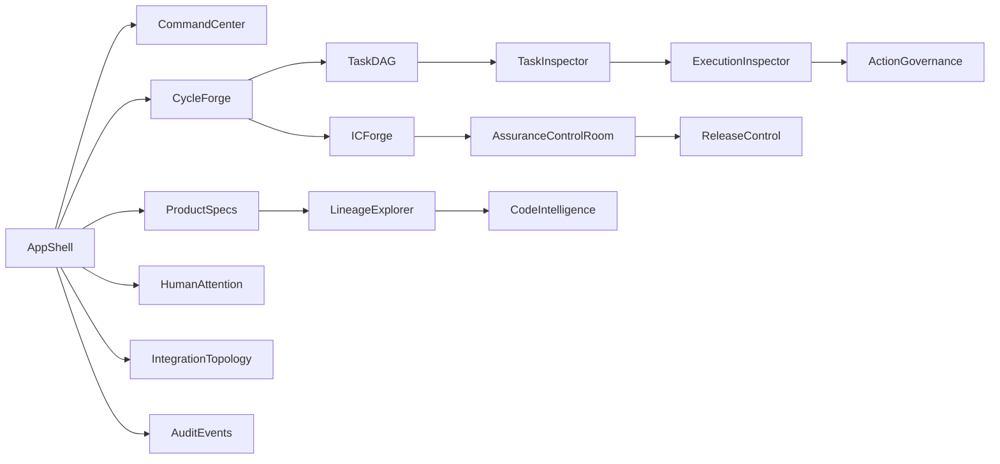
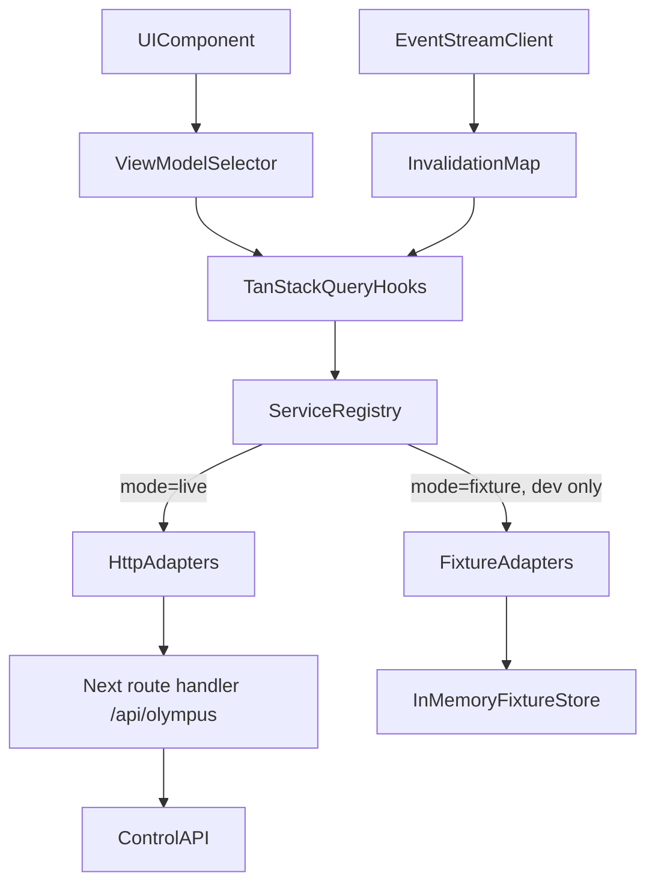
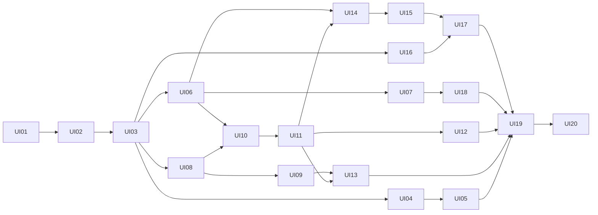

# Olympus Frontend UI Track — Implementation Plan

First build action: copy this plan verbatim to `plans/frontend-ui-implementation.md`. Render every "matrix" list below as a markdown table in that file. Then register the UI track in `STATUS.md` (see section 34.2).

---

## 1. Objective

Build `apps/dashboard`, the Olympus operator console. It is a dense, technical **software delivery control room / software forge** in which a Product Owner or Engineering Lead can follow the whole path, Intent → Product Model → Spec → Task DAG → Execution → Code → Integration → Assurance → Evidence → Governance → Release, for all four journeys. They must not need DB rows, LangGraph checkpoints, transcripts or logs to do so.

Constraints that shape everything:
- **Repository reality:** no backend, no frontend and no commits exist (`STATUS.md` §1: every phase is `NOT_STARTED`). Every backend capability is **PLANNED** (owned by phases 01–18). None is implemented or partial.
- **Phase 17** (`plans/17-dashboard-and-operator-experience.md`) owns the dashboard. Its stack, route map, invariants (the UI never computes eligibility, gates or readiness; every mutation is a typed command with an `Idempotency-Key`; SSE causes refetch only) and read-model list are **retained**. This track pre-builds the dashboard ahead of Phase 16 using fixture adapters. Phase 17 still owns the backend read models, `TransitionService.preview`, `/commands/catalog`, the Orchestrator and the live completion.
- Backend identifiers are used verbatim from the plans. Prompt terminology that differs is mapped in section 7.4 and never invented.

---

## 2. Existing Frontend Assessment

- **RETAIN:**
  - Phase 17 decisions: Next.js App Router, TS strict, Tailwind, shadcn/ui, TanStack Query, `openapi-typescript` + `openapi-fetch`, httpOnly-cookie auth proxy, a streaming SSE route handler, Vitest, Playwright and the `apps/dashboard` location.
  - Phase 17 route paths (section 4).
  - README §5 conventions (keys such as `DC-003` and `EX-551`, the command principle, `Idempotency-Key`).
  - Phase 18 CSRF and CORS requirements for the cookie proxy.
- **EXTEND:**
  - The Phase 17 route map gains cycle tasks, integration, agents and cycles-list routes.
  - The Phase 17 read-model list gains proposed shapes (sections 6 and 33).
  - `STATUS.md` gains a §16 Frontend UI Track.
- **REFACTOR / REPLACE:** none (nothing exists).
- **ADD:** all of `apps/dashboard/**`, the UI tests and the frontend sections of `STATUS.md`.

---

## 3. Information Architecture

Global shell:
- a left **NavRail**;
- a top **ContextBar** with ProjectSwitcher, CycleSwitcher, journey type, live connection indicator, attention count, actor and roles;
- a **DataModeBanner**, shown only in fixture mode and impossible to dismiss;
- a command palette (cmdk) for entity jump.

NavRail groups (contextual tabs, drawers and inspectors are preferred over separate routes):
- **Command Center:** project home, with the active cycle selected via `?cycle=`.
- **Delivery:**
  - Delivery Cycles: list, then Cycle Forge with tabs Overview, Tasks, Executions, Integration, Events.
  - Task Graph and Executions live inside the cycle.
- **Agents & Runtime:** tabs Capabilities, Executions, Actions (ToolGateway), Model Usage, Runtime.
- **Product & Specs:** tabs Sources, Product Tree, Specs, Architecture, Spec Deltas, Change Requests, Defects.
- **Lineage:** the product-to-code explorer.
- **Code Intelligence.**
- **Brownfield:** shown when the project has a `BROWNFIELD_ONBOARDING` cycle; otherwise listed with an empty state.
- **Integration:** IC Forge, scoped to a cycle.
- **Assurance:** tabs Control Room, Evidence Registry, Findings, Coverage.
- **Releases.**
- **Human Attention:** `/inbox`, with a global badge.
- **Integrations:** topology, inbound, outbound, reconciliation, connectors.
- **Audit / Events.**

Linked-entity navigation: every entity key renders through `EntityLink`. A click opens an **EntityDrawer** (a quick inspector sheet); Cmd/Ctrl-click navigates to the full page. Drawer state lives in URL search params (`?inspect=task:<id>`) so it is shareable and survives back/forward.



---

## 4. Route Map

All routes are under `apps/dashboard/app/`.

Route groups:
- `(auth)` holds the login page.
- `(console)` holds the shell layout.

Routes marked [P17] are verbatim from Phase 17; routes marked [NEW] are additions recorded in STATUS.

- `/login` [P17 17.3]
- `/projects` [P17]: list, readiness_state, current release.
- `/projects/[projectId]` [P17 overview, extended into the **Command Center**].
- `/projects/[projectId]/cycles` [NEW]: cycles list with type, state and objective.
- `/projects/[projectId]/cycles/[cycleId]` [P17]: **Cycle Forge** (LifecycleForge, StageInspector drawer, transition preview, approvals, events).
- `/projects/[projectId]/cycles/[cycleId]/tasks` [NEW]: **Task DAG**; `?task=` opens the TaskInspector.
- `/projects/[projectId]/cycles/[cycleId]/integration` [NEW]: **IC Forge**; `?ic=` selects the candidate.
- `/projects/[projectId]/agents` [NEW]: Agent Operations and Runtime; `?tab=capabilities|executions|actions|model-usage|runtime`.
- `/projects/[projectId]/product` [P17]: Product and Specs; `?feature=`, `?spec=`, `?compare=<fromSpecId>..<toSpecId>`, `?tab=`.
- `/projects/[projectId]/code` [P17]: Code Intelligence; `?index=canonical|<indexVersionId>`, `?entity=`.
- `/projects/[projectId]/brownfield` [P17].
- `/projects/[projectId]/assurance` [P17]; `?cycle=`, `?ic=`, `?tab=control-room|evidence|findings|coverage`.
- `/projects/[projectId]/integrations` [P17].
- `/projects/[projectId]/releases` [NEW]: list.
- `/executions/[executionId]` [P17]: Execution Inspector.
- `/integration-candidates/[icId]` [NEW]: IC detail (the same IcForge component, focused).
- `/impact/[iaId]` [P17]: Impact Explorer.
- `/defects/[defectId]` [P17].
- `/change-requests/[crId]` [P17].
- `/releases/[releaseId]` [P17]: Release Control.
- `/inbox` [P17]: Human Attention Center; `?project=`.
- `/lineage` [P17]; `?project=&root_type=&root_id=&direction=`.
- `/audit` [P17]: Audit and Events; `?project=&cycle=&type=&correlation_id=`.
- API route handlers:
  - `app/api/auth/login/route.ts`
  - `app/api/auth/logout/route.ts`
  - `app/api/olympus/[...path]/route.ts` (proxy, including SSE streaming)

Entity-addressed top-level routes resolve their project from the entity and render inside the project shell. URLs carry backend UUIDs, and the UI displays keys. Key-based URLs wait on missing API M-15.

---

## 5. Component Hierarchy

Directories mirror Phase 17 §9 (`components/{lifecycle,dag,graph,diff,evidence,knowledge-chip,confirm-command,approval-form}`), expanded:

- `components/ui/*`: shadcn generated (button, badge, card, tabs, sheet, dialog, dropdown-menu, tooltip, command, table, scroll-area, separator, skeleton, toggle-group, popover, select, textarea, sonner).
- `components/shell/`: `AppShell`, `NavRail`, `ContextBar`, `ProjectSwitcher`, `CycleSwitcher`, `DataModeBanner`, `LiveConnectionIndicator`, `CommandPalette`, `ActorMenu`.
- `components/states/`: `LoadingState` (skeletons), `EmptyState`, `ErrorState` (shows `OlympusApiError` code and reasons), `PendingCapability` ("Backend capability pending — Phase NN" / "Not available"), `FixtureBadge`.
- `components/status/`: `StatusBadge` (enum → tone + icon + label + shape), `KnowledgeChip`, `OriginBadge` (`GENERATED_LINEAGE` / `DISCOVERED` / `HUMAN_CONFIRMED`), `ConfidenceMeter` (numeric or `HIGH|MEDIUM|LOW`, plus cap reason), `RetrievalSourceBadge`, `ShaBadge`, `IndexKindBadge` (`CANDIDATE` provisional vs `CANONICAL`), `RecommendationVsGate`, `SeverityBadge`, `ImpactKindChip`.
- `components/entity/`: `EntityLink`, `EntityDrawer`, `KeyValueGrid`, `VersionTag` (`TC-001:v2`), `HashTag`, `TimeAgo`, `Duration`, `JsonInspector`.
- `components/confirm-command/`: `ConfirmCommandDialog` and the `CommandButton` hook binding.
- `components/approval-form/`: `ApprovalDecisionForm`, `ClarificationAnswerForm`, `PromotionDecisionForm`, `WaiverRequestForm`, `ExpectedBehaviorDecisionForm`, `ReconciliationResolveForm`.
- `components/lifecycle/`: `LifecycleForge`, `ForgeStage`, `ForgeSubstep`, `ForgeConduit` (connectors and loop arcs), `StageInspector`, `TransitionPreview`, `TerminalOverlay`.
- `components/timeline/`: `EventTimeline`, `EventRow`, `EventFilters`, `LiveTail`.
- `components/graph/`: `GraphCanvas` (`@xyflow/react` wrapper), `useElkLayout` (elkjs in a web worker), `GraphLegend`, `GraphListView` (accessible list twin), `GraphToolbar` (fit, depth, expand, filter).
- `components/dag/`: `TaskDag`, `TaskNode`, `TaskInspector`, `ContractView`, `EligibilityExplain`.
- `components/execution/`: `ExecutionChain` (Task → TaskContract → Eligibility → Execution → Snapshot → Lease → Worktree → AgentRuntime → ToolGateway → CandidateCommit), `ExecutionHeader`, `SnapshotPanel`, `LeasePanel`, `WorktreePanel`, `ModelCallsTable`, `CandidateCommitPanel`, `RetryLineage`, `CheckpointPanel`, `RuntimeTelemetryStream` (labelled non-authoritative).
- `components/diff/`: `UnifiedDiffViewer` (`react-diff-view` + `gitdiff-parser`), `StructuredSpecDiff`.
- `components/governance/`: `ActionGovernancePipeline`, `ActionRequestList`, `ActionRequestDetail`, `ResourcePanel`.
- `components/agents/`: `AgentOpsBoard`, `CapabilityLane`, `CapabilityCard`.
- `components/product/`: `ProductTree`, `ProductSourceList`, `FeatureSpecView`, `RequirementList`, `UserStoryList`, `AcList`, `ImplementationSpecView`, `ArchitectureView`, `SpecVersionPicker`, `ScopeApprovalPanel`, `KnowledgeList`.
- `components/spec-delta/`: `SpecDeltaView`, `DeltaSection`, `AcDeltaList`.
- `components/lineage/`: `LineageExplorer`, `LineageNode`, `LineageFilters`, `LineageQuestions`.
- `components/code/`: `IndexStatusBar`, `CodeSearch`, `EntityTree` (lazy), `CodeEntityPage`, `NeighborhoodGraph`, `RelationList`, `SpecCodeLinkList`.
- `components/brownfield/`: `DiscoveryPanel`, `ObservedBehaviorList`, `RecoveredSpecCard`, `CitationList`, `ReconciliationCategoryBadge`, `ReviewQueue`, `BaselineList`, `ReadinessMetrics`, `RecoveredWatermark`.
- `components/impact/`: `ImpactExplorer`, `ImpactFlow` (column flow), `ImpactItemList`, `ImpactPathGraph`, `ImpactRationale`.
- `components/integration/`: `IcForge`, `CommitConvergenceGraph`, `IntegrationChecks`, `ConflictRemediationChain`, `IcSupersessionChain`.
- `components/assurance/`: `AssuranceControlRoom`, `AssuranceLane`, `GateCard`, `ObligationList`, `FindingList`, `FindingDetail`, `CoverageMatrix`.
- `components/evidence/`: `EvidenceRegistry`, `EvidenceRow`, `AcEvidenceTree`.
- `components/attention/`: `AttentionCenter`, `AttentionItem`, `AttentionFilters`.
- `components/release/`: `ReleaseControl`, `EligibilityVerdict`, `EligibilityConditionList`, `ManifestView`, `DeploymentPanel`.
- `components/integrations/`: `IntegrationTopology`, `InboundPipeline`, `OutboundPipeline`, `ConnectorList`, `InboundEventList`, `ConnectorActionList`, `ReconciliationList`.
- `components/defects/`: `DefectView`, `ReproductionList`, `TraceCandidates`, `RootCausePanel`.
- `components/change-requests/`: `ChangeRequestView`, `InterpretationPanel`.
- `components/command-center/`: `CommandCenter`, `CycleSummaryHeader`, `ActivityPanels`, `AttentionSummary`, `EvidenceCoverageSummary`, `ReleaseEligibilitySummary`.

---

## 6. Typed Domain / View Models

Two layers:
1. **Contracts** (`lib/contracts/*`): zod schemas and inferred types mirroring backend wire shapes verbatim. Field names stay snake_case exactly as in the plans; no renaming at this layer.
2. **View models** (`lib/view-models/*`): pure, memoizable functions that turn contracts into UI models. They contain **presentation logic only**. They never compute eligibility, gate status, readiness, guard outcomes or transition validity.

Contract files:
- `common.ts`: `Uuid`, `Sha`, `IsoDateTime`, `VersionedRef{ref_type, ref_id, version?, key?}`, `Page<T>`, `ApiErrorBody`.
- `enums.ts`: every enum verbatim. Each is exported as a `const` tuple plus an `openEnum()` schema; values are listed in 7.3.
- Per-domain files with entity shapes from the plans:
  - `project.ts`: Project, Repository.
  - `delivery-cycle.ts`: DeliveryCycle (with `allowed_commands`), TransitionPreview / GuardResult.
  - `task.ts`: Task, TaskDependency, TaskContract, TaskContractBody, Eligibility.
  - `execution.ts`: Execution, ExecutionSnapshot + SnapshotContent, lease, Checkpoint, ContinuationPackage, ExecutionEvent, Artifact.
  - `runtime.ts`: ModelCall.
  - `actions.ts`: ActionRequest (`policy_decision{decision, rule_ids, reasons, policy_version_id}`), ActionResult, Worktree, CandidateCommit (`changed_files[{path, change_type, additions, deletions}]`), ConnectorAction, ConnectorResult.
  - `approvals.ts`, `clarifications.ts`.
  - `product.ts`: ProductSource, Capability, Feature, FeatureSpec + FeatureSpecBody, Requirement, UserStory, AcceptanceCriterion, KnowledgeItem, ProductDecomposition record, ScopeSet.
  - `planning.ts`: Architecture + ArchitectureBody, ArchitectureContract, ImplementationSpec + ImplementationSpecBody, TaskPlan.
  - `code-intelligence.ts`: CodeIndexVersion, CodeEntity, CodeRelation, RetrievalHit, repository_index_pointers, code_entity_changes.
  - `traceability.ts`: SpecCodeLink, `LineageGraph{nodes[{type, id, key, version, label, origin?, confidence?}], edges[{from, to, relation, origin, confidence}]}`.
  - `integration.ts`: IntegrationCandidate (`ordering[{task_key, candidate_commit_sha, position, reason}]`), integration_candidate_commits.
  - `assurance.ts`: Evidence, VerificationObligation, AcceptanceCoverage, Finding (with `fingerprint`), Gate (`status`, `recommendation`, `reasons`, `inputs_hash`, `finalized_by`), Review.
  - `release.ts`: Release, ReleaseManifestContent, `ReleaseEligibilityEvaluation{eligible, conditions[{name, ok, reasons, inputs_hash}], ...}`, DeliveryOutcome, DeploymentRecord.
  - `brownfield.ts`: RepositoryDiscovery, ObservedBehavior, RecoveredSpecEvidence, RecoveryProposal, Citation, BehavioralBaseline, BaselineSet, PromotionDecision, ReadinessAssessment (`metrics[{name, value, threshold, ok}]`).
  - `impact.ts`: SpecDelta, ImpactAssessment, ImpactItem (`path[{from, relation, to}]`), staleness_events.
  - `change.ts`: ChangeRequest, ChangeInterpretation, AcChange.
  - `defect.ts`: Defect, DefectTriage, Reproduction, TraceCorrelation, RootCauseAnalysis, ExpectedBehaviorResolution.
  - `connectors.ts`: ConnectorConfig, InboundEvent, ReconciliationItem, RepositoryEvent, ExternalLink.
  - `events.ts`: DomainEvent envelope.
  - `views.ts`: **proposed** read-model shapes for the Phase 17 endpoints (M-16, M-17 and friends), each marked `@proposed` in JSDoc.
  - `commands.ts`: command names per target and payload schemas.
  - `orchestrator.ts`: `OrchestratorTurn`, `ProposedCommand` (Phase 17 §6; types only).

```ts
// lib/contracts/events.ts
export const DomainEvent = z.object({
  id: Uuid, sequence: z.number().int(), event_type: z.string(),
  aggregate_type: z.string(), aggregate_id: Uuid,
  project_id: Uuid, delivery_cycle_id: Uuid.nullable(),
  payload: z.record(z.string(), z.unknown()),
  correlation_id: z.string(), causation_id: z.string().nullable(),
  actor_id: Uuid.nullable(), occurred_at: IsoDateTime,
});
```

`openEnum(values)`:
- In tests and fixture validation it parses strictly.
- At runtime, live responses accept unknown strings, log a warning, and render with an `UNKNOWN` tone plus the raw label. This tolerates the cross-plan inconsistencies in 34.1 without crashing.

Key view models (`lib/view-models/*`):

```ts
type DataSource = "live" | "fixture";
type StageDisplayState = "NOT_STARTED" | "READY" | "ACTIVE" | "WAITING" | "BLOCKED" | "FAILED" | "COMPLETE";
interface ForgeStageVM {
  state: string;                 // backend DeliveryCycle state, verbatim
  label: string; display: StageDisplayState;
  visits: { enteredAt: string; exitedAt?: string }[];  // from delivery_cycle.transitioned history
  owningCapabilities: CapabilityId[];
  substeps: ForgeSubstepVM[];    // artifact presence, labelled "artifact present", not authority
  activity: { runningExecutions: number; checkpointed: number; pendingApprovals: number; openClarifications: number; blockingFindings: number };
  forwardCommand?: { command: string; preview?: GuardResult[] };   // preview from server only
}
interface CapabilityLaneVM { capability: CapabilityId; executions: AgentExecutionVM[]; derivedFrom: "executions" }
interface AgentExecutionVM { executionId; executionKey; taskKey; cycleKey; status: ExecutionStatus; agentProfile; runtime?: string; modelAlias?: string; worktreeBranch?: string; startedAt?: string; currentAction?: { tool; resource; action; status }; lastEvent?: { type; at }; error?: string }
interface TaskNodeVM { taskId; key; title; workType; origin; status; capability?; riskTier?; deps: string[]; specRefs: VersionedRef[]; latestExecution?: { key; status }; outputStatus: "PENDING" | "PRODUCED" | "VALIDATED" | "UNKNOWN" }
interface AttentionItemVM { kind: "APPROVAL" | "CLARIFICATION" | "PROMOTION_REVIEW" | "BLOCKING_FINDING" | "RECONCILIATION_ESCALATION"; category: AttentionCategory; why: string; projectId; cycleId?; refs: EntityRef[]; risk?: string; options: AttentionAction[]; recommendation?: string; subjectPin?: { subject_type; subject_version; subject_hash } }
interface ReleaseVerdictVM { verdict: "RELEASE_ELIGIBLE" | "RELEASE_BLOCKED" | "NOT_EVALUATED"; reasons: { condition: string; reasons: string[] }[]; evaluatedAt; integratedSha }  // verdict === server `eligible`, nothing else
```

Stage display-state rule (presentation only, documented in `lib/view-models/lifecycle.ts`):
- Stages before `cycle.state` in the display order that were visited show **COMPLETE**.
- The current stage shows:
  - **FAILED** if the cycle is in terminal `FAILED`;
  - else **BLOCKED** if the server guard preview for its forward command has failing reasons and there is a blocking finding, a failed execution or a blocking open clarification;
  - else **WAITING** if there are pending approvals, open clarifications or `CHECKPOINTED` executions;
  - else **ACTIVE** if there are running executions;
  - else **READY**.
- The next stage shows **READY** only when the server preview says its command is allowed; otherwise **NOT_STARTED**.
- Backward loops (`return_to_development`, `READINESS ⇄ REMEDIATION`, `revise_*`) render as loop arcs with visit counts.

---

## 7. API Client Architecture



### 7.1 Layout

- `lib/api/http.ts`: `createHttpClient({ baseUrl: "/api/olympus" })`.
  - Injects `X-Correlation-ID` (new per user action) and `Idempotency-Key` on mutations.
  - Normalizes errors into `OlympusApiError{status, code, message, reasons[], currentState?}`, mapping 401, 403, 409 `IllegalTransition`/`StateConflict`, and 422 `GuardFailed`/`GUARD_NOT_IMPLEMENTED:<id>`/idempotency mismatch.
  - In development, validates responses with zod and surfaces contract drift.
- `lib/api/domains/<domain>.ts` (one per domain): exports a `XService` interface and `createXHttpService(http)`. Domains:
  - `projects`, `delivery-cycles`, `product`, `specs`, `planning`, `tasks`, `executions`, `agents`, `runtime`, `actions`, `code-intelligence`, `lineage`, `impact`, `integration`, `assurance`, `evidence`, `approvals`, `clarifications`, `brownfield`, `baselines`, `releases`, `change-requests`, `defects`, `connectors`, `events`, `audit`, `views`, `auth`.
- `lib/api/services.ts`: the `OlympusServices` aggregate and `createServices(config)`.
  - Live mode builds the HTTP adapters.
  - Fixture mode dynamically imports `@/lib/fixtures` (code-split), and only when `NEXT_PUBLIC_OLYMPUS_DATA_MODE=fixture`.
- `lib/api/capabilities.ts`: the capability manifest `{id, label, requiredOperations: ["GET /delivery-cycles/{id}/release-eligibility"], backendPhase: "10"}`.
  - Live mode fetches `/api/olympus/openapi.json` once and resolves each capability to `available | pending`.
  - A live adapter method whose capability is pending throws `CapabilityPendingError`, which renders `PendingCapability`.
  - Fixture mode is never mixed into live mode (no hybrid; see decision OD-2).
- `lib/api/generated/schema.d.ts`: produced by `pnpm gen:api` (Phase 17 17.2) once the backend exists, plus `lib/api/generated/compat.test-d.ts`, which runs vitest `expectTypeOf` checks of zod-inferred contracts against generated types. Any mismatch becomes a STATUS drift entry.
- `lib/query/keys.ts`: query key factory, e.g. `qk.cycle(id)`, `qk.cycleTasks(id)`, `qk.taskDag(id)`, `qk.execution(id)`, `qk.icAssurance(id)`, `qk.releaseEligibility(cycleId)`.
- `lib/query/hooks/*`: one hook per read, e.g. `useCycle`, `useTaskDag`, `useExecution`, `useReleaseEligibility`.
- `lib/commands/use-command.ts`: `useOlympusCommand(spec)`.
  - Generates the `Idempotency-Key` when the confirm dialog opens and reuses it on retry.
  - Sends `{expected_state, payload}` for cycle commands.
  - Maps 409 to "state changed, refresh", 422 to a guard-reason list, and 403 to a role message.
  - Invalidates affected keys on success.
  - Every mutation path is reachable only through `ConfirmCommandDialog`.
- `lib/auth/*`:
  - `useActor()` reads `GET /auth/me` (M-03; fixture actor in fixture mode).
  - `can(role)` drives UI hiding or disabling; the server stays authoritative.
- Proxy `app/api/olympus/[...path]/route.ts` (Node runtime, `dynamic = "force-dynamic"`):
  - forwards to `OLYMPUS_API_URL` with `Authorization: Bearer <httpOnly cookie olympus_token>`;
  - forwards `Idempotency-Key`, `X-Correlation-ID` and `Last-Event-ID`;
  - streams `text/event-stream` unbuffered;
  - enforces double-submit CSRF on mutating methods (Phase 18).
- Login route: `POST {token}` → validate with `GET /auth/me` (fall back to `GET /projects`) → set the httpOnly, SameSite=Strict cookie and the CSRF cookie.

### 7.2 Service interface example

```ts
export interface DeliveryCycleService {
  list(projectId: Uuid): Promise<DeliveryCycle[]>;
  get(cycleId: Uuid): Promise<DeliveryCycle>;                    // includes allowed_commands
  nextTransitions(cycleId: Uuid): Promise<TransitionPreview[]>;  // GET /delivery-cycles/{id}/next-transitions (P17)
  events(cycleId: Uuid, q: { after?: number; limit?: number }): Promise<Page<DomainEvent>>;
  command(cycleId: Uuid, command: CycleCommand, body: { expected_state: string; payload?: unknown }, idem: string): Promise<CommandResult>;
}
```

### 7.3 Verbatim enums (copy into `lib/contracts/enums.ts`)

Kernel and work:
- `DeliveryCycleType`: GREENFIELD_BUILD, BROWNFIELD_ONBOARDING, FEATURE_CHANGE, BUG_FIX, REMEDIATION
- Per-type states (display order):
  - GREENFIELD_BUILD: DISCOVERY, PRODUCT_MODEL, ARCHITECTURE, PLANNING, DEVELOPMENT, INTEGRATION, ASSURANCE, RELEASE, COMPLETE
  - BROWNFIELD_ONBOARDING: RECON, CODE_INDEX, RECOVERED_SPEC, BASELINE, READINESS, REMEDIATION (loop), READY
  - FEATURE_CHANGE: INTAKE, SPEC_DELTA, IMPACT_ANALYSIS, PLANNING, DEVELOPMENT, INTEGRATION, ASSURANCE, RELEASE, COMPLETE
  - BUG_FIX: TRIAGE, REPRODUCTION, EXPECTED_BEHAVIOR, ROOT_CAUSE, DEVELOPMENT, INTEGRATION, REGRESSION, ASSURANCE, RELEASE, COMPLETE
  - REMEDIATION: INTAKE, PLANNING, DEVELOPMENT, INTEGRATION, ASSURANCE, RELEASE, COMPLETE
  - Terminal states on every type: CANCELLED, FAILED
- Cycle commands: start_product_modeling, start_architecture, revise_product_model, start_planning, revise_architecture, start_development, start_integration, start_assurance, return_to_development, start_release, complete, start_code_index, start_spec_recovery, start_baseline, start_readiness, start_remediation, reassess_readiness, declare_ready, start_spec_delta, start_impact_analysis, revise_spec_delta, start_reproduction, resolve_expected_behavior, start_root_cause, start_regression, cancel, fail (SYSTEM only; never shown as a button)
- `ProjectReadiness`: UNKNOWN, ONBOARDING, READY_FOR_CHANGE
- `ActorKind`: HUMAN, AGENT, SYSTEM, INTEGRATION
- `ActorRole`: OPERATOR, APPROVER, VIEWER, SYSTEM, INTEGRATION
- `WorkType`: ANALYSIS, CODE_CHANGE, VERIFICATION, INTEGRATION, RELEASE
- `TaskOrigin`: IMPLEMENTATION_PLAN, REMEDIATION, REPAIR, CONTROL_PLANE
- `TaskStatus`: DRAFT, BLOCKED, READY, QUEUED, RUNNING, COMPLETED, FAILED, CANCELLED, STALE, REVALIDATION_REQUIRED
- `TaskContractStatus`: DRAFT, ISSUED, SUPERSEDED
- `base_policy`: CYCLE_BASE, DEPENDENCY_INTEGRATION, EXPLICIT_SHA, NONE
- `executor_kind`: AGENT_RUNTIME, DETERMINISTIC
- Risk tiers: R0, R1, R2, R3
- `ApprovalType`:
  - Phase 01: SCOPE, ARCHITECTURE, ARCHITECTURE_DELTA, IMPLEMENTATION_SPEC, SPEC_DELTA, SPEC_DECISION, REPAIR_SPEC, PROMOTION, FINDING_WAIVER, ACTION, RELEASE, READINESS
  - Added by later phases: UNREPRODUCED_REPAIR, EXPECTED_BEHAVIOR (Phase 15), DEPLOYMENT (Phase 16). See C-01.
- `ApprovalStatus`: PENDING, APPROVED, REJECTED, CHANGES_REQUESTED, EXPIRED, CANCELLED
- Approval decision values: APPROVED, REJECTED, CHANGES_REQUESTED

Execution and runtime:
- `ExecutionStatus`: QUEUED, LEASED, STARTED, CHECKPOINTED, OUTPUT_PRODUCED, VALIDATING, COMMITTED, COMPLETED, FAILED, TIMED_OUT, CANCELLED, STALE
- Lease state: ACTIVE, RELEASED, EXPIRED
- Checkpoint reason: CLARIFICATION, APPROVAL, EXTERNAL_DEPENDENCY, RECONCILIATION (+ WAITING_EXTERNAL; see C-06)
- Clarification status: OPEN, ANSWERED, CANCELLED
- Eligibility reason prefixes: NOT_READY, DEPENDENCY_INCOMPLETE, ARTIFACT_MISSING, CONTRACT_VERSION_MISMATCH, APPROVAL_MISSING, POLICY_BLOCKED, CONFLICTING_EXECUTION, BASE_RESOLVER_UNAVAILABLE
- `model_calls.status`: SUCCEEDED, FAILED_SCHEMA, FAILED_PROVIDER, BUDGET_EXCEEDED, CANCELLED
- Model aliases: product_decomposition, planning, architecture, repository_reasoning, implementation, review, verification_planning, orchestration, embedding
- `AgentEvent.type`: MODEL_CALL_STARTED, MODEL_CALL_COMPLETED, TOOL_REQUESTED, TOOL_RESULT, PROGRESS, CHECKPOINT_REQUESTED, OUTPUT_PROPOSED, ERROR

ToolGateway and connectors:
- `ActionStatus`: REQUESTED, DENIED, PENDING_APPROVAL, APPROVED, EXECUTING, SUCCEEDED, FAILED, RECONCILIATION_REQUIRED
- Tools: repo.read, repo.search, repo.list, repo.write, repo.delete, shell.run, test.run, git.diff, git.status, git.commit, olympus.ask_question, olympus.request_approval, olympus.submit_artifact
- Worktree mode: WRITABLE, READONLY
- Worktree status: ACTIVE, REMOVED, ORPHANED
- Connector action status: PENDING, SUCCEEDED, FAILED_RETRYABLE, FAILED_FINAL, UNKNOWN

Product and planning:
- `source_type`: PRD, BRD, SRS, BRIEF, FEATURE_LIST, USER_STORIES, ARCHITECTURE_NOTE, DESCRIPTION, ISSUE, CHANGE_REQUEST, DEFECT_REPORT, JSON
- `SpecStatus`: DRAFT, PROPOSED, APPROVED, SUPERSEDED, REJECTED (+ PROMOTED, CONFIRMED_EXISTING for RECOVERED rows)
- `SpecKind`: CANONICAL, RECOVERED
- `ModelOrigin`: GREENFIELD, RECOVERED, HUMAN, CHANGE, REPAIR
- Capability/Feature status: PROPOSED, APPROVED, RETIRED
- `EvidenceRequirement`: EXECUTABLE, RUNTIME, EXECUTABLE_OR_RUNTIME, REVIEW_ALLOWED
- Requirement kind: FUNCTIONAL, NON_FUNCTIONAL, CONSTRAINT
- Requirement priority: MUST, SHOULD, COULD
- AC `change_kind`: ADDED, MODIFIED, UNCHANGED, REMOVED
- `KnowledgeClass`: FACT, INFERENCE, UNCERTAINTY, DECISION, ASSUMPTION
- Knowledge confidence: HIGH, MEDIUM, LOW, NULL
- Architecture kind: BASELINE, DELTA, RECOVERED
- ImplementationSpec kind: FEATURE, DELTA, REPAIR, REMEDIATION (+ RECOVERED)
- TaskPlan status: PROPOSED, ACCEPTED, REJECTED, SUPERSEDED

Code intelligence and integration:
- `IndexKind`: CANDIDATE, CANONICAL
- `IndexSource`: REPOSITORY_SNAPSHOT, EXECUTION, INTEGRATION_CANDIDATE, RELEASE (+ EXTERNAL_PUSH; see C-07)
- Index status: BUILDING, READY, FAILED, SUPERSEDED, DISCARDED
- `EntityType`: REPOSITORY, PACKAGE, MODULE, FILE, CLASS, METHOD, FUNCTION, ROUTE, SCHEMA, ORM_MODEL, TABLE, TEST
- `RelationType`: CONTAINS, IMPORTS, CALLS, INHERITS, ACCESSES, EXPOSES, USES_SCHEMA, MAPS_TO, VERIFIED_BY
- Relation provenance: AST, FRAMEWORK:fastapi, FRAMEWORK:sqlalchemy, FRAMEWORK:pydantic, FRAMEWORK:pytest, HEURISTIC
- `retrieval_source`: STRUCTURAL, LEXICAL, SEMANTIC
- Search mode: symbol, lexical, route, hybrid
- SpecCodeLink `spec_type`: FEATURE_SPEC, IMPLEMENTATION_SPEC, ACCEPTANCE_CRITERION
- SpecCodeLink relation: IMPLEMENTS, VERIFIES
- SpecCodeLink origin: GENERATED_LINEAGE, DISCOVERED, HUMAN_CONFIRMED
- SpecCodeLink status: ACTIVE, STALE, RETIRED (+ SUPERSEDED, Phase 12)
- `ICStatus`: CREATED, INTEGRATING, VALIDATING, READY, CONFLICT, FAILED, SUPERSEDED

Assurance and release:
- Finding source: INTEGRATION, WARDEN, SENTINEL, SYSTEM, READINESS, LINEAGE
- Finding severity: BLOCKER, MAJOR, MINOR, INFO (+ CRITICAL; see C-04)
- Finding status: OPEN, IN_REMEDIATION, RESOLVED, WAIVED, SUPERSEDED
- Finding categories:
  - Phase 08: MERGE_CONFLICT, INTEGRATION_CHECK_FAILED, LINEAGE_DECLARATION_MISMATCH
  - Warden: ARCHITECTURE_CONFORMANCE, CONTRACT_CONFORMANCE, SECURITY, CORRECTNESS, MAINTAINABILITY, TEST_ADEQUACY, SCOPE_VIOLATION, RISK
  - Later phases: WARDEN_UNSPECIFIED_CONCERN, FLAKY_TEST, LINEAGE_LINK_STALE, EXTERNAL_DRIFT, CONNECTOR_FAILURE, RECONCILIATION_ESCALATED, SECRET_IN_CONTEXT
- `EvidenceType`: UNIT_TEST, INTEGRATION_TEST, API_TEST, E2E_TEST, REGRESSION_TEST, REPRODUCTION, RUNTIME_OBSERVATION, STATIC_REVIEW, MODEL_ASSESSMENT, EXTERNAL_CI, INTEGRATION_CHECK
- Evidence result: PASS, FAIL, ERROR, SKIPPED
- Evidence producer: SENTINEL, WARDEN, INTEGRATION, CI, SYSTEM
- Evidence subject_type: AC, BASELINE, FINDING, DEFECT, GATE, IC
- Obligation gate_type: SENTINEL, BASELINE, REGRESSION, REPRODUCTION
- Obligation reason: AC_MANDATORY, AC_OPTIONAL, IMPACT_ASSESSMENT, BASELINE_REQUIRED, DEFECT_REPRODUCTION, REGRESSION (+ BASELINE_IMPACTED, AC_REVALIDATION, SMOKE; see C-03)
- Obligation status: OPEN, SATISFIED, FAILED, WAIVED
- Gate type: INTEGRATION, WARDEN, SENTINEL, BASELINE, REGRESSION, REPRODUCTION
- Gate status: PENDING, PASS, FAIL, SUPERSEDED
- Warden recommendation: APPROVE, REQUEST_CHANGES
- Sentinel recommendation (`recommended`): PASS, FAIL
- `ReleaseStatus`: DRAFT, ELIGIBLE, NOT_ELIGIBLE, APPROVED, EXECUTING, RELEASED, FAILED, SUPERSEDED
- Eligibility condition names: manifest_valid, integration_candidate_is_current, required_gates_pass, required_approvals_exist, required_executions_not_stale, blocking_findings, mandatory_acceptance_criteria_have_evidence, required_behavioral_baselines_pass (+ Bug Fix: defect_reproduced_before_repair, original_reproduction_passes, regression_evidence_present)
- DeliveryOutcome result: RELEASED, READY_FOR_CHANGE, CANCELLED, FAILED
- Deployment status: REQUESTED, DEPLOYING, HEALTHY, FAILED, ROLLED_BACK

Brownfield:
- ObservedBehaviorKind: ROUTE_BEHAVIOR, TEST_ASSERTED, TEST_EXECUTION, DATA_INVARIANT, VALIDATION_RULE, STATE_TRANSITION, RUNTIME_OBSERVED
- Reconciliation category: MATCHED, NEW, MISSING, DIVERGENT
- `BaselineStatus`: PROPOSED, ACTIVE, REJECTED, FAILED_AT_BASE, SUPERSEDED, RETIRED, REVALIDATION_REQUIRED
- Baseline source: BROWNFIELD_EXISTING_TEST, BROWNFIELD_CHARACTERIZATION, BROWNFIELD_RUNTIME_PROBE, RELEASE_PROMOTION, CHANGE, REPAIR (+ REGRESSION; see C-05)
- PromotionDecision: PROMOTE_AS_CANONICAL, CONFIRM_EXISTING, REJECT_AS_NOT_INTENDED, DEFER, APPROVE_AS_PROJECT_ARCHITECTURE, ACTIVATE, RESOLVE, ACCEPT_KNOWN_GAP
- Readiness result: READY, NOT_READY
- Readiness metric names: principal_coverage, review_completion, baseline_coverage, baseline_pass, blocking_uncertainties_open, failing_existing_tests_unclassified, architecture_approved

Change, defect and impact:
- SpecDelta status: PROPOSED, APPROVED, REJECTED, SUPERSEDED
- IA `seed_kind`: SPEC_DELTA, DEFECT_ROOT_CAUSE, MANUAL
- IA status: RUNNING, COMPLETE, SUPERSEDED
- ImpactItem `item_type`: CODE_ENTITY, TEST, BASELINE, CONTRACT, SPEC
- `impact_kind`: DIRECT, TRANSITIVE, CANDIDATE, SEMANTIC_CANDIDATE
- ChangeRequest status: RECEIVED, INTERPRETED, SPEC_APPROVED, IN_DELIVERY, DONE, REJECTED, CANCELLED (+ RELEASED; see C-02)
- Interpretation resolution: EXISTING_FEATURE, NEW_FEATURE_IN_CAPABILITY, NEW_CAPABILITY
- AcChange op: ADD, MODIFY, REMOVE
- Defect status: REPORTED, TRIAGED, REPRODUCED, NOT_REPRODUCIBLE, EXPECTED_RESOLVED, ROOT_CAUSED, IN_REPAIR, FIXED, RELEASED, REJECTED
- Defect severity: S1, S2, S3, S4
- Reproduction phase: PRE_REPAIR, POST_REPAIR, REGRESSION_VALIDATION
- Reproduction outcome: REPRODUCED, NOT_REPRODUCED, PASS, FAIL, ERROR
- Trace `evidence_basis`: TRACEBACK, EXECUTED, GRAPH_ONLY
- RCA status: PROPOSED, ACCEPTED, REJECTED
- ExpectedBehavior classification: SPECIFIED, UNDERSPECIFIED, CONFLICTING, NOT_A_DEFECT
- ExpectedBehavior `resolution_kind`: SPECIFIED, SPEC_DELTA, HUMAN_DECIDED, NOT_A_DEFECT

Inbound and integrations:
- InboundEvent status: RECEIVED, DUPLICATE, REJECTED, ACCEPTED, STALE (+ INFO; see C-08)
- `auth_kind`: BEARER, HMAC_SHA256, NONE_LOCAL
- Inbound adapters: document_upload, change_request_api, defect_report_api, git_provider_webhook, repository_registration, issue_tracker_webhook, ci_callback, operator_api
- Connector providers: GITHUB, GITEA, LOCAL, HTTP
- Connectors: git_local, git_provider, ci, artifact, issue_tracker, deployment, http_generic
- ReconciliationItem kind: OUTBOUND_UNKNOWN, INBOUND_GAP, REPOSITORY_DRIFT
- ReconciliationItem status: OPEN, RECONCILING, RESOLVED_EXECUTED, RESOLVED_NOT_EXECUTED, ESCALATED, RESOLVED_MANUAL
- RepositoryEvent classification: OLYMPUS_RELEASE, EXTERNAL_FAST_FORWARD, EXTERNAL_REWRITE, NON_DEFAULT_REF, STALE

### 7.4 Prompt term → backend term mapping (the UI uses the right-hand side)

- DIRECTLY/TRANSITIVELY/POSSIBLY_AFFECTED → DIRECT / TRANSITIVE / CANDIDATE + SEMANTIC_CANDIDATE. There is no UNAFFECTED class.
- tool.requested / tool.allowed / tool.denied → `action.requested` / ActionStatus APPROVED, EXECUTING, then `action.completed` / `action.denied`.
- integration_candidate.created/ready → `integration.created` / `integration.ready`.
- code_index.completed → `code_index.ready` (candidate) / `code_index.updated` (canonical).
- warden.started / sentinel.started / agent.running → `execution.started` with agent_profile `warden.review`, `sentinel.plan` or `sentinel.execute`.
- release.approval_requested → `approval.requested` with approval_type RELEASE.
- repair.started → `remediation.requested`.
- commit.created → `candidate_commit.created`.
- capability.generated / feature.generated → `product_decomposition.proposed`, then `feature_spec.proposed`.
- Warden "PASS" recommendation → `APPROVE` (`REQUEST_CHANGES` for fail).
- Action states REQUESTED/ALLOWED/DENIED/APPROVAL_REQUIRED/RUNNING/COMPLETED/FAILED → ActionStatus verbatim (the "ALLOWED" column shows APPROVED or passed policy).
- Evidence SECURITY_SCAN / CODE_REVIEW / COMPATIBILITY_CHECK → not backend types; `STATIC_REVIEW` (Warden) covers review.
- Command Center stages "SPECIFICATION/IMPACT/APPROVAL" → actual journey states. Approvals render as gate markers on transitions, not as stages.
- "Regression" stage in Feature Change → a substep of ASSURANCE (BASELINE obligations). `REGRESSION` is a real state only in BUG_FIX.

---

## 8. Backend Dependency Matrix

Format: UI capability — API/event required — backend status — fixture needed — blocking. Every row has backend status PLANNED (the phase is NOT_STARTED) unless marked MISSING, which means the plans have no such contract (see section 33). "Blocking" means blocking for LIVE_VERIFIED; no row blocks fixture-mode build.

- Login / session — `GET /auth/me` (M-03); fallback `GET /projects` — MISSING / P01 — yes — yes
- Project list/detail — `GET /projects`, `GET /projects/{id}` (readiness_state, active_baseline_set) — P01/P12 — yes — yes
- Cycle list/detail + allowed commands — `GET /projects/{id}/delivery-cycles`, `GET /delivery-cycles/{id}` — P01 — yes — yes
- Transition preview — `GET /delivery-cycles/{id}/next-transitions` — P17 — yes — yes
- Cycle commands — `POST /delivery-cycles/{id}/commands/{command}` — P01 — yes (scripted) — yes
- Cycle overview read model — `GET /views/delivery-cycles/{id}/overview` (M-16 shape) — P17 (shape MISSING) — yes — no (composed fallback)
- Project overview read model — `GET /views/projects/{id}/overview` — P17 (shape proposed) — yes — no (fallback)
- State machine definitions — `GET /delivery-cycle-types/{type}/state-machine` (M-10) — MISSING — static display order — no
- Cycle events history — `GET /delivery-cycles/{id}/events` — P01 — yes — yes
- Cycle SSE — `GET /delivery-cycles/{id}/events/stream` (Last-Event-ID) — P01 — yes (scripted stream) — yes
- Project SSE — `GET /events/stream?project_id=&after=` (M-01) — MISSING (referenced by P17) — yes — no (per-cycle fallback)
- Task list / DAG — `GET /delivery-cycles/{id}/tasks`, `GET /delivery-cycles/{id}/task-dag` (P06), `GET /views/tasks/{cycle_id}/dag` (P17) — P01/P06/P17 — yes — yes
- Task detail / contract / history — `GET /tasks/{id}`, `/tasks/{id}/contract`, `/tasks/{id}/contracts` — P01 — yes — yes
- Task eligibility explain — `GET /tasks/{id}/eligibility` — P03 — yes — yes
- Task commands — `POST /tasks/{id}/commands/{mark_ready|cancel_task|retry_task}` — P01 — yes — yes
- Executions per task — `GET /tasks/{id}/executions` — P03 — yes — yes
- Executions per cycle/project — `GET /delivery-cycles/{id}/executions`, `GET /projects/{id}/executions` (M-04) — MISSING — yes — no (fallback: per-task fan-out)
- Execution detail/snapshot/events/artifacts/model-calls/cancel — `GET /executions/{id}`, `/snapshot`, `/events`, `/events/stream`, `/artifacts`, `/model-calls`, `POST /executions/{id}/cancel` — P03 — yes — yes
- Worktree / candidate commit / actions — `GET /executions/{id}/worktree`, `/candidate-commit`, `/actions`, `GET /actions/{id}` — P04 — yes — yes
- Agent activity — `GET /views/projects/{id}/agent-activity` (M-05) — MISSING — yes — no (fallback from M-04 / per-task)
- Agent profiles — `GET /agent-profiles` (M-06) — MISSING — yes — no
- Runtime aliases / workers — `GET /runtime/model-aliases`, `GET /runtime/workers` (M-07) — MISSING — yes — no (PendingCapability)
- Model usage aggregate — `GET /projects/{id}/model-usage` (M-08) — MISSING — yes — no
- Project-wide actions — `GET /actions?project_id=&status=` (M-09) — MISSING — yes — no
- Clarifications — `GET /clarifications?status=OPEN`, `POST /clarifications/{id}/answer` — P03 — yes — yes
- Approvals — `GET /approvals?status=PENDING`, `GET /approvals/{id}`, `POST /approvals/{id}/decision` — P01 — yes — yes
- Inbox read model — `GET /views/inbox` (M-17 shape) — P17 (shape MISSING) — yes — no (composed fallback)
- Product sources — `GET /projects/{id}/sources`, `/sources/{id}`, `/sources/{id}/content` — P05 — yes — yes
- Product tree/specs — `/projects/{id}/capabilities`, `/projects/{id}/features`, `/features/{id}`, `/features/{id}/specs`, `/specs/{id}` — P05 — yes — yes
- Scope approval request — `POST /delivery-cycles/{id}/scope/approval-request` — P05 — yes — yes
- Decompositions / knowledge — `/delivery-cycles/{id}/decompositions`, `/decompositions/{id}`, `/delivery-cycles/{id}/knowledge` — P05/P11 — yes — yes
- Architecture / ImplementationSpecs / TaskPlans — `/projects/{id}/architecture`, `/architectures/{id}`, `/features/{id}/implementation-specs`, `/implementation-specs/{id}`, `/delivery-cycles/{id}/task-plans`, `/task-plans/{id}`, `POST /task-plans/{id}/commands/accept`, the approval-request endpoints — P06 — yes — yes
- Spec delta — `/delivery-cycles/{id}/spec-delta`, `/spec-deltas/{id}`, `POST /spec-deltas/{id}/approval-request` — P13/P14 — yes — yes
- Change requests — `/projects/{id}/change-requests`, `/change-requests/{id}`, `/delivery-cycles/{id}/change-interpretation`, architecture-delta propose/decline — P14 — yes — yes
- Code index status — `/repositories/{id}/code-index/canonical`, `/repositories/{id}/code-index/versions`, `/code-index/versions/{id}` — P07/P08 — yes — yes
- Code browse/search — `/code/entities`, `/code/entities/{id}`, `/code/entities/{id}/neighbors`, `/code/search?mode=`, `/code/paths`, `/views/code/entities/{stable_key}/neighborhood` (P17) — P07/P13/P17 — yes — yes
- Lineage forward/reverse — `/features/{id}/implementation`, `/features/{id}/code`, `/specs/{id}/code-links`, `/specs/{id}/lineage`, `/code/entities/{id}/lineage`, `/tasks/{id}/lineage`, `/executions/{id}/lineage` — P08 — yes — yes
- Generic lineage with Evidence/Gate/Release nodes — `GET /lineage?root_type=&root_id=&direction=` (M-11) — MISSING — yes — no (partial via P08 + manifest)
- Integration candidates — `/delivery-cycles/{id}/integration-candidates`, `/integration-candidates/{id}`, `POST /delivery-cycles/{id}/integration-candidates` — P08 — yes — yes
- Findings — `/delivery-cycles/{id}/findings`, `/findings/{id}`, `POST /findings/{id}/remediate`, `POST /findings/{id}/waive` — P08/P09 — yes — yes
- Assurance — `/integration-candidates/{id}/gates`, `/gates/{id}`, `/integration-candidates/{id}/obligations`, `/reviews/{id}`, `/verification-plans/{id}`, `/views/ic/{id}/assurance` (P17) — P09/P17 — yes — yes
- Evidence / coverage — `/delivery-cycles/{id}/evidence`, `/evidence/{id}`, `/delivery-cycles/{id}/coverage`, `/views/projects/{id}/coverage` (P17) — P09/P17 — yes — yes
- Release — `/delivery-cycles/{id}/release-eligibility`, `POST /delivery-cycles/{id}/release`, `/releases/{id}`, `/projects/{id}/releases`, `/releases/{id}/manifest`, `POST /releases/{id}/approve`, `POST /releases/{id}/execute`, `/delivery-cycles/{id}/outcome` — P10 — yes — yes
- Deployments — `POST /releases/{id}/deploy`, `/rollback`, `GET /releases/{id}/deployments` — P16 — yes — yes
- Brownfield — `/delivery-cycles/{id}/discovery`, `/observed-behaviors`, `/knowledge?class=`, `/recovery`, `/projects/{id}/features?origin=RECOVERED`, `POST /delivery-cycles/{id}/recovery/rerun` — P11 — yes — yes
- Baselines / promotion / readiness — `/delivery-cycles/{id}/review-queue`, `POST /delivery-cycles/{id}/promotion-decisions`, `/projects/{id}/baselines`, `/baselines/{id}`, `POST /baselines/{id}/activate`, `/projects/{id}/baseline-sets`, `/delivery-cycles/{id}/readiness` — P12 — yes — yes
- Impact — `POST /delivery-cycles/{id}/impact-assessments`, `/impact-assessments/{id}`, `/specs/{id}/impact`, `/delivery-cycles/{id}/staleness` — P13 — yes — yes
- Defects — `/projects/{id}/defects`, `/defects/{id}`, `/reproductions`, `/trace`, `/root-cause`, `POST .../expected-behavior/decide`, `/proceed-unreproduced`, `/reject` — P15 — yes — yes
- Inbound events — `/integrations/inbound-events`, `/integrations/inbound-events/{id}` — P05/P16 — yes — yes
- Connectors — `/connectors`, `/projects/{id}/connectors`, `POST /connectors/{id}/validate`, `/connector-actions/{id}`, `/connector-actions?cycle_id=&status=` — P04/P16 — yes — yes
- Reconciliation — `/reconciliation`, `/reconciliation/{id}`, `POST .../retry`, `POST .../resolve` — P16 — yes — yes
- Repository events — `/repositories/{id}/events` — P16 — yes — yes
- Audit — `/audit?target_type=&target_id=`; correlation search (M-12) — P01 / MISSING — yes — partial
- Command catalog — `GET /commands/catalog` — P17 — yes — no
- Orchestrator — `/orchestrator/sessions*`, SSE `orchestrator.turn_completed` — P17 — no (deferred) — no

---

## 9. Fixture Adapter Strategy

- **Location:** `lib/fixtures/**`, development only.
  - `lib/fixtures/index.ts` exports `createFixtureServices(scenario)`, which implements `OlympusServices`.
  - `lib/fixtures/builders/*.ts` holds factory functions (`buildTask`, `buildExecution`, …). Every builder output is parsed with the zod contract, so contract drift breaks fixture tests.
  - `lib/fixtures/store.ts` is an in-memory store keyed by UUID (stable UUIDv7 literals per scenario).
  - `lib/fixtures/scenarios/*`:
    - `supportdesk-chained` (default):
      - DC-001 GREENFIELD_BUILD COMPLETE with R1 RELEASED;
      - DC-002 BROWNFIELD_ONBOARDING READY, Project READY_FOR_CHANGE;
      - DC-003 FEATURE_CHANGE "Add ticket priority: LOW, MEDIUM, HIGH" in DEVELOPMENT, with two Forge executions running, one task BLOCKED (`DEPENDENCY_INCOMPLETE`), one PENDING_APPROVAL action and a pending SPEC_DELTA-derived approval;
      - DC-004 BUG_FIX "Updating a CLOSED ticket returns HTTP 500" in ASSURANCE, with the SENTINEL gate FAIL while Sentinel recommended FAIL, the WARDEN gate PASS while Warden recommended APPROVE, one BLOCKER finding and release-eligibility NOT eligible with deterministic reasons.
    - `greenfield-early`: DC-001 in PRODUCT_MODEL with an open blocking clarification and a pending SCOPE approval.
    - `brownfield-review`: DC-002 in BASELINE with a review queue, mixed FACT/INFERENCE/UNCERTAINTY items and readiness NOT_READY.
    - `empty`: a project with no cycles.
    - `errors`: adapters reject with representative `OlympusApiError`s (401, 403, 409, 422 with reasons, 500).
  - `lib/fixtures/event-script.ts` is a scripted SSE playback. Example sequence for DC-003: `execution.started` → `action.requested` → `action.completed` → `candidate_commit.created` → `execution.completed` → `task.ready` → `execution.created`. Events are spaced 2–4s apart; pause/step controls live in the DataModeBanner.
- **Command simulation:** fixture adapters apply a small **scripted outcome table**, e.g. approval decision → approval status + `approval.decided` event; clarification answer → ANSWERED + event; cycle command → only the scripted transitions per scenario, otherwise a 422 with reason `FIXTURE_NO_SCRIPT`. This is explicitly **not** a rule engine. No guard logic is ported to TS.
- **Isolation rules (enforced):**
  1. ESLint `no-restricted-imports`: `@/lib/fixtures/**` is importable only from `lib/api/services.ts`, `lib/events/fixture-stream.ts`, `lib/fixtures/**` and tests.
  2. `services.ts` loads fixtures with dynamic `import()` behind the `mode === "fixture"` check, so the code is split out of live bundles.
  3. `next.config.ts` throws at build time when `NODE_ENV=production` and the data mode is `fixture`, unless `OLYMPUS_DEMO_BUILD=1`. Demo builds always render a permanent "DEMO DATA — not operational state" banner.
  4. Components never import fixtures. A Vitest guard test (`tests/unit/fixture-isolation.test.ts`) scans `components/` and `app/` for fixture imports and literal fixture keys.
  5. Every fixture-served panel shows `FixtureBadge`, and the global DataModeBanner shows the scenario name.
- Fixture runs never count as journey proof. Playwright fixture specs are tagged `@fixture` and reported separately.

---

## 10. Event / SSE Strategy

- `lib/events/stream-client.ts` wraps `EventSource` behind the proxy:
  - It prefers the project stream `/api/olympus/events/stream?project_id=&after=` when that capability is available (M-01).
  - Otherwise it opens `/delivery-cycles/{id}/events/stream` for the selected cycle plus up to two other non-terminal cycles.
  - Resume works through `Last-Event-ID` (native on auto-reconnect; the server must emit `id: <sequence>`, M-20) and an explicit `?after=<lastSequence>` on manual reconnect. `lastSequence` is persisted per stream in `sessionStorage`.
  - Delivery is at-least-once, so events are deduplicated by `(streamKey, sequence)` in an LRU of 5,000.
  - Backoff runs from 1s to 30s with jitter. States are `LIVE | CONNECTING | RECONNECTING | OFFLINE | POLLING`.
  - Gap handling: if reconnect took longer than 30s, or the first resumed sequence is greater than `lastSequence + 1` (with cycle-filtered streams, gaps are detected only via the reconnect-duration rule), all project-scoped queries are invalidated ("refresh after reconnect").
- `lib/events/invalidation-map.ts` maps event_type to query-key predicates. Invalidations are batched every 150ms. **Event payloads are never written into the query cache.** Payloads are used only for:
  1. rendering timeline rows (events are immutable audit facts);
  2. `useEventPulse(entityRef)`, a 600ms visual pulse on the matching node or row.
- Mapping groups:
  - `delivery_cycle.*`: cycle, overview, nextTransitions, projectOverview.
  - `task.*` and `task_contract.*`: tasks, dag, task.
  - `execution.*`, `lease.expired`, `model_call.*`, `artifact.created`, `worktree.*`: execution, cycleExecutions, agentActivity, taskExecutions.
  - `action.*` and `connector.*`: executionActions, agentActivity, connectorActions.
  - `candidate_commit.created`, `integration.*`, `code_index.*`, `spec_code_link.*`: ICs, IC, codeIndex, lineage.
  - `obligation.*`, `evidence.*`, `coverage.*`, `review.*`, `gate.*`, `finding.*`, `remediation.*`: assurance, evidence, coverage, findings, releaseEligibility, inbox.
  - `approval.*`, `clarification.*`, `scope.*`, `promotion.*`: approvals, clarifications, inbox, nextTransitions.
  - `release.*`, `delivery_outcome.*`, `deployment.*`: release, eligibility, projectOverview.
  - `product_source.*`, `product_decomposition.*`, `feature_spec.*`, `architecture.*`, `implementation_spec.*`, `task_plan.*`, `knowledge_item.*`: product queries.
  - `repository.*`, `observed_behavior.*`, `recovery.*`, `recovered_spec.*`, `baseline.*`, `baseline_set.*`, `readiness.*`, `project.ready_for_change`: brownfield and project.
  - `spec_delta.*`, `impact.*`, `embedding.*`, `staleness`-related (`task.revalidation_required`, `execution.stale`, `baseline.revalidation_required`): delta, impact.
  - `change_request.*`, `architecture_delta.*`: CR.
  - `defect.*`, `reproduction.*`: defect.
  - `inbound_event.*`, `reconciliation.*`, `external_ci.*`, `issue.*`: integrations.
  - `security.*`, `ops.*`, `command.rejected`: audit only.
  - Unknown types: invalidate cycle overview and timeline, and log them.
- `lib/events/event-registry.ts` lists every event name from the plans (01: project.created … command.rejected; 02: model_call.*; 03; 04; 05; 06; 07; 08; 09; 10; 11; 12; 13; 14; 15; 16; 17 orchestrator.turn_completed; 18) with category, severity (info/notice/warning/critical) and an entity-ref extractor. An exhaustiveness test asserts that every registry entry has an invalidation rule.
- The execution inspector opens `/executions/{id}/events/stream` (`execution_events`, non-authoritative runtime telemetry, visually labelled as such).
- Polling fallback runs only when SSE is unavailable: `refetchInterval` of 15s on active views; none on terminal cycles.
- An `aria-live="polite"` announcer reports gate.finalized, release.eligible, release.blocked, approval.requested and execution.failed, throttled to one announcement per 5s.

---

## 11. Lifecycle Forge Implementation

- `lib/journeys/definitions.ts` holds display metadata per `DeliveryCycleType`:
  - the ordered states (verbatim, as in 7.3);
  - per state: label, one-line purpose, owning capabilities, forward command name, required/produced artifact descriptors and **substeps**;
  - a header comment stating that these are display metadata only and are replaced by M-10 when it lands;
  - no guard logic.
- Substeps per journey (artifact probes; each declares the query that detects presence):
  - **Greenfield:**
    - DISCOVERY: ProductSource ingested.
    - PRODUCT_MODEL: Decomposition proposed → Capabilities → Features → FeatureSpecs → REQ/US/AC → Clarifications resolved → Scope Approval.
    - ARCHITECTURE: Architecture proposed → contracts → ARCHITECTURE approval.
    - PLANNING: ImplementationSpecs approved → TaskPlan accepted → TaskContracts issued.
    - DEVELOPMENT: Executions → candidate commits.
    - INTEGRATION: IC → integrated SHA → checks → canonical index.
    - ASSURANCE: obligations → Warden review → Sentinel evidence → gates finalized.
    - RELEASE: eligibility → RELEASE approval → Stratos execution → R1.
  - **Brownfield:**
    - RECON: repository registered (`registered_sha`).
    - CODE_INDEX: discovery → FACT items → canonical index (REPOSITORY_SNAPSHOT) → existing tests run.
    - RECOVERED_SPEC: ObservedBehaviors → Scout survey → RecoveredSpecs (FACT/INFERENCE/UNCERTAINTY) → reconciliation.
    - BASELINE: baseline proposals → characterization → review queue → promotion decisions.
    - READINESS: assessment metrics (⇄ REMEDIATION).
    - READY: Project READY_FOR_CHANGE.
  - **Feature Change:**
    - INTAKE: ChangeRequest.
    - SPEC_DELTA: interpretation → FeatureSpec delta → SPEC_DELTA approval.
    - IMPACT_ANALYSIS: ImpactAssessment → architecture delta decision.
    - PLANNING through RELEASE: as Greenfield; ASSURANCE includes BASELINE obligations ("Regression").
  - **Bug Fix:**
    - TRIAGE: Defect → triage.
    - REPRODUCTION: PRE_REPAIR reproduction → REPRODUCTION evidence (FAIL).
    - EXPECTED_BEHAVIOR: resolution.
    - ROOT_CAUSE: trace correlation → root cause (INFERENCE) → IA → repair ImplementationSpec.
    - DEVELOPMENT, INTEGRATION.
    - REGRESSION: POST_REPAIR reproduction → regression validation.
    - ASSURANCE, RELEASE.
- `LifecycleForge` props: `{ cycle, stages: ForgeStageVM[], variant: "full" | "compact", onSelectStage }`. It is a horizontal conduit (custom HTML/CSS, not React Flow): stage tiles joined by connectors, with loop arcs for backward edges and a terminal overlay for CANCELLED or FAILED.
- Visual states:
  - **COMPLETE:** settled, muted solid fill and check icon.
  - **ACTIVE:** an amber "heat" border animation, present **only** when `activity.runningExecutions > 0`.
  - **WAITING:** violet, hourglass icon.
  - **BLOCKED:** orange, octagon icon, with the blocker text shown inline.
  - **FAILED:** rose, x icon.
  - **READY:** hollow ring.
  - **NOT_STARTED:** dashed outline.
- Each tile shows: label, display state, duration (from transition history), owning capability icons, substep progress (e.g. "4/6 artifacts present"), blocker summary and the next transition command.
- `StageInspector` (a Sheet) shows:
  - inputs and outputs (artifact descriptors linked to entities);
  - Tasks, Executions and agents for the stage (filtered by stage window and task origin);
  - ActionRequests, artifacts, findings and approvals;
  - stage events (time-window filtered timeline);
  - `TransitionPreview`: the server `GuardResult[]` with pass/fail and reasons, plus a `CommandButton` for the forward command, which uses `ConfirmCommandDialog` with `expected_state = cycle.state`.

---

## 12. Agent / Runtime UI Implementation

- `lib/journeys/capabilities.ts` maps `agent_profile` (or `deterministic_executor`) to a capability:
  - Orchestrator: `orchestrator.*`
  - Kira: `kira.*`
  - Atlas: `atlas.*`
  - Scout: `scout.*`
  - Forge: `forge`
  - Warden: `warden.*`
  - Sentinel: `sentinel.*`
  - Stratos: `stratos.release`
  - Olympus Deterministic: `integration.merge`, `reproduction.run`, `trace.correlate`, `brownfield.run_existing_tests`, `noop.verify_artifact`
  - Diagnostics: `diagnostic.*`
- Capabilities render as monochrome engineering glyphs (lucide icons plus a wordmark), never personas.
- `AgentOpsBoard` shows one `CapabilityLane` per capability. Each `CapabilityCard` is an execution row with:
  - status (ExecutionStatus verbatim);
  - cycle key, task key and execution key;
  - runtime (`runtime_metadata.runtime`, otherwise "Not available");
  - model alias (contract `model_alias`; deterministic executors show "— no LLM");
  - worktree branch (`/executions/{id}/worktree`);
  - elapsed time (ticking from `started_at`);
  - current action (latest ActionRequest in EXECUTING or PENDING_APPROVAL: `tool`, `resource.action`, status);
  - last event (latest `execution_events.type` + time);
  - produced artifacts count;
  - blocker or error (`failure_class`, `failure_detail`).
- The lane header shows a derived summary (RUNNING / QUEUED / WAITING / IDLE counts) labelled "derived from Executions".
- Data path: `GET /views/projects/{id}/agent-activity` (M-05), otherwise M-04, otherwise a fan-out over the active cycle's tasks via `/tasks/{id}/executions`, capped at 50 tasks.
- Runtime tab:
  - Leases, read per execution.
  - Workers (M-07) and model aliases (M-07): PendingCapability.
  - Model usage per execution (`ModelCallsTable`: alias, provider, model, status, tokens, `cost_usd_estimate`, `latency_ms`, `transport_retries`/`schema_retries`, `provider_request_id`). The project aggregate depends on M-08.
- Actions tab and **Resource / Action Inspector** (`ResourcePanel` + `ActionGovernancePipeline`):
  - Resources come from the TaskContract: `repository_id`, `allowed_scope` paths, `inputs` VersionedRefs (FeatureSpec, ImplementationSpec, Architecture), `allowed_actions`, `prohibited_operations`, `required_outputs`, worktree (path, branch, base_sha, mode) and snapshot `base_commit`.
  - The pipeline renders the Phase 04 validation order as steps: token+lease → allowed_tools → allowed_actions → params → workspace/path → prohibited_operations → action policy → approval. The failing step is highlighted from `policy_decision.reasons` and `rule_ids`, followed by connector execution and the ActionResult.

---

## 13. Task DAG Implementation

- Data: `GET /delivery-cycles/{id}/task-dag` (P06), or the P17 view when available. Fallback: tasks plus dependencies.
- `TaskDag`: React Flow with an elk layered layout running left to right in a worker.
  - `TaskNode` shows key, title, capability glyph, `StatusBadge`, risk tier (latest snapshot `risk_tier`, otherwise "—"), dependency count, FeatureSpec and ImplementationSpec ref chips, latest execution status and output status.
  - Edges use `FINISH_TO_START`. Edges from incomplete dependencies are dashed.
  - The toolbar filters by status, capability and origin (IMPLEMENTATION_PLAN / REMEDIATION / REPAIR / CONTROL_PLANE), offers critical-path highlighting from the selected node (ancestors and descendants), and toggles a list view.
- `TaskInspector` (a Sheet at `?task=`) has these sections:
  - Task; TaskContract (version tag, status, `content_hash`, `compiled_by`, body fields);
  - Feature / FeatureSpec / ImplementationSpec / Requirements / User Stories / ACs (resolved from `task_spec_refs` and contract `inputs`);
  - Dependencies; Required Inputs; Expected Outputs (`required_outputs`, with produced status);
  - Executions (attempt history with `RetryLineage`);
  - Candidate Commits; Evidence (via AC coverage); Findings (`remediation_task_id` back-references); Events;
  - `EligibilityExplain` (`GET /tasks/{id}/eligibility`, reason codes rendered verbatim);
  - Commands: `mark_ready`, `retry_task`, `cancel_task`, each through a ConfirmCommandDialog.

---

## 14. Product / Spec Workspace

- `ProductTree` shows ProductSource(s) → Capability → Feature with status, origin and spec counts. `RECOVERED` origin nodes carry the RECOVERED watermark style.
- `FeatureSpecView` shows:
  - `lineage_key`, version, status, `spec_kind`, `content_hash`;
  - the body (behavior, summary, inputs, outputs, rules, constraints, out_of_scope);
  - Requirements (kind, priority);
  - User Stories;
  - ACs (given/when/then, `mandatory`, `evidence_requirement`, `requirement_keys`, `change_kind`);
  - source provenance (`derived_from_source_version_id` → ProductSource section);
  - approval (`approval_id` → Approval with subject hash).
- `ImplementationSpecView` shows components, apis, schemas, data_changes, required_tests, `file_scope`, `ac_coverage` and `conformance_report`, plus the architecture version link.
- The linked panel shows:
  - Tasks (`/specs/{id}/lineage`);
  - CodeEntities (`/specs/{id}/code-links` with origin and confidence);
  - Tests and Evidence (cycle coverage filtered to the ACs);
  - Release (releases whose manifest `feature_specs` include this version).
- Tabs: Sources (content viewer), Architecture (`ArchitectureView`: components, layers, decisions, contracts), Decompositions (`validation_report`) and Knowledge (DECISION / ASSUMPTION).
- OPERATOR actions: scope approval request, ImplementationSpec and Architecture approval requests, TaskPlan accept. Each is a typed command.

---

## 15. Spec Delta (and Change Requests)

- `SpecDeltaView` uses the authoritative SpecDelta (`/delivery-cycles/{id}/spec-delta` or `/spec-deltas/{id}`):
  - a side-by-side FeatureSpec `from_spec_id` vs `to_spec_id` (both fetched);
  - sections for requirements, acceptance_criteria, rules, inputs and outputs, with ADDED / REMOVED / MODIFIED from `changes`. UNCHANGED items are the display complement, computed from the from/to items not listed.
  - Text-level inline diff for MODIFIED statements.
  - An "AC delta" list: new ACs and modified ACs.
  - Affected ImplementationSpecs (kind DELTA, `supersedes_id`).
  - IA status (the cycle's ImpactAssessment) and the approval state (Approval SPEC_DELTA).
- Comparing arbitrary versions without a SpecDelta (`?compare=`) renders as "Local comparison — not a SpecDelta" with neutral styling.
- `ChangeRequestView` (`/change-requests/[id]`) shows status, interpretation (resolution, candidates with `RetrievalSourceBadge`, rationale, `architecture_change_expected`), links to the delta, IA and release, and the rerun interpretation command.

---

## 16. Product-to-Code Lineage

- `LineageExplorer`:
  - The root picker is a type selector (Feature, FeatureSpec, ImplementationSpec, Task, Execution, Commit, File, Class, Function, Route, Test, Evidence, Release) plus search:
    - code types use `/code/search`;
    - spec types use the product lists;
    - Commit, Evidence and Release resolve through their entity lists.
  - Direction is Forward or Reverse.
- Forward queries: `/features/{id}/implementation`, `/specs/{id}/lineage`, `/tasks/{id}/lineage`, `/executions/{id}/lineage`. Reverse: `/code/entities/{id}/lineage` (including `changed_by`).
- Release roots use `/releases/{id}/manifest` (feature_specs, executions, candidate_commits, acceptance evidence). Evidence roots use the evidence subject (AC) and IC. Generic M-11 replaces both when available.
- Graphs are merged incrementally: clicking a node offers "expand upstream/downstream", which issues the next query and merges nodes by `(type, id)`. The default view is at most 2 hops and 150 nodes.
- Edges are styled by origin: GENERATED_LINEAGE solid, HUMAN_CONFIRMED solid with a person glyph, DISCOVERED dashed with a confidence label.
- `LineageQuestions` offers guided presets on a selected CodeEntity that highlight the path and answer in text:
  - Why does this exist? / Which Feature? / Which FeatureSpec? (SpecCodeLink → ImplementationSpec → FeatureSpec → Feature)
  - Which Task / Execution / Commit? (`changed_by`)
  - Which Test? (`VERIFIED_BY`)
  - Which Evidence / Release?
- Missing hops render "Not available (requires M-11)" rather than guesses.
- Type filters hide or show node categories without refetching.

---

## 17. Code Intelligence

- `IndexStatusBar` shows:
  - canonical index SHA (`/repositories/{id}/code-index/canonical` → version `commit_sha`, kind CANONICAL, source, status);
  - the current IC (latest non-SUPERSEDED IC of the active cycle) with a factual "canonical SHA = IC integrated_sha" match/mismatch label;
  - current release (`released_index_version_id`);
  - candidate indexes (list filtered by kind CANDIDATE, with `scope_ref` such as an execution key);
  - indexing status (BUILDING / READY / FAILED).
- `IndexKindBadge`:
  - CANONICAL is solid with a seal icon: "Canonical Integrated Code Index @ <sha>".
  - CANDIDATE is dashed and hatched: "Candidate Code Index (provisional)".
  - Selecting a candidate index sets a persistent PROVISIONAL banner across the page.
- `CodeSearch` modes are symbol, lexical, route and hybrid (when P13 is available). Each hit shows `RetrievalSourceBadge`, score, provenance and `commit_sha`.
- `EntityTree` is lazy: it starts with `GET /code/entities?index_version_id=&type=PACKAGE|MODULE`, and children load on expand through `/code/entities/{id}/neighbors?relation=CONTAINS&direction=out&depth=1`. The tree is virtualized.
- `CodeEntityPage` shows:
  - stable_key, type, file:lines and metadata (signature, decorators, route method/path, ORM columns);
  - `RelationList` (in/out, grouped by relation type, provenance and confidence);
  - `NeighborhoodGraph` (depth 1–2, at most 200 nodes, relation filters);
  - `SpecCodeLinkList` (origin, confidence, status, evidence refs);
  - change history (`code_entity_changes` via reverse lineage `changed_by`).
- The full repository graph is never rendered.

---

## 18. Brownfield Intelligence

`/projects/[id]/brownfield` tabs:
- **Discovery:** `repository_discoveries.content` (manifests, dependencies, frameworks, entry points, git stats) and FACT KnowledgeItems.
- **Code Graph:** a deep link into Code Intelligence on the REPOSITORY_SNAPSHOT canonical index.
- **Observed Behaviour:** kind, description, provenance, numeric confidence, `passed`, evidence refs as file:line citations.
- **Recovered Features & Specs:** `RecoveredSpecCard` for `spec_kind=RECOVERED`.
- **Knowledge:** all five classes with a `blocking` flag.
- **Baselines:** status, source, check_kind, given/when/then, `established_sha`, evidence.
- **Review Queue:** with `PromotionDecisionForm`.
- **Readiness:** `ReadinessMetrics` table of name/value/threshold/ok straight from the server, plus result, remediable and reasons; Project `readiness_state` in the header.

Every recovered item shows:
- classification `KnowledgeChip`;
- confidence (persisted plus `claimed_confidence`, with the cap reason when they differ);
- provenance; source citations (`Citation{ref_type, ref}`);
- review state (status); promotion state (latest PromotionDecision); canonical state (PROMOTED / CONFIRMED_EXISTING, linking to the canonical spec or `HUMAN_CONFIRMED` links);
- the reconciliation category (MATCHED / NEW / MISSING / DIVERGENT).

`RecoveredWatermark` ("RECOVERED — not approved product intent") stays on until a promotion decision exists.

KnowledgeChip encodings must differ in shape and icon, not only color:
- FACT: solid square + check-dot
- INFERENCE: dashed outline + "≈"
- UNCERTAINTY: amber triangle + "?"
- DECISION: seal
- ASSUMPTION: dotted hollow

INFERENCE is never styled like FACT.

---

## 19. Impact Analysis

- `ImpactExplorer` (`/impact/[iaId]`):
  - header: seed kind, seeds (SpecDelta or defect root cause), status, `index_version_id` and `commit_sha`, `architecture_delta_suggested`, `SEMANTIC_UNAVAILABLE` degradation flag, summary;
  - `ImpactFlow` columns: Seed → ImplementationSpec / SPEC items → CODE_ENTITY (DIRECT) → dependency expansion (TRANSITIVE / CANDIDATE / SEMANTIC_CANDIDATE) → TEST → BASELINE (and CONTRACT) → Generated Tasks (cycle tasks whose spec refs intersect). Column counts are clickable filters.
  - `ImpactItemList`: item_type, ref, `ImpactKindChip`, `RetrievalSourceBadge`, confidence, contract_surface, selected_for_verification, rationale.
  - `ImpactPathGraph`: renders `path[{from, relation, to}]` for the selected item, answering "why impacted".
- No UNAFFECTED class is shown.

---

## 20. IntegrationCandidate Forge

- `IcForge`:
  - `CommitConvergenceGraph` (React Flow): Execution → CandidateCommit nodes converge into the IC node, then Integrated SHA → Integration Checks → Canonical Code Index → Assurance.
  - Shows base_sha, `integration_branch`, `ordering` (position, reason), included/skip_reason, ancestry (`parent_sha` / `base_sha`), ICStatus, checks artifact content (`compileall`, `pytest --collect-only`, `pytest -q`) and index status.
  - `ConflictRemediationChain` (when CONFLICT or FAILED): IC → Finding (MERGE_CONFLICT / INTEGRATION_CHECK_FAILED) → `remediation_task_id` Task → Executions → resolution candidate commit → the new IC (`supersedes_id` chain).
  - `IcSupersessionChain` lists prior ICs.
- Live pulses fire on `integration.*` and `code_index.updated`.

---

## 21. Assurance / Evidence

- `AssuranceControlRoom` (data: `/views/ic/{id}/assurance`, otherwise gates + obligations + findings + evidence + reviews):
  - Target strip: IC key, exact `integrated_sha`, ICStatus.
  - **WARDEN lane (Engineering Assurance):** review execution status, findings (severity, blocking, category, remediation), STATIC_REVIEW evidence.
  - **SENTINEL lane (Behavioral Assurance):** verification plan status, obligations (reason, status), executable evidence, uncovered obligations.
  - `RecommendationVsGate`, separate in each lane:
    - left "Agent recommendation — advisory" (dashed border; Warden APPROVE / REQUEST_CHANGES, Sentinel PASS / FAIL from `Gate.recommendation`);
    - right "Olympus Gate — authoritative" (solid border with lock; `Gate.status`, `reasons`, `finalized_by`, `finalized_at`, `inputs_hash`);
    - a "≠" separator, plus a `recommendation_overridden` note when present.
  - The other gates row shows INTEGRATION, BASELINE, REGRESSION and REPRODUCTION gate cards.
  - Footer: blocking findings count and the release-eligibility verdict (server).
- `EvidenceRegistry` / `CoverageMatrix` (`/delivery-cycles/{id}/coverage`):
  - `AcEvidenceTree` (AC-003 → EV-402 PASS, …);
  - mandatory AC coverage, baseline coverage, missing evidence (OPEN required obligations);
  - "for another SHA" / carried-forward labels (factual comparison of `commit_sha` to the current IC, plus `carried_forward_from_id`);
  - evidence type, result, producer, execution, artifact links and time;
  - a virtualized list.
- Findings actions: remediate and waive (the waive action creates an Approval FINDING_WAIVER and is labelled "requests waiver approval").

---

## 22. Human Attention

- `AttentionCenter` (`/inbox`): uses `/views/inbox` (M-17) when available; otherwise composes pending approvals, OPEN clarifications, review-queue items, ESCALATED reconciliation items and OPEN blocking findings.
- Category mapping (display):
  - SCOPE → Scope Approval
  - ARCHITECTURE / ARCHITECTURE_DELTA → Architecture Decisions
  - IMPLEMENTATION_SPEC / SPEC_DELTA / SPEC_DECISION / REPAIR_SPEC / EXPECTED_BEHAVIOR → Specification Approvals
  - PROMOTION / READINESS → Baseline and Promotion Review
  - ACTION / UNREPRODUCED_REPAIR → Policy Escalation
  - FINDING_WAIVER → Waiver Requests
  - RELEASE / DEPLOYMENT → Release Approval
  - clarifications → Clarifications
  - blocking findings → Blocking Findings
- Each `AttentionItem` shows: why action is needed, project, cycle, Feature/Spec, Task, Execution, risk, evidence/context links, the pinned subject (`subject_type` / `subject_version` / `subject_hash`), available options and any server-provided recommendation.
- Actions use `ApprovalDecisionForm` (APPROVED / REJECTED / CHANGES_REQUESTED + note), `ClarificationAnswerForm`, `PromotionDecisionForm`, `WaiverRequestForm` and `ReconciliationResolveForm`. All are role-gated: VIEWER sees disabled controls with an explanation.
- Copy states: "Approval is recorded only through this form; chat or acknowledgement does not count."

---

## 23. Release Control

- `ReleaseControl` (`/releases/[id]`) shows: release key and status, cycle, IC, exact `integrated_sha`, the manifest (`ManifestView`: feature_specs and implementation_specs versions, acceptance [ac_key, mandatory, evidence keys, status], baselines, gates map, approvals, waived findings, blocking_findings, executions, candidate_commits, policy version, `content_hash`), Warden and Sentinel gates, findings, approvals, evidence and deployments.
- `EligibilityVerdict` renders "RELEASE ELIGIBLE" or "RELEASE BLOCKED" strictly from the server's `eligible`.
  - `EligibilityConditionList` shows each `{name, ok, reasons}` verbatim, failing conditions first, plus `inputs_hash` and evaluation time.
  - "Not evaluated" is shown when there is no evaluation.
- Approve is enabled only when `release.status === "ELIGIBLE"` and the actor has APPROVER. It is pinned to the manifest `content_hash`, and recompute triggers are left to the server.
- Execute, deploy and rollback each go through a ConfirmCommandDialog.
- The frontend contains no eligibility arithmetic. A unit test asserts that `EligibilityVerdict` depends only on `eligible`.

---

## 24. Inbound / Outbound Integration UI

- `IntegrationTopology`: two pipeline diagrams (static structure, live counts per step).
  - **Inbound:** External Source → Inbound Adapter (adapter names verbatim) → Authentication (`auth_kind`) → Validation → Normalization → Idempotency (DUPLICATE count) → Olympus Command/Event (`command_log_id`) → Control Plane.
  - **Outbound:** Agent/Service → ActionRequest → ToolGateway → Scope Validation → Policy Evaluation → Approval if required → Connector → External System → ActionResult → Evidence/Audit.
- Lists:
  - `InboundEventList`: source, event_id, status, correlation_id, idempotency_key, rejection_reason.
  - `ConnectorActionList`: connector, action, status, attempt, idempotency_key, correlation_id, external_ref, failure.
  - `ReconciliationList`: kind, status, attempts, next_attempt_at, last_observation, with retry and resolve commands.
  - `ConnectorList`: config, provider, active, enabled_actions, last validation result via `POST /connectors/{id}/validate`. The health enum depends on M-18.
  - Repository events with drift classification.
- Clicking a pipeline step filters the lists.

---

## 25. Event / Audit UI

- `EventTimeline` is reusable (compact in Command Center and StageInspector, full on `/audit`):
  - virtualized rows: time, event_type (category icon), severity, entity refs as EntityLinks, actor, correlation_id (click to filter);
  - "Load older" uses `after`/`before` sequence pagination;
  - the live tail is appended from SSE and deduplicated against history by sequence.
- Filters: Project, DeliveryCycle, Feature, Task, Execution, Agent (capability via agent_profile in the payload), Event Type (multi-select from the registry), Severity.
  - Filters apply server-side where the API supports them and client-side otherwise. The project-wide query depends on M-02.
- The `/audit` page adds an audit-event search (`/audit?target_type=&target_id=`; correlation search needs M-12) showing before/after JSON diffs.

---

## 26. Accessibility

- Status is never conveyed by color alone. `StatusBadge` always combines icon, text label and shape (solid / ring / dashed / octagon / triangle). An exhaustive `Record<Enum, Tone>` mapping fails compilation when a value is missing.
- Keyboard:
  - roving tabindex across forge stages (arrow keys, Enter opens the inspector);
  - DAG and graph nodes are focusable with arrow navigation, Enter to inspect and Esc to close;
  - every graph has a `GraphListView` twin, toggled with the "L" key and a toolbar button.
- Visible 2px focus rings. Radix-based Dialog/Sheet with focus trap and return.
- Semantic tables and lists. A skip-to-content link.
- `aria-label` on graph nodes (e.g. "TASK-003, Add priority column, status RUNNING, risk R2, 2 dependencies").
- `prefers-reduced-motion` disables the heat and pulse animations.
- WCAG AA contrast in both themes, enforced by `@axe-core/playwright` on every major route.

---

## 27. Performance

- Route-level code splitting. React Flow and elkjs load via `next/dynamic` only on graph routes. elk runs in a web worker. Layout is memoized by graph signature; pulses toggle CSS classes without re-layout.
- `@tanstack/react-virtual` virtualizes events, evidence, code entities, inbound events, connector actions and findings.
- Cursor pagination (sequence) for events. Server `limit` parameters are honored.
- Graph caps: neighborhood depth ≤ 2 and ≤ 200 nodes; lineage starts at 2 hops / 150 nodes and expands incrementally; the code tree is lazy.
- TanStack Query defaults:
  - `staleTime` 30s for active entities; `Infinity` for immutable records (snapshots, issued contracts, evidence, manifests, model calls).
  - SSE-driven invalidation and batched invalidation flush.
  - `select`-based memoized view models.
- Budget: initial JS for `/projects/[id]` under 250KB gzip, excluding graph chunks. A Playwright trace check covers Command Center TTI with fixture data.

---

## 28. Testing

- **Component tests** (Vitest + Testing Library + jsdom). For each major component, cover loading / empty / error / running / blocked / complete states, interactions, graph selection (via list twin), drawer open/close with URL sync, and filters.
- **View-model tests:**
  - lifecycle display-state rules (including loops and terminal overlays);
  - capability mapping;
  - attention categorization;
  - release verdict depends only on `eligible`;
  - impact grouping;
  - SpecDelta UNCHANGED complement;
  - exhaustive tone mapping.
- **API adapter tests** use MSW **in tests only** (never as the fixture mode):
  - response mapping and zod parsing of sample payloads per contract;
  - error normalization (401, 403, 409 StateConflict with current state, 422 GuardFailed reasons, `GUARD_NOT_IMPLEMENTED`);
  - `Idempotency-Key` present and stable across retry;
  - `CapabilityPendingError` when the OpenAPI path is absent;
  - fixture/live parity: one shared contract-test suite runs against both the fixture adapter and the HTTP adapter (with MSW-served contract samples).
- **Event tests** (mock EventSource): connection, Last-Event-ID and `?after=` resume, dedupe of duplicate sequences, gap and long-reconnect full invalidation, invalidation map exhaustiveness, payload never written to the cache, polling fallback.
- **Guard tests:** fixture isolation scan, production fixture-build guard, ESLint restricted imports.
- **Playwright:**
  - `tests/ui/*.spec.ts` (`@fixture` project, `NEXT_PUBLIC_OLYMPUS_DATA_MODE=fixture`):
    - shell navigation;
    - Command Center for DC-003 and DC-004;
    - forge stage inspector;
    - DAG to task inspector to execution page;
    - attention approve flow (scripted);
    - Brownfield chips distinct;
    - Impact labels;
    - release blocked reasons with Approve disabled;
    - viewer-role disabled forms;
    - axe checks.
  - `@live` project (enabled when `OLYMPUS_API_URL` is reachable and seeded via real APIs): the Phase 17 §12 UI tests. Phase 19 adds `tests/e2e/mvp_walkthrough.spec.ts`.
  - Journey proof (Greenfield → R1, Brownfield → READY_FOR_CHANGE, Feature Change → R2, Bug Fix → R3) comes only from `@live` runs against the real backend (Phase 19).
- Commands (in `apps/dashboard`): `pnpm lint`, `pnpm typecheck`, `pnpm test`, `pnpm test:e2e` (fixture project), `pnpm test:e2e:live`, `pnpm gen:api`.

---

## 29. Implementation Sequence (phases)

UI phase states (STATUS §16): `NOT_STARTED | IN_PROGRESS | FIXTURE_COMPLETE | LIVE_PARTIAL | LIVE_VERIFIED | BLOCKED`.
- **FIXTURE_COMPLETE:** every acceptance criterion passes in fixture mode, adapter contract tests pass, and lint, typecheck and tests are green.
- **LIVE_VERIFIED:** the backend phases are COMPLETE and the `@live` tests pass for that UI phase.

Rendering alone never qualifies a phase.



Each phase below lists: objective; files; components; routes; APIs/events; fixtures; tasks; tests; milestone; acceptance criteria (AC); exit; dependencies. The common exit for every phase:
- `pnpm lint && pnpm typecheck && pnpm test` green;
- the phase's Playwright fixture specs green;
- STATUS §16 updated with state, evidence and new missing APIs.

### UI-01 Frontend Foundation
- Objective: scaffold `apps/dashboard` and the design system.
- Files:
  - `package.json` (pnpm, Node 22): next (latest stable, App Router), react 19, typescript strict, tailwindcss v4, shadcn/ui (`components.json`), @tanstack/react-query, @tanstack/react-virtual, zod, lucide-react, date-fns, clsx, tailwind-merge, cmdk, sonner;
  - dev dependencies: vitest, @testing-library/react, @testing-library/user-event, jsdom, msw, @playwright/test, @axe-core/playwright, eslint (`eslint-config-next`, typescript-eslint, jsx-a11y), openapi-typescript, openapi-fetch;
  - `tsconfig.json`, `next.config.ts` (fixture production guard), `eslint.config.mjs` (restricted imports), `vitest.config.ts`, `playwright.config.ts` (projects `fixture`, `live`), `.env.example` (`OLYMPUS_API_URL`, `NEXT_PUBLIC_OLYMPUS_DATA_MODE`, `NEXT_PUBLIC_FIXTURE_SCENARIO`, `OLYMPUS_DEMO_BUILD`), `Dockerfile`, `README.md`;
  - `app/globals.css`: tokens for dark-first and light themes:
    - background #0B0D10, surface #12151A, raised #181C22, border #262B33, text #E6E8EB, muted #8B93A1;
    - forge accent amber #F59E0B;
    - tones: complete #4ADE80, running #38BDF8, waiting #A78BFA, blocked #F97316, failed #F43F5E, ready #94A3B8, not-started #4B5563, unknown #9CA3AF;
    - Geist Sans for UI, Geist Mono for keys and SHAs; 13px data density; tabular numerals.
- Components: AppShell, NavRail, ContextBar (placeholders), DataModeBanner, `components/states/*`, StatusBadge with the tone system (`lib/status/tones.ts`), ShaBadge, `components/ui/*`.
- Routes: `(console)/layout.tsx`, `/projects` placeholder, `/login` page shell.
- APIs/events: none. Fixtures: none.
- Tasks: scaffold; shadcn init; theme; NavRail with every section; tone registry; production fixture guard; ESLint rules; Vitest and Playwright bootstrap; a smoke test.
- Tests: tone registry snapshot; shell renders; production-guard unit test; Playwright smoke plus axe on the shell.
- Milestone: `pnpm dev` shows the console shell with navigation and themed states.
- AC: TS strict on; lint, typecheck and tests green; axe has zero serious violations on the shell; the fixture production guard throws in a test.
- Exit: common. Dependencies: none.

### UI-02 Typed Domain / API Contracts and Service Layer
- Objective: build contracts, services, capability detection, fixture framework and query keys.
- Files: `lib/contracts/*` (all of section 6 and the 7.3 enums), `lib/api/http.ts`, `lib/api/domains/*.ts` (interfaces + HTTP adapters for every endpoint in section 8), `lib/api/services.ts`, `lib/api/capabilities.ts`, `lib/query/{keys,query-client}.ts`, `lib/fixtures/{index,store,builders/*}`, the scenario `supportdesk-chained` with a minimal seed (project, four cycles), `lib/api/generated/README.md` (gen:api instructions).
- Components: `PendingCapability` wiring, `FixtureBadge`, `useDataSource`.
- Routes: none new.
- APIs: all contracts defined. Events: the envelope schema.
- Fixtures: builders for every entity; zod-validated.
- Tasks:
  - write every contract with verbatim fields and enums;
  - `openEnum`;
  - error normalization;
  - service interfaces per domain;
  - OpenAPI-based capability detection;
  - dynamic fixture loading;
  - contract-parity test harness.
- Tests: zod parsing of fixture builders; http error mapping; capability detection with/without paths; parity suite skeleton; fixture isolation scan.
- Milestone: `createServices()` works in both modes; fixtures validate against contracts.
- AC: every section 8 endpoint has a typed service method; each enum in 7.3 exists verbatim; unknown enum values render with the UNKNOWN tone in live mode; no component imports fixtures.
- Exit: common. Dependencies: UI-01.

### UI-03 Project + DeliveryCycle Shell, Events, Commands, Roles
- Objective: project-aware shell, SSE infrastructure, command and role infrastructure, and governance primitives.
- Files:
  - `app/api/auth/{login,logout}/route.ts`, `app/api/olympus/[...path]/route.ts` (streaming, CSRF);
  - `lib/events/{stream-client,invalidation-map,event-registry,fixture-stream,use-event-stream}.ts` and `EventStreamProvider`;
  - `lib/commands/use-command.ts`, `lib/auth/*`;
  - `/projects` list, `/projects/[projectId]/layout.tsx`, `/projects/[projectId]/cycles` list.
- Components: ProjectSwitcher, CycleSwitcher, LiveConnectionIndicator, ActorMenu, ConfirmCommandDialog, CommandButton, ApprovalDecisionForm, ClarificationAnswerForm, EntityLink, EntityDrawer, EventTimeline (compact), CommandPalette.
- APIs: projects, cycles, `/auth/me` (M-03), cycle events and stream. Events: full registry.
- Fixtures: the scripted event stream; fixture actor with roles toggle (OPERATOR+APPROVER / VIEWER) in the DataModeBanner.
- Tasks: proxy with cookie auth and SSE passthrough; login flow; SSE resume/dedupe/backoff; invalidation map; command hook; role gating; drawer URL state.
- Tests: event tests (section 28), command tests (Idempotency-Key, 409/422 mapping), proxy route unit test (headers forwarded, SSE not buffered), role-gating test, Playwright login, project switch and cycle list.
- Milestone: selecting a project and cycle updates the shell live from the (fixture) event stream.
- AC: SSE events trigger refetch only; reconnect resumes by sequence; every mutation path passes through ConfirmCommandDialog with an Idempotency-Key; VIEWER sees disabled decision controls.
- Exit: common. Dependencies: UI-02.

### UI-04 Lifecycle Forge
- Objective: reusable LifecycleForge, StageInspector and TransitionPreview for all five cycle types.
- Files: `lib/journeys/definitions.ts`, `lib/journeys/capabilities.ts`, `lib/view-models/lifecycle.ts`, `components/lifecycle/*`, `/projects/[projectId]/cycles/[cycleId]/page.tsx` (Cycle Forge with tabs Overview and Events).
- APIs: cycle, next-transitions, cycle events (transition history), tasks, executions, approvals, clarifications, findings (activity counts), plus substep probe queries.
- Events: `delivery_cycle.transitioned` and the activity events.
- Fixtures: cycles in every display state, including a REMEDIATION loop, a `return_to_development` loop, CANCELLED and FAILED.
- Tasks: journey definitions with substeps; display-state view model; conduit layout with loop arcs; inspector sections; transition preview plus forward command; keyboard navigation.
- Tests: lifecycle view-model truth table; component states (NOT_STARTED, READY, ACTIVE, WAITING, BLOCKED, FAILED, COMPLETE); the heat animation appears only with running executions; Playwright forge inspector open and command confirm (scripted).
- Milestone: all four journeys render their correct backend state sequence with live stage activity.
- AC: stage order matches 7.3 verbatim; transition allowance comes only from the server preview; blocked stages show blocker text; the inspector lists inputs, outputs, tasks, executions, actions, artifacts, findings, approvals, events and transition requirements.
- Exit: common. Dependencies: UI-03.

### UI-05 Command Center
- Objective: the primary screen answering the Command Center questions.
- Files: `/projects/[projectId]/page.tsx`, `components/command-center/*`, `lib/view-models/command-center.ts`.
- Components: CycleSummaryHeader (Project, Cycle key and type, objective, target release = release key for the cycle or "Not yet created", current stage, risk = "Not available" until M-13), compact LifecycleForge, ActivityPanels (Active Agents, Active Tasks, Running Executions, Blocked Tasks), AttentionSummary, Blocking Findings, EvidenceCoverageSummary, ReleaseEligibilitySummary, live EventTimeline.
- APIs: project and cycle overview views (P17, fallback composition), tasks, executions, inbox, findings, coverage, release-eligibility.
- Fixtures: the DC-003 and DC-004 scenarios.
- Tasks: compose the overview with read-model preference; summary widgets link to deep views (render PendingView placeholders for not-yet-built routes); cycle switch via `?cycle=`.
- Tests: component states; summary counts from fixtures; release summary reflects server `eligible` only; Playwright for both scenarios.
- Milestone: SupportDesk DC-003 and DC-004 are understandable from one screen.
- AC: every listed question has a visible answer or an explicit "Not available / Backend capability pending"; there are no fabricated values.
- Exit: common. Dependencies: UI-04.

### UI-06 Task DAG + Execution Inspector
- Objective: interactive DAG, TaskInspector and the full Execution Inspector.
- Files: `components/graph/*`, `components/dag/*`, `components/execution/*`, `components/diff/UnifiedDiffViewer`, `/projects/[projectId]/cycles/[cycleId]/tasks/page.tsx`, `/executions/[executionId]/page.tsx`, `lib/view-models/{dag,execution}.ts`.
- Dependencies added: @xyflow/react, elkjs, react-diff-view, gitdiff-parser.
- APIs: task-dag, tasks, contract(s), eligibility, task executions, execution, snapshot, events and stream, artifacts, model-calls, worktree, candidate-commit, actions, cancel.
- Events: `task.*`, `execution.*`, `action.*`, `candidate_commit.created`.
- Fixtures:
  - a DAG of 8 tasks with mixed statuses, a remediation task and a retry lineage (EX failed → EX completed);
  - a checkpointed execution;
  - an ActionRequest DENIED with reasons;
  - a candidate commit with diff artifact text.
- Tasks: elk worker layout; node rendering; list twin; inspector sections; ExecutionChain visualization; panels for snapshot (content + hash), lease (worker, heartbeat, expiry), worktree, model calls, actions, checkpoints and the diff; the RuntimeTelemetryStream labelled non-authoritative.
- Tests: graph selection via the list twin; inspector URL sync; execution states; retry lineage; diff renders; Playwright DAG → inspector → execution.
- Milestone: Task → Execution → candidate commit is traceable visually.
- AC: every execution field listed in the prompt is shown when present and "Not available" when absent; backend enums are used verbatim.
- Exit: common. Dependencies: UI-03 (UI-04 for stage linking).

### UI-07 Agent / Runtime Operations and Resource / Action Inspector
- Objective: the Agents and Runtime workspace plus governance visualization.
- Files: `/projects/[projectId]/agents/page.tsx`, `components/agents/*`, `components/governance/*`, `lib/view-models/agents.ts`.
- APIs: agent-activity (M-05) with the fallback chain; executions; actions; worktree; model-calls; runtime (M-07); model usage (M-08); agent profiles (M-06).
- Events: `execution.*`, `action.*`, `model_call.*`.
- Fixtures: active executions across Kira, Forge×2, Warden, Sentinel and the deterministic `integration.merge`; a PENDING_APPROVAL action; a DENIED action.
- Tasks: capability mapping; lanes and cards with a ticking elapsed time; pending-capability panels for runtime, workers and aliases; ResourcePanel; ActionGovernancePipeline; an Actions tab filtered by status.
- Tests: capability mapping; card shows "Not available" for missing runtime; pipeline highlights the failing step from `policy_decision.reasons`; Playwright agents board.
- Milestone: the operator sees which capability is doing what, with which model alias, worktree and action.
- AC: no persona imagery; derived summaries are labelled; missing backend data shows pending or unavailable states; ActionStatus is verbatim.
- Exit: common. Dependencies: UI-06.

### UI-08 Product / Specs
- Objective: the Product and Spec workspace.
- Files: `/projects/[projectId]/product/page.tsx`, `components/product/*`, `components/approval-form/*` (scope/spec approval request bindings).
- APIs: sources, capabilities, features, specs, decompositions, knowledge, architecture, implementation-specs, task-plans, scope approval request, approval requests.
- Events: `product_*`, `feature_spec.*`, `scope.*`, `architecture.*`, `implementation_spec.*`, `task_plan.*`.
- Fixtures: the SupportDesk PRD source; 2 capabilities and 5 features; FeatureSpec v1/v2 for Ticket Priority; ImplementationSpec FEATURE and DELTA; architecture.
- Tasks: tree; spec view; ImplementationSpec view; links panel; architecture tab; operator actions.
- Tests: component states; AC list shows mandatory and `evidence_requirement`; links panel; Playwright navigation.
- Milestone: Capability → Feature → FeatureSpec → REQ/US/AC → ImplementationSpec is navigable with versions and approvals.
- AC: version, status, source, provenance, approval and linked tasks, code, tests, evidence and release are shown where available.
- Exit: common. Dependencies: UI-03.

### UI-09 Spec Delta + Change Requests
- Objective: delta comparison and the CR page.
- Files: `components/spec-delta/*`, `components/diff/StructuredSpecDiff`, `components/change-requests/*`, `/change-requests/[crId]/page.tsx`; product page `?compare=` support.
- APIs: spec-delta, spec-deltas, change-requests, change-interpretation, architecture-delta propose/decline.
- Events: `spec_delta.*`, `change_request.*`, `architecture_delta.*`.
- Fixtures: the SpecDelta for DC-003 (ADDED AC for priority, MODIFIED list AC); the CR with interpretation and candidates.
- Tasks: delta sections; UNCHANGED complement; local-comparison mode; CR view.
- Tests: delta classification view model; local-comparison labelling; Playwright.
- Milestone: FeatureSpec v1 vs v2 with ADDED/REMOVED/MODIFIED/UNCHANGED, affected ImplementationSpecs and IA status.
- AC: an authoritative SpecDelta is visually distinct from a local comparison.
- Exit: common. Dependencies: UI-08.

### UI-10 Product-to-Code Lineage
- Objective: the bidirectional lineage explorer.
- Files: `/lineage/page.tsx`, `components/lineage/*`, `lib/view-models/lineage.ts`.
- APIs: P08 lineage endpoints, release manifest, evidence; M-11 when available.
- Events: `spec_code_link.*`, `code_index.updated`.
- Fixtures: a full chain Feature → … → Release R2 for `TicketService.update_priority`, plus a DISCOVERED link with confidence 0.84.
- Tasks: root picker; graph merge; expand; origin styling; question presets; type filters; list twin.
- Tests: graph merge dedupe; preset path highlighting; missing-hop messaging; Playwright reverse traversal from a function.
- Milestone: every lineage question is answerable for the fixture function.
- AC: forward and reverse traversal; filters for every listed type; origin and confidence always visible.
- Exit: common. Dependencies: UI-06, UI-08.

### UI-11 Code Intelligence
- Objective: the repository browser with index distinction.
- Files: `/projects/[projectId]/code/page.tsx`, `components/code/*`.
- APIs: code-index canonical and versions, entities, neighbors, search, paths, the neighborhood view.
- Events: `code_index.*`.
- Fixtures: canonical index @ IC-003 SHA; a candidate index for EX-551; about 60 entities across all EntityTypes.
- Tasks: status bar; index selector with PROVISIONAL banner; search; lazy tree; entity page; neighborhood graph with caps.
- Tests: candidate vs canonical styling; lazy expand calls; caps enforced; Playwright search → entity → neighborhood.
- Milestone: the operator can browse and search without rendering the full graph.
- AC: canonical SHA, candidate SHA, current IC, current release and index status are shown; candidate and canonical are unmistakable.
- Exit: common. Dependencies: UI-10.

### UI-12 Brownfield Intelligence
- Objective: the Brownfield workspace.
- Files: `/projects/[projectId]/brownfield/page.tsx`, `components/brownfield/*`, `components/status/KnowledgeChip`.
- APIs: discovery, observed-behaviors, knowledge, recovery, recovered features, specs, code-links, review-queue, promotion-decisions, baselines, baseline-sets, readiness.
- Events: brownfield groups.
- Fixtures: the `brownfield-review` scenario.
- Tasks: tabs; RecoveredSpecCard; watermark; PromotionDecisionForm; readiness table.
- Tests: chips differ by shape/icon/text (DOM assertions); watermark until promoted; promotion form payload; readiness renders server values only; Playwright.
- Milestone: FACT, INFERENCE and UNCERTAINTY are distinct and promotion is explicit.
- AC: every recovered item shows classification, confidence, provenance, source, review state, promotion state and canonical state.
- Exit: common. Dependencies: UI-11, UI-08.

### UI-13 Impact Analysis
- Objective: the Impact Explorer.
- Files: `/impact/[iaId]/page.tsx`, `components/impact/*`, `lib/view-models/impact.ts`.
- APIs: impact-assessments, specs impact, staleness, tasks.
- Events: `impact.*`, staleness events.
- Fixtures: IA-003 with DIRECT, TRANSITIVE, CANDIDATE and SEMANTIC_CANDIDATE items and STRUCTURAL/LEXICAL/SEMANTIC sources.
- Tasks: flow columns; item list; path graph; rationale.
- Tests: grouping; path rendering; Playwright labels and paths.
- Milestone: the operator can see why each item is impacted.
- AC: backend classifications and retrieval sources are shown verbatim; there is no UNAFFECTED.
- Exit: common. Dependencies: UI-09, UI-11.

### UI-14 IntegrationCandidate Forge
- Objective: convergence visualization.
- Files: `/projects/[projectId]/cycles/[cycleId]/integration/page.tsx`, `/integration-candidates/[icId]/page.tsx`, `components/integration/*`.
- APIs: integration-candidates, artifacts content, findings, tasks, executions, code-index.
- Events: `integration.*`, `code_index.updated`, `candidate_commit.created`.
- Fixtures: IC-003 READY from 3 commits; IC-002 CONFLICT → finding → remediation → IC-003 supersedes.
- Tasks: convergence graph; checks panel; conflict chain; supersession chain.
- Tests: chain rendering per ICStatus; Playwright.
- Milestone: commits converging into the IC, through to assurance, are visible.
- AC: base SHA, ancestry, merge order, merge status, conflicts, validation, integrated SHA and index status are shown.
- Exit: common. Dependencies: UI-06, UI-11.

### UI-15 Assurance + Evidence
- Objective: the Assurance Control Room and Evidence Registry.
- Files: `/projects/[projectId]/assurance/page.tsx`, `components/assurance/*`, `components/evidence/*`, `components/status/RecommendationVsGate`.
- APIs: the IC assurance view, gates, obligations, reviews, verification-plans, findings and their remediate/waive actions, evidence, coverage.
- Events: assurance groups.
- Fixtures: DC-004 (Sentinel FAIL gate with obligation reasons; a BLOCKER finding); DC-003 coverage matrix.
- Tasks: lanes; recommendation-vs-gate split; gate cards; obligations; coverage tree; evidence registry; finding actions.
- Tests: the recommendation is never rendered in the gate slot; a recommendation-override case; coverage tree; Playwright.
- Milestone: "Agent Recommendation ≠ Olympus Gate State" is visually explicit.
- AC: both lanes show target IC, exact SHA, status, checks, findings, evidence and recommendation; gates come from the server; the evidence mapping shows producer, time and commit.
- Exit: common. Dependencies: UI-14.

### UI-16 Human Attention + Approvals
- Objective: the centralized Attention Center.
- Files: `/inbox/page.tsx`, `components/attention/*`, the remaining forms in `components/approval-form/*`, `lib/view-models/attention.ts`.
- APIs: inbox view (M-17) with composed fallback; approvals; decision; clarifications and answer; review queue; reconciliation; findings waive.
- Events: `approval.*`, `clarification.*`, `promotion.*`, `reconciliation.*`, `finding.*`.
- Fixtures: one item per category.
- Tasks: normalization; categories; item detail; forms; role gating; a global badge count.
- Tests: categorization; decision payload pinned to the subject; viewer disabled; Playwright approve flow updates the forge via a scripted event.
- Milestone: every human decision is reachable from one place.
- AC: each item explains why, project, cycle, spec, task, execution, risk, context, options and recommendation; the chat-acknowledgement disclaimer is present.
- Exit: common. Dependencies: UI-03.

### UI-17 Release Control
- Objective: release governance.
- Files: `/releases/[releaseId]/page.tsx`, `/projects/[projectId]/releases/page.tsx`, `components/release/*`.
- APIs: release-eligibility, releases, manifest, approve, execute, outcome, deployments, deploy, rollback.
- Events: `release.*`, `deployment.*`, `gate.finalized`.
- Fixtures: R3 NOT_ELIGIBLE with reasons (`required_gates_pass`: SENTINEL FAIL; `blocking_findings`; `mandatory_acceptance_criteria_have_evidence`: AC-004-02 missing); R2 RELEASED, HEALTHY.
- Tasks: verdict; condition list; manifest view; approve, execute and deploy dialogs.
- Tests: the verdict depends only on `eligible`; Approve disabled unless ELIGIBLE and APPROVER; Playwright blocked reasons.
- Milestone: release eligibility and the exact SHA are authoritative and explained.
- AC: RELEASE ELIGIBLE / RELEASE BLOCKED come strictly from the server, with deterministic reasons listed.
- Exit: common. Dependencies: UI-15, UI-16.

### UI-18 Integrations + Event/Audit
- Objective: integration topology and the audit timeline.
- Files: `/projects/[projectId]/integrations/page.tsx`, `/audit/page.tsx`, `components/integrations/*`, the full `components/timeline/*`.
- APIs: inbound-events, connectors, connector-actions, reconciliation and its retry/resolve, repository events, external-links, audit, events (M-02).
- Events: integration groups plus all.
- Fixtures: inbound DUPLICATE and REJECTED; a connector action UNKNOWN → reconciliation item; a GITEA connector.
- Tasks: pipelines with counts; lists; reconciliation actions; full timeline filters; audit diffs.
- Tests: pipeline step filtering; reconciliation commands; timeline filters and dedupe; Playwright.
- Milestone: inbound and outbound governance is visible and correlated.
- AC: connector health, last event, last action, retry state, reconciliation state, idempotency key, correlation ID and failure state are shown.
- Exit: common. Dependencies: UI-03, UI-07.

### UI-19 Journey UX Refinement
- Objective: journey-specific polish and the remaining entity pages.
- Files: `/defects/[defectId]/page.tsx`, `components/defects/*`; journey substep probes completed for all four journeys; empty and first-run states (a project with no cycles → explains how cycles start via APIs/inbound); CommandPalette entity jump; an Orchestrator panel shell gated by the P17 capability (renders PendingCapability; types only, no canned conversation).
- APIs: defects (all P15 endpoints).
- Fixtures: the `greenfield-early` scenario; a DC-004 defect with PRE/POST reproductions, trace candidates and INFERENCE root cause.
- Tasks: defect view; per-journey Command Center emphasis (Greenfield product model, Brownfield readiness, Feature Change delta and impact, Bug Fix reproduction); cross-links audit.
- Tests: Playwright per journey (fixture): each journey's forge plus its key screen.
- Milestone: all four journeys read coherently end-to-end in fixture mode.
- AC: the Greenfield, Brownfield, Feature Change and Bug Fix visualizations each pass their fixture walkthrough spec.
- Exit: common. Dependencies: UI-05, UI-12, UI-13, UI-17, UI-18.

### UI-20 E2E / Hardening
- Objective: quality gates and live readiness.
- Files: `tests/ui/*.spec.ts` complete; a `@live` project scaffold mirroring Phase 17 §12; `docs` section in `apps/dashboard/README.md` covering data modes and live switchover; bundle budget check; axe on every major route.
- Tasks:
  - accessibility pass;
  - performance pass (virtualization, dynamic imports, worker layout);
  - verify fixture isolation and the production guard;
  - inspect loading, empty, error, blocked and running states per route (a checklist in STATUS);
  - finalize the missing-API list;
  - run `pnpm gen:api` when the backend is available, otherwise record it as blocked.
- Tests: the full suite; axe; bundle budget.
- Milestone: FIXTURE_COMPLETE for the whole track, with the live switchover documented.
- AC: section 31 frontend acceptance (fixture tier) is all green.
- Exit: section 32 fixture-tier exit. Dependencies: all.

---

## 30. Milestones

- **M-UI-A Foundation** (UI-01..03): shell, contracts, services, SSE, commands.
- **M-UI-B Delivery Control Room** (UI-04..07): forge, Command Center, DAG, executions, agents, governance.
- **M-UI-C Product-to-Code** (UI-08..11): specs, delta, lineage, code intelligence.
- **M-UI-D Change Intelligence** (UI-12..13): Brownfield and impact.
- **M-UI-E Assurance & Release** (UI-14..17): IC, assurance, attention, release.
- **M-UI-F Integrations & Hardening** (UI-18..20).
- **M-UI-LIVE-n:** after each backend phase COMPLETEs, switch the matching UI phases to live and run their `@live` specs. The final live milestone is Phase 17 (read models, Orchestrator) plus Phase 19 (Playwright walkthrough, R3 approval via the dashboard).

---

## 31. Acceptance Criteria (frontend MVP)

Fixture tier (achievable now):
- All routes in section 4 render loading, empty, error, blocked and running states.
- No component embeds operational data; fixtures are isolated and badged.
- Every enum and event is verbatim from the plans; unknown values degrade safely.
- SSE causes refetch only, resumes by sequence and deduplicates.
- Every mutation is a typed command with an `Idempotency-Key`, a confirm dialog and role gating.
- Eligibility, gates, readiness and guard outcomes are never computed client-side (unit-tested).
- Recommendation and Gate are visually separated; candidate and canonical indexes are distinguishable; knowledge classes are distinct by shape, icon and text.
- Lineage works both ways for the fixture chain.
- axe passes; the keyboard paths work.

Live tier (requires backend):
- Every section 8 row marked "Blocking yes" is integrated against the running control-api.
- Phase 17 §14 criteria pass; Phase 19 Playwright walkthrough passes.

## 32. Exit Criteria

- **Fixture tier:** UI-01..UI-20 are FIXTURE_COMPLETE in STATUS §16; `pnpm lint`, `typecheck`, `test` and `test:e2e` are green; missing APIs (section 33) and contract conflicts (section 34) are recorded in STATUS.
- **Live tier:** each UI phase is LIVE_VERIFIED after its backend phases COMPLETE; Phase 17 is set COMPLETE only under its own §15; journey readiness is proven only by Phase 19 live runs.

## 33. Missing Backend APIs / Events (record in STATUS §16)

- M-01 Project-wide SSE `GET /events/stream?project_id=&after=` (Phase 17 references it; Phase 01 defines only the per-cycle stream). Owner: 01/17.
- M-02 Project-wide event history `GET /events?project_id=&delivery_cycle_id=&event_type=&aggregate_type=&aggregate_id=&after=&limit=`.
- M-03 Current actor `GET /auth/me` returning `{actor_id, kind, name, roles, scopes}`.
- M-04 `GET /delivery-cycles/{id}/executions?status=` and `GET /projects/{id}/executions?status=&agent_profile=`.
- M-05 `GET /views/projects/{id}/agent-activity` (per agent_profile: active executions, latest action, latest event).
- M-06 `GET /agent-profiles`, `GET /agent-profiles/{name}` (model_alias, allowed_tools, prompt versions).
- M-07 `GET /runtime/model-aliases` (alias → provider/model, no secrets) and `GET /runtime/workers` (lease/heartbeat derived).
- M-08 `GET /projects/{id}/model-usage?group_by=alias|cycle` (tokens, cost).
- M-09 `GET /actions?project_id=&delivery_cycle_id=&status=&tool=`.
- M-10 `GET /delivery-cycle-types/{type}/state-machine` (states, edges, commands, guards). Phase 01 already stores machines as data.
- M-11 Generic lineage `GET /lineage?root_type=&root_id=&direction=&depth=` including CandidateCommit, IC, Evidence, Gate and Release nodes, with reverse from Release, Evidence and Test.
- M-12 Audit search params `correlation_id`, `actor_id`, `from`, `to`.
- M-13 DeliveryCycle risk tier and target release (cycle field or overview read model).
- M-14 Reverse spec → tasks query (covered by M-11 if adopted).
- M-15 Key resolution `GET /projects/{id}/resolve?key=`.
- M-16 Shape of `GET /views/delivery-cycles/{id}/overview`: stage timeline `[{state, entered_at, exited_at, visits}]`, activity counts, `next_transitions`.
- M-17 Shape of `GET /views/inbox` (normalized attention items).
- M-18 Connector health state and `last_validated_at` in `GET /connectors` / `/projects/{id}/connectors`.
- M-19 Evidence currency flag (`is_current_ic`) in the coverage/evidence read models.
- M-20 SSE framing: `id: <sequence>`, `event: <event_type>`, data = envelope (to be confirmed in Phase 01).
- M-21 IC progress events (`integration.started` / status changes for INTEGRATING and VALIDATING).

## 34. Risks / Open Decisions

### 34.1 Contract conflicts found in the plans (record as STATUS drift entries FE-C01..; the frontend tolerates both values via `openEnum`)

- C-01 Phase 15 uses ApprovalTypes `UNREPRODUCED_REPAIR` and `EXPECTED_BEHAVIOR`, and Phase 16 uses `DEPLOYMENT`; none of these are in the Phase 01 `ApprovalType` enum.
- C-02 ChangeRequest terminal status is `DONE` in Phase 14 and `RELEASED` in Phase 19.
- C-03 Obligation reasons `BASELINE_IMPACTED`, `AC_REVALIDATION` and `SMOKE` (Phases 13/14) are not in the Phase 09 enum.
- C-04 Finding severity `CRITICAL` (Phases 16/18) is not in `BLOCKER|MAJOR|MINOR|INFO`.
- C-05 Baseline `source=REGRESSION` and `check_kind=TEST` (Phase 15) are not in the Phase 12 enums.
- C-06 Checkpoint reason `WAITING_EXTERNAL` (Phase 16) differs from `EXTERNAL_DEPENDENCY` (Phase 03).
- C-07 IndexSource `EXTERNAL_PUSH` (Phase 16) is not in the Phase 07 enum.
- C-08 InboundEvent status `INFO` (Phase 16) is not in the Phase 05 enum.
- C-09 The REMEDIATION cycle has no named INTAKE→PLANNING command (Phase 01).
- C-10 Phase 17 `GET /views/code/entities/{stable_key}/neighborhood` vs Phase 07 `/code/entities/{id}/neighbors` (both are supported; the view is preferred).

### 34.2 STATUS.md changes made during the build

- Add "## 16. FRONTEND UI TRACK" containing:
  - a phase list UI-01..UI-20 with state, milestone, evidence and blockers;
  - a backend dependency summary;
  - M-01..M-21;
  - a journey visualization readiness row per journey (fixture vs live);
  - an integration readiness note.
- Add a Planning Change Log entry: "UI track pre-builds apps/dashboard ahead of Phase 16 with fixture adapters; Phase 17 dependency on 16 unchanged for live completion; no invariant change."
- Add Drift Log entries for C-01..C-10 (planning inconsistencies; invariant impact none; approver pending).
- Add a Phase 17 Notes cross-reference.
- Tick no Phase 17 or Technical Acceptance boxes until the live tier.

### 34.3 Risks

- Contract drift while the backend does not exist. Mitigation: zod contracts, the parity suite, `gen:api` compat checks, drift entries.
- Static journey ordering duplicates state-machine knowledge. Mitigation: display-only, with M-10 replacement.
- Fixture leakage into production. Mitigation: ESLint rule, dynamic import, build guard, banner, scan test.
- Read-model shapes are undefined in Phase 17. Mitigation: proposed shapes in `views.ts`, plus a composed fallback.
- SSE buffering through the Next proxy. Mitigation: Node runtime, force-dynamic, no compression, a test.
- Phase 00 has not started and the repository has no commits. Mitigation: touch only `apps/dashboard/**`, `plans/frontend-ui-implementation.md` and `STATUS.md`; leave root tooling to Phase 00.
- Graph performance. Mitigation: caps, worker layout, list twins.

### 34.4 Open decisions (working defaults applied)

- OD-1: URLs use backend UUIDs (Phase 17 convention); key URLs wait on M-15.
- OD-2: no hybrid live/fixture mode; live mode shows PendingCapability instead of fixtures.
- OD-3: the Orchestrator chat panel is deferred to the Phase 17 backend (shell only, in UI-19).
- OD-4: approval-type and enum unions are tolerated until C-01..C-08 are resolved.
- OD-5: Command Center "Risk" shows "Not available" until M-13.
